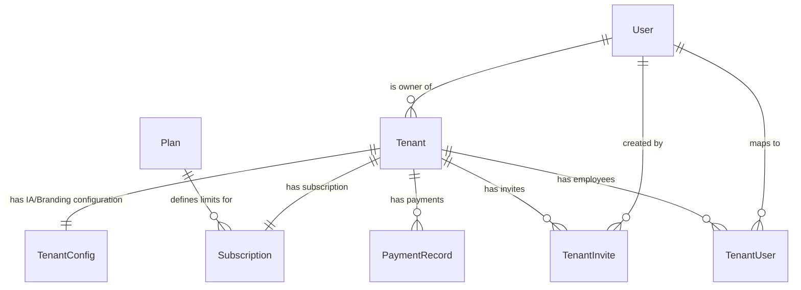

# Módulo Tenants & Configurações Globais

Este documento detalha os modelos responsáveis pelo controle de inquilinos (Tenants), configurações de IA/RAG por tenant, faturamento, convites, permissões de funcionários e configurações dinâmicas globais (Core), todos residindo na **única base de dados unificada** do sistema.

---

## Diagrama de Entidades (Camada de Configuração e Tenants)

---

## 1. Módulo: `tenants`

### `Tenant`
Armazena a entidade raiz de cada cliente corporativo (inquilino) do sistema. Todos os dados das tabelas de negócio do inquilino são isolados logicamente referenciando esta tabela.

*   **Nome da Tabela:** `tenants_tenant`
*   **Campos:**
    *   `id` (UUID, Chave Primária): Identificador único global gerado automaticamente (`uuid.uuid4`).
    *   `name` (VARCHAR(100), Não Nulo): Nome corporativo ou fantasia do inquilino.
    *   `slug` (VARCHAR(100), Não Nulo, Único): Slug identificador para rotas web e subdomínios.
    *   `api_key` (VARCHAR(100), Não Nulo, Único): Chave de API única gerada automaticamente para comunicações externas (`uuid.uuid4().hex`).
    *   `owner_id` (INT, Chave Estrangeira, Não Nulo): Relação com o modelo `auth_user` (dono da conta). Cascade ao deletar.
    *   `email` (VARCHAR(254), Opcional/Vazio): E-mail de contato principal do tenant.
    *   `phone` (VARCHAR(20), Opcional/Vazio): Telefone de contato do tenant.
    *   `active` (BOOLEAN, Padrão: `True`): Define se o tenant está ativo no ecossistema.
    *   `setup_completed` (BOOLEAN, Padrão: `False`): Se as configurações iniciais do tenant foram concluídas.
    *   `onboarding_step` (INTEGER, Padrão: `1`): Indica em qual etapa do onboarding inicial o tenant se encontra.
    *   `access_code` (VARCHAR(20), Opcional/Nulo): Código de acesso temporário gerado pelo administrador do sistema.
    *   `created_at` (TIMESTAMPTZ, Não Nulo): Data/hora de criação do inquilino.
    *   `updated_at` (TIMESTAMPTZ, Não Nulo): Data/hora da última atualização cadastral.

---

### `TenantConfig`
Configurações de IA, parâmetros do LLM/RAG, prompts do sistema e branding personalizado por Tenant. Os parâmetros de chaves de API locais sobrescrevem as chaves globais da tabela `CoreSettings` quando preenchidos.

*   **Nome da Tabela:** `tenants_tenantconfig`
*   **Campos:**
    *   `id` (INT, Chave Primária): ID incremental automático.
    *   `tenant_id` (UUID, Chave Estrangeira, Não Nulo, Único): Vínculo um para um com `Tenant`. Cascade ao deletar.
    
    *   **=== PROMPTS DE IA ===**
    *   `dados_empresa` (TEXT, Opcional/Vazio): Informações gerais da empresa para base do RAG contextual.
    *   `persona_bot` (TEXT, Opcional/Vazio): Persona e diretrizes de tom de voz/comportamento da LLM.
    *   `bot_agent_name` (VARCHAR(80), Opcional/Vazio): Nome de exibição do bot nos chats (ex: `*Íris:*`).
    
    *   **=== MENSAGENS AUTOMÁTICAS E FALLBACKS ===**
    *   `msg_fallback` (VARCHAR(500), Padrão: `"Recebemos sua mensagem. Em breve retornaremos."`): Mensagem de erro de processamento.
    *   `msg_sem_info` (VARCHAR(500), Padrão: `"Desculpe, não encontrei informações sobre isso."`): Mensagem de ausência de informações úteis no RAG.
    *   `msg_transferencia` (VARCHAR(500), Padrão: `"Vou transferir seu atendimento para o setor responsável."`): Mensagem exibida antes de desativar o bot e acionar humano.
    
    *   **=== EXTRAÇÃO DE ENTIDADES ===**
    *   `entity_types` (JSONB, Padrão: `{}`): Tipos de entidades dinâmicas que o bot deve extrair (ex: `{"documento": "Extraia o CPF ou CNPJ"}`).
    
    *   **=== CONFIGURAÇÕES DO LLM (IA) ===**
    *   `llm_class` (VARCHAR(50), Opcional/Vazio): Classe da LLM (ex: `ChatGroq`, `ChatOpenAI`, `ChatOllama`).
    *   `model` (VARCHAR(100), Opcional/Vazio): Nome do modelo da LLM (ex: `gpt-4o-mini`, `llama-3.3-70b-versatile`).
    *   `llm_temperature` (NUMERIC(3, 2), Padrão: `0.00`): Temperatura de criatividade do LLM.
    
    *   **=== TRANSCRIÇÃO E VISÃO ===**
    *   `transcription_provider` (VARCHAR(50), Opcional/Vazio): Provedor de transcrição de áudios (ex: `openai`, `groq`).
    *   `transcription_model` (VARCHAR(100), Opcional/Vazio): Modelo para transcrição (ex: `whisper-1`).
    *   `vision_provider` (VARCHAR(50), Opcional/Vazio): Provedor de visão computacional (ex: `google`, `openai`).
    *   `vision_model` (VARCHAR(100), Opcional/Vazio): Modelo para interpretar mídias visuais (ex: `gemini-2.5-flash`).
    
    *   **=== EMBEDDINGS E RAG ===**
    *   `embeddings_class` (VARCHAR(50), Padrão: `"OpenAIEmbeddings"`): Classe para geração de embeddings vetoriais.
    *   `embeddings_model` (VARCHAR(100), Opcional/Vazio): Modelo de embeddings (ex: `text-embedding-3-small`).
    *   `chunk_size` (INTEGER, Padrão: `1000`): Tamanho dos blocos de corte de texto (chunks).
    *   `chunk_overlap` (INTEGER, Padrão: `200`): Sobreposição de caracteres entre chunks.
    
    *   **=== THRESHOLDS E PARAMETRIZAÇÃO ===**
    *   `similarity_threshold` (NUMERIC(3, 2), Padrão: `0.40`): Limite mínimo de similaridade para intenções.
    *   `vector_distance_threshold` (NUMERIC(3, 2), Padrão: `0.25`): Limite de distância de cosseno máximo aceitável para o pgvector.
    
    *   **=== API KEYS LOCAIS ===**
    *   `api_keys` (JSONB, Padrão: `{}`): Dicionário de chaves de API locais criptografadas que sobrescrevem o global (ex: `{"groq_api_key": "...", "openai_api_key": "..."}`).
    
    *   **=== BRANDING E REGIONALIZAÇÃO ===**
    *   `brand_name` (VARCHAR(100), Opcional/Vazio): Nome do painel personalizado.
    *   `primary_color` (VARCHAR(7), Padrão: `"#0d6efd"`): Cor primária do painel.
    *   `secondary_color` (VARCHAR(7), Padrão: `"#6c757d"`): Cor secundária do painel.
    *   `timezone` (VARCHAR(50), Padrão: `"America/Sao_Paulo"`): Fuso horário do tenant.
    *   `language_code` (VARCHAR(10), Padrão: `"pt-br"`): Idioma padrão do painel.
    *   `updated_at` (TIMESTAMPTZ, Não Nulo): Data da última atualização cadastral.
*   **Métodos de Código:**
    *   `set_api_key(service, key)`: Criptografa a chave usando AES-GCM e a insere no dicionário JSONB.
    *   `get_api_key(service)`: Descriptografa e retorna a chave de API do serviço.

---

### `Plan`
Define os planos de assinatura do SaaS comercial e seus limites operacionais no ecossistema (como número máximo de instâncias de WhatsApp no Evolution centralizado).

*   **Nome da Tabela:** `tenants_plan`
*   **Campos:**
    *   `id` (INT, Chave Primária): ID incremental automático.
    *   `name` (VARCHAR(100), Não Nulo): Nome do plano comercial (ex: "Premium", "Enterprise").
    *   `description` (TEXT, Opcional/Vazio): Descrição detalhada do plano.
    *   `price` (NUMERIC(10, 2), Opcional/Nulo): Preço do plano em reais.
    *   `max_instances` (INTEGER, Padrão: `1`): Limite de instâncias da Evolution API ativas simultaneamente (`-1` para ilimitado).
    *   `max_departments` (INTEGER, Padrão: `1`): Limite de departamentos/filas de atendimento (`-1` para ilimitado).
    *   `active` (BOOLEAN, Padrão: `True`): Indica se o plano comercial está disponível para novas inscrições.
    *   `created_at` (TIMESTAMPTZ, Não Nulo): Data de criação do plano.

---

### `Subscription`
Assinatura de um inquilino e rastreamento do faturamento/integrações de pagamento.

*   **Nome da Tabela:** `tenants_subscription`
*   **Campos:**
    *   `id` (INT, Chave Primária): ID incremental automático.
    *   `tenant_id` (UUID, Chave Estrangeira, Não Nulo, Único): Vínculo um para um com `Tenant`. Cascade ao deletar.
    *   `plan_id` (INT, Chave Estrangeira, Opcional/Nulo): Vínculo com `Plan` contratado. Protege contra deleção (`on_delete=PROTECT`).
    *   `status` (VARCHAR(20), Não Nulo, Padrão: `"ACTIVE"`): Enum status do faturamento.
        *   *Opções do Enum:* `PENDING_PAYMENT` (Aguardando Pagamento), `PAYMENT_CONFIRMED` (Pagamento Confirmado), `ACTIVE` (Ativo), `PAST_DUE` (Atrasado), `SUSPENDED` (Suspenso), `CANCELLED` (Cancelado).
    *   `current_period_start` (TIMESTAMPTZ, Opcional/Nulo): Data/hora do início da vigência do faturamento ativo.
    *   `current_period_end` (TIMESTAMPTZ, Opcional/Nulo): Data/hora de encerramento da vigência/próximo vencimento.
    *   `payment_gateway` (VARCHAR(50), Opcional/Vazio): Gateway integrado (ex: `asaas`, `stripe`).
    *   `external_customer_id` (VARCHAR(100), Opcional/Vazio): ID do cliente no Gateway.
    *   `external_subscription_id` (VARCHAR(100), Opcional/Vazio): ID do contrato recorrente no Gateway.
    *   `updated_at` (TIMESTAMPTZ, Não Nulo): Última atualização do registro.
*   **Métodos de Código:**
    *   `is_active() -> bool`: Verifica se a assinatura está válida (considera expiração e status).
    *   `extend_period(months)`: Estende o término da assinatura.
    *   `set_manual_period(start, end)`: Permite forçar datas de vencimento via administrativo.

---

### `PaymentRecord`
Registro histórico de lançamentos de pagamentos manuais ou reconciliados dos Tenants.

*   **Nome da Tabela:** `tenants_paymentrecord`
*   **Campos:**
    *   `id` (INT, Chave Primária): ID incremental automático.
    *   `tenant_id` (UUID, Chave Estrangeira, Não Nulo): Relação com `Tenant`. Cascade ao deletar.
    *   `amount` (NUMERIC(10, 2), Não Nulo): Valor financeiro do pagamento.
    *   `payment_date` (DATE, Não Nulo): Data em que o pagamento foi realizado.
    *   `payment_method` (VARCHAR(20), Não Nulo): Forma de pagamento utilizada.
        *   *Opções do Enum:* `PIX`, `TRANSFER` (Transferência), `CASH` (Dinheiro), `BOLETO`, `OTHER` (Outro).
    *   `period_start` (DATE, Não Nulo): Início do período contratual coberto pelo pagamento.
    *   `period_end` (DATE, Não Nulo): Final do período contratual coberto pelo pagamento.
    *   `notes` (TEXT, Opcional/Vazio): Observações manuais sobre o pagamento.
    *   `recorded_by_id` (INT, Chave Estrangeira, Opcional/Nulo): ID do usuário (`auth_user`) que lançou o pagamento. Seta nulo em deleção.
    *   `created_at` (TIMESTAMPTZ, Não Nulo): Data/hora do lançamento.

---

### `TenantInvite`
Convites enviados para futuros colaboradores ingressarem no espaço do tenant, definindo permissões administrativas iniciais.

*   **Nome da Tabela:** `tenants_tenantinvite`
*   **Campos:**
    *   `id` (UUID, Chave Primária): UUID aleatório de convite.
    *   `tenant_id` (UUID, Chave Estrangeira, Não Nulo): Vínculo com `Tenant`. Cascade ao deletar.
    *   `email` (VARCHAR(254), Não Nulo): E-mail do funcionário convidado.
    *   `name` (VARCHAR(100), Não Nulo): Nome do funcionário convidado.
    *   `role` (VARCHAR(20), Padrão: `"staff"`): Cargo/Nível de permissões atribuído.
        *   *Opções do Enum:* `admin` (Administrador), `manager` (Gerente), `staff` (Funcionário), `viewer` (Visualizador).
    *   `module_permissions` (JSONB, Padrão: `{}`): Dicionário de permissões de módulos funcionais.
    *   `flow_permissions` (JSONB, Padrão: `[]`): Lista de IDs de `FluxoAtendimento` do banco unificado liberados para o usuário.
    *   `token` (VARCHAR(64), Não Nulo, Único): Token gerado automaticamente via URL-safe.
    *   `expires_at` (TIMESTAMPTZ, Não Nulo): Data limite de expiração do token (padrão: 7 dias da criação).
    *   `used` (BOOLEAN, Padrão: `False`): Se o convite já foi aceito.
    *   `created_at` (TIMESTAMPTZ, Não Nulo): Data de geração.
    *   `created_by_id` (INT, Chave Estrangeira, Opcional/Nulo): Usuário (`auth_user`) que gerou o convite.
*   **Métodos de Código:**
    *   `is_valid() -> bool`: Verifica se o token não expirou e não foi utilizado.

---

### `TenantUser`
Perfil de usuário/funcionário vinculado a um Tenant, controlando acessos aos departamentos do chat e permissões administrativas.

*   **Nome da Tabela:** `tenants_tenantuser`
*   **Campos:**
    *   `id` (INT, Chave Primária): ID incremental automático.
    *   `user_id` (INT, Chave Estrangeira, Não Nulo, Único): Um para um com `auth_user`. Cascade ao deletar.
    *   `tenant_id` (UUID, Chave Estrangeira, Não Nulo): Muitos para um com `Tenant`. Cascade ao deletar.
    *   `role` (VARCHAR(20), Padrão: `"staff"`): Nível de permissão administrativa.
        *   *Opções do Enum:* `admin` (Administrador), `manager` (Gerente), `staff` (Funcionário), `viewer` (Visualizador).
    *   `module_permissions` (JSONB, Padrão: `{}`): Permissões por módulos (ex: `{"modulo_comercial": {"view": true, "edit": false}}`).
    *   `flow_permissions` (JSONB, Padrão: `[]`): Lista lógica de IDs de fluxos de atendimento (`FluxoAtendimento`) liberados ao atendente no Kanban.
    *   `is_active` (BOOLEAN, Padrão: `True`): Indica se o funcionário está ativo no tenant.
    *   `created_at` (TIMESTAMPTZ, Não Nulo): Data de contratação/ingresso.
    *   `created_by_id` (INT, Chave Estrangeira, Opcional/Nulo): Usuário administrativo que criou o vínculo.
*   **Métodos de Código:**
    *   `has_module_permission(module, action) -> bool`: Valida se o usuário pode ver, criar ou editar dados de um app específico.
    *   `has_flow_permission(flow_id) -> bool`: Valida acesso à coluna/quadro do Kanban.
    *   `allowed_flow_ids() -> list[int]`: Retorna a lista de IDs inteiros permitidos.
