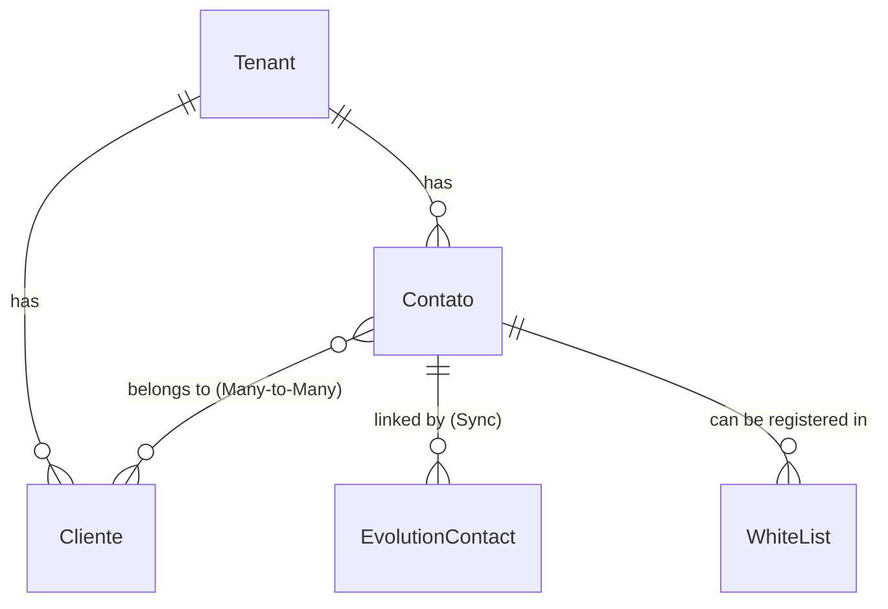

# Módulo Clientes & Contatos

Este documento descreve os modelos de contatos e clientes corporativos, todos residindo no **banco de dados único** do sistema e isolados logicamente através de chaves estrangeiras vinculadas à tabela de Tenants.

---

## Diagrama de Entidades (Clientes & Contatos)

---

## 1. Módulo: `clientes`

### `Contato`
Armazena a entidade dos usuários finais do WhatsApp. Identifica a pessoa que iniciou o contato de forma única pelo número do telefone e pelo escopo do inquilino (Tenant).

*   **Nome da Tabela:** `oraculo_contato`
*   **Campos:**
    *   `id` (INT, Chave Primária): ID incremental automático.
    *   `tenant_id` (UUID, Chave Estrangeira, Não Nulo): Relacionamento com `Tenant`. Cascade ao deletar.
    *   `telefone` (VARCHAR(20), Opcional/Nulo): Número de telefone do contato.
        *   *Validador:* `validate_telefone`. Valida se tem entre 10 e 15 caracteres numéricos.
        *   *Normalização (no save):* Remove caracteres não numéricos e prefixa com o DDI `"55"` (Brasil) caso não comece com ele (ex: `11999999999` vira `5511999999999`).
    *   `nome_contato` (VARCHAR(100), Opcional/Nulo): Nome atribuído manualmente ou identificado no sistema para o contato.
    *   `slug` (SLUG, Opcional/Nulo, Padrão: `""`): Slug URL-friendly gerado de forma automática com base no `nome_contato`.
    *   `email` (VARCHAR(254), Opcional/Nulo): E-mail do contato para fins de CRM.
    *   `nome_perfil_whatsapp` (VARCHAR(100), Opcional/Nulo): Nome de perfil que o contato definiu em seu próprio WhatsApp (obtido via webhook Evolution).
    *   `data_cadastro` (TIMESTAMPTZ, Não Nulo): Data em que o contato interagiu pela primeira vez no sistema (gerado automaticamente no insert).
    *   `ultima_interacao` (TIMESTAMPTZ, Não Nulo): Data e hora da última mensagem inbound ou outbound do contato (atualizado no update do model).
    *   `ativo` (BOOLEAN, Padrão: `True`): Define se o contato está ativo para interações.
    *   `metadados` (JSONB, Padrão: `{}`): Estrutura flexível para armazenar parâmetros adicionais do cliente (ex: dados do navegador, estado de funis externos).
    *   `foto_perfil` (VARCHAR(255) / FILE, Opcional/Nulo): Avatar do contato armazenado localmente na pasta `contatos/fotos/%Y/%m/`. Obtido a partir do `profilePictureUrl` enviado pelo WhatsApp.
    *   `foto_perfil_url_origem` (VARCHAR(512), Opcional/Nulo): URL original do avatar de origem no WhatsApp para atuar como chave de cache e evitar novos downloads desnecessários.
*   **Restrições e Unicidade:**
    *   Unicidade composta: A combinação de `tenant_id` e `telefone` deve ser única (um contato de WhatsApp só pode existir uma vez por tenant, mas pode interagir com tenants diferentes na mesma base).
*   **Regras de Negócio (no Método `save`):**
    *   **Geração de Slug:** Se o slug estiver vazio e o `nome_contato` estiver presente, gera automaticamente um slug único. Se houver colisão de slugs no escopo do tenant, anexa um sufixo numérico.
    *   **Normalização de Telefone:** Limpa qualquer caractere não numérico e adiciona o DDI `"55"`.
*   **Ordenação:** Ordenado decrescentemente por `ultima_interacao` (contatos recentes primeiro).

---

### `Cliente`
Cadastro formal de clientes (Pessoas Físicas e Jurídicas) com dados de faturamento, fiscais e geográficos vinculados ao respectivo Tenant. Permite associar múltiplos contatos (telefones de funcionários) a uma mesma conta jurídica.

*   **Nome da Tabela:** `oraculo_cliente`
*   **Campos:**
    *   `id` (INT, Chave Primária): ID incremental automático.
    *   `tenant_id` (UUID, Chave Estrangeira, Não Nulo): Relacionamento com `Tenant`. Cascade ao deletar.
    *   `nome_fantasia` (VARCHAR(200), Não Nulo): Nome comum/comercial do cliente. Campo obrigatório.
    *   `slug` (SLUG, Opcional/Nulo, Padrão: `""`): Slug URL-friendly gerado com base no `nome_fantasia`.
    *   `razao_social` (VARCHAR(200), Opcional/Nulo): Razão Social corporativa.
    *   `tipo` (VARCHAR(20), Opcional/Nulo): Tipo de cliente.
        *   *Opções do Enum:* `fisica` (Pessoa Física), `juridica` (Pessoa Jurídica).
    *   `cnpj` (VARCHAR(18), Opcional/Nulo): CNPJ para empresas.
        *   *Validador:* `validate_cnpj`. Exige exatamente 14 dígitos numéricos (após limpeza de caracteres especiais) e valida consistência básica (não aceita `00000000000000`).
        *   *Normalização (no save):* Converte a entrada limpa para o formato formatado com máscara `XX.XXX.XXX/XXXX-XX`.
    *   `cpf` (VARCHAR(14), Opcional/Nulo): CPF para pessoas físicas.
        *   *Validador:* `validate_cpf`. Exige exatamente 11 dígitos numéricos e valida consistência básica.
        *   *Normalização (no save):* Converte para o formato formatado com máscara `XXX.XXX.XXX-XX`.
    *   `telefone` (VARCHAR(20), Opcional/Nulo): Telefone institucional fixo ou móvel.
        *   *Validador:* `validate_telefone`.
        *   *Normalização (no save):* Se contiver 10 ou mais dígitos e não começar com "+", formata como `(XX) XXXX-XXXX` ou `(XX) XXXXX-XXXX`.
    *   `site` (VARCHAR(200) / URL, Opcional/Nulo): Website oficial do cliente.
    *   `ramo_atividade` (VARCHAR(200), Opcional/Nulo): Segmento de atuação da empresa.
    *   `observacoes` (TEXT, Opcional/Nulo): Notas livres adicionais sobre o cliente corporativo.
    *   `cep` (VARCHAR(10), Opcional/Nulo): CEP do endereço fiscal.
        *   *Validador:* `validate_cep`. Exige exatamente 8 dígitos numéricos.
        *   *Normalização (no save):* Converte para o formato formatado com máscara `XXXXX-XXX`.
    *   `logradouro` (VARCHAR(200), Opcional/Nulo): Rua, avenida, praça, etc.
    *   `numero` (VARCHAR(10), Opcional/Nulo): Número do lote/prédio.
    *   `complemento` (VARCHAR(100), Opcional/Nulo): Sala, bloco, apartamento, andar.
    *   `bairro` (VARCHAR(100), Opcional/Nulo): Bairro do endereço.
    *   `cidade` (VARCHAR(100), Opcional/Nulo): Município.
    *   `uf` (VARCHAR(2), Opcional/Nulo): Unidade Federativa. É convertida automaticamente para letras maiúsculas no `save()`.
    *   `pais` (VARCHAR(50), Padrão: `"Brasil"`, Opcional/Nulo): País de residência fiscal.
    *   `contatos` (M2M / Relacionamento Muitos para Muitos, Opcional/Vazio): Tabela associativa com contatos autorizados vinculados a esse cliente. Tabela intermediária: `oraculo_cliente_contatos` (gerada pelo Django). related_name: `"clientes"`.
    *   `data_cadastro` (TIMESTAMPTZ, Não Nulo): Data/hora de registro do cliente.
    *   `ultima_atualizacao` (TIMESTAMPTZ, Não Nulo): Data/hora da última alteração cadastral.
    *   `ativo` (BOOLEAN, Padrão: `True`): Define se a conta está ativa.
    *   `metadados` (JSONB, Padrão: `{}`): Estrutura para informações flexíveis da conta.
*   **Restrições e Unicidade:**
    *   Unicidade composta: A combinação de `tenant_id` e `cnpj`/`cpf` deve ser única se preenchidos (garante que um CNPJ só pode ser cadastrado uma vez por inquilino, mas permite em inquilinos diferentes).
*   **Regras de Negócio (no Método `save`):**
    *   **Geração de Slug:** Gera slug a partir do `nome_fantasia` caso esteja nulo, garantindo unicidade dentro do mesmo tenant.
    *   **Validação manual (`clean()`):** Valida se o `nome_fantasia` não é nulo ou composto apenas por espaços em branco.
*   **Métodos Auxiliares:**
    *   `get_endereco_completo() -> str`: Concatena de forma inteligente logradouro, número, complemento, bairro, cidade, UF, CEP e país em uma única string formatada.
    *   `adicionar_contato(contato)` / `remover_contato(contato)`: Helpers para associar/desassociar contatos no relacionamento many-to-many.
    *   `atualizar_metadados(chave, valor)` / `get_metadados(chave, padrao)`: Helpers para manipular o dicionário JSON de metadados.
*   **Ordenação:** Ordenado alfabeticamente por `nome_fantasia`.
