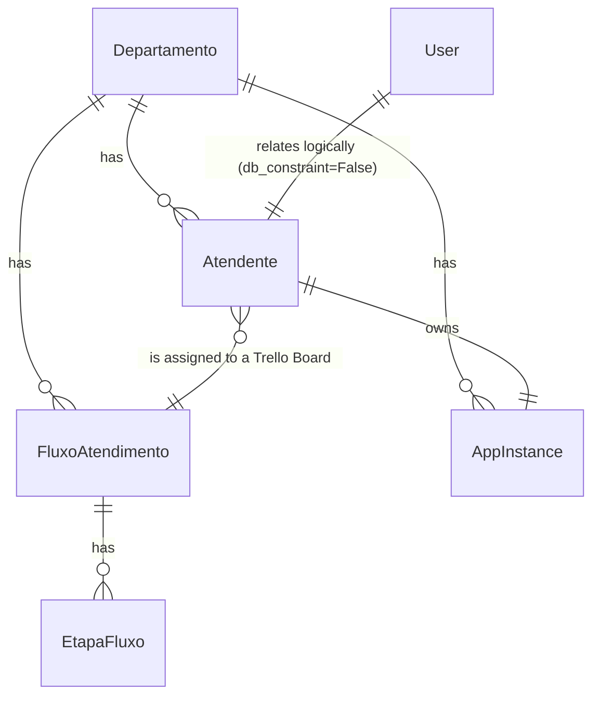

# Módulo Operacional (Estrutura de Trabalho)

Este documento descreve os modelos residentes no **Banco de Dados do Tenant** responsáveis pela estrutura organizacional, incluindo departamentos, atendentes humanos, canais de mensageria (instâncias) e o fluxo kanban personalizado.

---

## Diagrama de Entidades (Operacional)

---

## 1. Módulo: `operacional`

### `Departamento`
Define as divisões operacionais ou setores comerciais do inquilino (ex: Comercial, Suporte, Financeiro).

*   **Nome da Tabela:** `oraculo_departamento`
*   **Campos:**
    *   `id` (INT, Chave Primária): ID incremental automático.
    *   `nome` (VARCHAR(100), Não Nulo, Único): Nome legível do departamento.
    *   `slug` (SLUG, Opcional/Nulo, Único): Slug gerado a partir do nome.
    *   `descricao` (TEXT, Opcional/Nulo): Detalhamento do departamento.
    *   `ativo` (BOOLEAN, Padrão: `True`): Determina se o setor está operacional.
    *   `telefone_instancia` (VARCHAR(20), Opcional/Nulo): Número do WhatsApp cadastrado como instância para este departamento.
        *   *Validador:* `validate_telefone_instancia`. Valida se tem pelo menos 10 e no máximo 15 dígitos.
    *   `api_key` (VARCHAR(100), Opcional/Nulo): API Key de acesso da instância vinculada no Evolution API.
        *   *Validador:* `validate_api_key`. Garante que não esteja vazia e contenha ao menos 8 caracteres.
    *   `configuracoes` (JSONB, Padrão: `{}`): Configurações operacionais flexíveis (ex: mensagens automáticas de fora do horário de atendimento).
    *   `metadados` (JSONB, Padrão: `{}`): Estrutura para integração com APIs externas.
    *   `data_criacao` (TIMESTAMPTZ, Não Nulo): Data/hora de cadastro do departamento.
*   **Regras de Negócio (no Método `save`):**
    *   **Slug:** Gera slug automaticamente a partir do nome se não estiver preenchido.
    *   **Telefone:** Normaliza o campo `telefone_instancia` removendo quaisquer caracteres não numéricos.
*   **Métodos Auxiliares:**
    *   `validar_api_key(data) [Classmethod]`: Valida as credenciais recebidas via webhook da Evolution API (apikey e instance) e retorna o departamento ativo correspondente.
    *   `get_fluxo() -> Optional[FluxoAtendimento]`: Retorna o primeiro fluxo de atendimento ativo ordenado por data de criação.
    *   `get_fluxo_etapas() -> QuerySet[EtapaFluxo]`: Retorna todas as etapas do fluxo do departamento ordenadas pela ordem de sequência.
    *   `ensure_fluxo(nome) -> FluxoAtendimento`: Helper que garante que o departamento tenha ao menos um fluxo padrão cadastrado, criando-o se necessário.
*   **Índices:**
    *   `oraculo_departamento_slug` (slug)
    *   `oraculo_departamento_ativo_nome` (ativo, nome)
*   **Ordenação:** Ordenado alfabeticamente por `nome`.

---

### `Atendente`
Cadastro dos atendentes humanos que operarão os chats no painel. Controla limites de atendimento simultâneo (Fairness) e horário de trabalho.

*   **Nome da Tabela:** `oraculo_atendente`
*   **Alias de Compatibilidade:** `AtendenteHumano` (utilizado nos testes legados)
*   **Campos:**
    *   `id` (INT, Chave Primária): ID incremental automático.
    *   `nome` (VARCHAR(100), Não Nulo): Nome completo do operador.
    *   `slug` (SLUG, Opcional/Nulo, Único, Padrão: `""`): Slug URL-friendly para identificação do perfil.
    *   `telefone` (VARCHAR(20), Opcional/Nulo, Único): Telefone do atendente.
        *   *Validador:* `validate_telefone`.
        *   *Normalização (no save):* Converte o número de telefone removendo não numéricos, prefixando com `"55"` e salvando com o prefixo `"+"`. (ex: `11999999999` vira `+5511999999999`).
    *   `cargo` (VARCHAR(100), Não Nulo, Padrão: `""`): Cargo ocupado pelo atendente.
    *   `email` (VARCHAR(254), Não Nulo): E-mail corporativo. Obrigatório na validação.
    *   `departamento_id` (INT, Chave Estrangeira, Opcional/Nulo): Departamento ao qual pertence. Seta nulo em deleção.
    *   `fluxo_id` (INT, Chave Estrangeira, Não Nulo): Relação com `FluxoAtendimento` (quadro Kanban do Trello) ao qual o atendente será inserido. Protegido contra deleção (`on_delete=PROTECT`).
    *   `usuario_id` (INT, Chave Estrangeira lógica, Opcional/Nulo): Vínculo com a tabela `auth_user` (banco default). Possui `db_constraint=False` para evitar erro de cross-database.
    *   `usuario_sistema` (VARCHAR(50), Opcional/Nulo): Nome de usuário para logins em sistemas legados.
    *   `ativo` (BOOLEAN, Padrão: `True`): Indica se o operador está habilitado a acessar o sistema.
    *   `disponivel` (BOOLEAN, Padrão: `True`): Se o operador está aceitando novos atendimentos no momento (Fairness/Round-Robin).
    *   `max_atendimentos_simultaneos` (INTEGER, Padrão: `5`): Limite de atendimentos ativos que o atendente pode conduzir em paralelo.
    *   `data_ultima_atribuicao` (TIMESTAMPTZ, Opcional/Nulo): Timestamp do último atendimento atribuído. Usado para fila Round-Robin.
    *   `horario_trabalho` (JSONB, Padrão: `{}`): Horários permitidos de login/atendimento por dia da semana.
    *   `especialidades` (JSONB, Padrão: `[]`): Lista de tags com especialidades do operador (ex: `["segunda_via", "suporte_tecnico"]`).
    *   `metadados` (JSONB, Padrão: `{}`): Preferências adicionais do operador.
    *   `data_cadastro` (TIMESTAMPTZ, Não Nulo): Data/hora de inclusão.
    *   `ultima_atividade` (TIMESTAMPTZ, Não Nulo): Última ação registrada do operador no sistema.
*   **Regras de Negócio (no Método `save` e `clean`):**
    *   **Slug:** Gerado automaticamente de forma única a partir do nome.
    *   **Validações manuais (`clean()`):**
        *   `email` é obrigatório.
        *   `fluxo` é obrigatório na criação de novos registros.
        *   **Coerência de Departamento:** Se o atendente possuir departamento e fluxo definidos, o departamento do fluxo deve coincidir com o departamento do atendente.
*   **Métodos Auxiliares:**
    *   `get_atendimentos_ativos() -> int`: Retorna o número de atendimentos vinculados a este atendente que estejam com status `fila`, `em_atendimento` ou `pendencia`.
    *   `is_available() -> bool`: Retorna `True` se o atendente estiver ativo, disponível e o número de atendimentos ativos for menor que `max_atendimentos_simultaneos`.
    *   `current_load() -> int`: Alias de `get_atendimentos_ativos()`.
*   **Índices:**
    *   `oraculo_atendente_dept_disp_idx` (departamento, disponível)
    *   `oraculo_atendente_disp_max_idx` (disponível, max_atendimentos_simultaneos)
    *   `oraculo_atendente_last_assign_idx` (data_ultima_atribuicao)
    *   `oraculo_atendente_fluxo_idx` (fluxo)
*   **Ordenação:** Ordenado alfabeticamente por `nome`.

---

### `AppInstance`
Configuração de instâncias de comunicação ( Evolution API) conectadas a canais de mensagem do Tenant.

*   **Nome da Tabela:** `oraculo_app_instance`
*   **Campos:**
    *   `id` (INT, Chave Primária): ID incremental automático.
    *   `api_key` (VARCHAR(128), Não Nulo, Único): Chave de API da instância vinculada.
    *   `channel` (VARCHAR(32), Não Nulo): Canal de integração (ex: `"whatsapp"`).
    *   `display_name` (VARCHAR(100), Opcional/Nulo): Nome de exibição amigável.
    *   `departamento_id` (INT, Chave Estrangeira, Opcional/Nulo): Setor padrão associado às mensagens inbound recebidas nesta instância. Seta nulo em deleção.
    *   `owner_id` (INT, Chave Estrangeira, Opcional/Nulo, Único): Atendente humano dono do dispositivo móvel conectado (se aplicável). Seta nulo em deleção.
    *   `active` (BOOLEAN, Padrão: `True`): Se a instância está ativa no sistema de sincronização.
    *   `resposta_bot` (BOOLEAN, Padrão: `True`): Determina se mensagens recebidas por este canal podem ser processadas e respondidas pelo Bot inteligente.
    *   `metadata` (JSONB, Padrão: `{}`): Parâmetros adicionais da instância.
    *   `created_at` (TIMESTAMPTZ, Não Nulo): Data de conexão da instância.
*   **Índices:**
    *   `oraculo_app_instance_api_key_idx` (api_key)
    *   `oraculo_app_instance_channel_idx` (channel)
    *   `oraculo_app_instance_dept_idx` (departamento)
*   **Ordenação:** Ordenado descrescentemente por `created_at` (instâncias novas primeiro).

---

### `TipoEtapa`
Enumeração de tipos de etapas válidos para o fluxo Kanban.

*   *Opções do Enum (TextChoices):*
    *   `fila` (Fila de Entrada): Etapa de entrada onde os clientes aguardam triagem/bot.
    *   `trabalho` (Em Trabalho): Atendimento sendo operado ativamente.
    *   `espera` (Aguardando Resposta): Aguardando alguma ação ou retorno do cliente.
    *   `finalizacao` (Finalização): Etapa conclusiva do atendimento.

---

### `FluxoAtendimento`
Define fluxos de trabalho personalizados por departamento. Mapeia a lógica de um quadro Kanban.

*   **Nome da Tabela:** `oraculo_fluxo_atendimento`
*   **Campos:**
    *   `id` (INT, Chave Primária): ID incremental automático.
    *   `departamento_id` (INT, Chave Estrangeira, Não Nulo): Departamento ao qual este fluxo pertence. Cascade ao deletar.
    *   `nome` (VARCHAR(100), Não Nulo): Nome descritivo do fluxo.
    *   `descricao` (TEXT, Opcional/Nulo): Detalhamento do propósito do fluxo.
    *   `ativo` (BOOLEAN, Padrão: `True`): Define se o fluxo está ativo.
    *   `data_criacao` (TIMESTAMPTZ, Não Nulo): Data de criação.
    *   `data_atualizacao` (TIMESTAMPTZ, Não Nulo): Data da última modificação.
*   **Métodos Auxiliares:**
    *   `get_etapa_inicial() -> Optional[EtapaFluxo]`: Retorna a primeira etapa associada que seja do tipo `FILA`.
    *   `get_etapas_por_tipo(tipo) -> QuerySet[EtapaFluxo]`: Filtra etapas ativas do fluxo por tipo (`FILA`, `TRABALHO`, etc.) ordenando pelo campo `ordem`.
*   **Ordenação:** Ordenado pelo nome do departamento vinculado.

---

### `EtapaFluxo`
Representa uma coluna física no Kanban do departamento. Cada atendimento ativo reside em uma Etapa específica.

*   **Nome da Tabela:** `oraculo_etapa_fluxo`
*   **Campos:**
    *   `id` (INT, Chave Primária): ID incremental automático.
    *   `fluxo_id` (INT, Chave Estrangeira, Não Nulo): Fluxo Kanban ao qual esta coluna pertence. Cascade ao deletar.
    *   `nome` (VARCHAR(50), Não Nulo): Nome da coluna no Kanban (ex: "Aguardando Vendedor", "Orçamento Enviado").
    *   `descricao` (VARCHAR(200), Opcional/Nulo): Explicação curta do propósito da etapa.
    *   `ordem` (INTEGER, Não Nulo): Posição da etapa na ordenação horizontal do Kanban (menores números exibidos à esquerda).
    *   `cor` (VARCHAR(7), Padrão: `"#6B7280"`): Código de cor hexadecimal para destaque visual na interface.
        *   *Normalização (no save):* Valida se começa com `"#"` e converte formato de 3 caracteres `#RGB` para 6 caracteres `#RRGGBB`.
    *   `tipo_etapa` (VARCHAR(20), Padrão: `"trabalho"`): Associação com o comportamento definido por `TipoEtapa`.
    *   `permite_atribuicao` (BOOLEAN, Padrão: `True`): Define se atendentes humanos podem ser atribuídos como responsáveis enquanto o atendimento residir nesta coluna.
    *   `automatico` (BOOLEAN, Padrão: `False`): Se as transições para esta coluna ocorrem via automações do bot.
    *   `regras_transicao` (JSONB, Padrão: `{}`): Regras de lógica de negócio para aceitar movimentação para esta coluna (ex: limites de tempo ou SLA).
    *   `campos_obrigatorios` (JSONB, Padrão: `[]`): Lista com os slugs de `CampoPersonalizado` que precisam estar obrigatoriamente preenchidos para que o card possa ser movido para esta etapa.
    *   `ativo` (BOOLEAN, Padrão: `True`): Define se a coluna está visível no Kanban.
    *   `data_criacao` (TIMESTAMPTZ, Não Nulo): Data de criação da coluna.
*   **Restrições e Unicidade:**
    *   `unique_together`: `[["fluxo", "ordem"]]` (Não é permitido que duas etapas no mesmo fluxo tenham o mesmo número de ordem).
*   **Índices:**
    *   `oraculo_etapa_fluxo_ordem_idx` (fluxo, ordem)
    *   `oraculo_etapa_fluxo_tipo_idx` (tipo_etapa)
    *   `oraculo_etapa_fluxo_ativo_idx` (ativo)
*   **Ordenação:** Ordenado por `fluxo` e depois pelo campo `ordem`.
