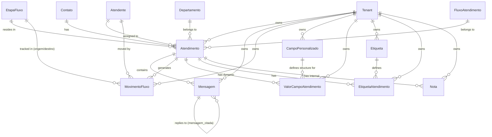

# Módulo Atendimentos & Mensageria

Este documento descreve os modelos de atendimentos, mensagens, transições no Kanban, anotações internas e campos personalizados dinâmicos, todos residentes no **banco de dados único** do sistema, protegidos por isolamento lógico via `tenant_id` e utilizando chaves estrangeiras físicas para garantir a integridade.

---

## Diagrama de Entidades (Atendimentos & Mensagens)

---

## 1. Módulo: `atendimentos`

### `StatusAtendimento`
Enumeração que controla o ciclo de vida geral do atendimento (utilizado principalmente para compatibilidade e SLAs).

*   *Opções do Enum (TextChoices):*
    *   `fila` (Fila): Aguardando atendimento ou interação humana inicial.
    *   `em_atendimento` (Em Atendimento): Operador humano ativo no chat.
    *   `pendencia` (Pendência): Aguardando retorno de informações externas ou contato.
    *   `resolvido` (Resolvido): Atendimento concluído com sucesso.
    *   `cancelado` (Cancelado): Atendimento encerrado sem resolução.
    *   `arquivado` (Arquivado): Removido da listagem do painel ativo.
*   *Aliases de Compatibilidade (definidos em tempo de runtime):*
    *   `EM_ANDAMENTO` $\rightarrow$ `EM_ATENDIMENTO`
    *   `AGUARDANDO_ATENDENTE` $\rightarrow$ `FILA`
    *   `AGUARDANDO_CONTATO` $\rightarrow$ `PENDENCIA`

---

### `TipoMensagem`
Especificação do tipo de mídia trafegada no WhatsApp.

*   *Opções do Enum (TextChoices):*
    *   `extendedTextMessage` (Texto Formatado)
    *   `imageMessage` (Imagem)
    *   `videoMessage` (Vídeo)
    *   `audioMessage` (Áudio)
    *   `documentMessage` (Documento)
    *   `stickerMessage` (Sticker)
    *   `locationMessage` (Localização)
    *   `contactMessage` (Contato/vCard)
    *   `listMessage` (Lista Interativa)
    *   `buttonsMessage` (Botões de Ação)
    *   `pollMessage` (Enquete)
    *   `reactMessage` (Reação/Emoji)

---

### `TipoRemetente`
Identifica quem originou o disparo da mensagem.

*   *Opções do Enum (TextChoices):*
    *   `contato` (Contato): Mensagem inbound do cliente final.
    *   `bot` (Bot/Sistema): Mensagem automática gerada pela IA ou rotinas de trigger.
    *   `atendente_humano` (Atendente Humano): Disparo manual de operador logado no painel.

---

### `Atendimento`
A entidade principal que une o cliente final ao departamento, fluxo e operador responsável no banco centralizado.

*   **Nome da Tabela:** `oraculo_atendimento`
*   **Campos:**
    *   `id` (INT, Chave Primária): ID incremental automático.
    *   `tenant_id` (UUID, Chave Estrangeira, Não Nulo): Relacionamento com `Tenant`. Cascade ao deletar.
    *   `contato_id` (INT, Chave Estrangeira, Não Nulo): Relação com `Contato`. Cascade ao deletar.
    *   `departamento_id` (INT, Chave Estrangeira, Opcional/Nulo): Departamento atual do atendimento. Seta nulo em deleção.
    *   `fluxo_atendimento_id` (INT, Chave Estrangeira, Opcional/Nulo): Fluxo ativo no qual o card reside. Seta nulo em deleção.
    *   `status` (VARCHAR(20), Padrão: `"fila"`): Status geral (Enum `StatusAtendimento`).
    *   `etapa_atual_id` (INT, Chave Estrangeira, Opcional/Nulo): Etapa/coluna física no Kanban do fluxo (referencia `EtapaFluxo`). Seta nulo em deleção.
    *   `data_inicio` (TIMESTAMPTZ, Não Nulo): Registra a data/hora em que o atendimento foi aberto (gerado automaticamente).
    *   `data_fim` (TIMESTAMPTZ, Opcional/Nulo): Registra a data/hora em que o atendimento foi fechado (status virou `resolvido`, `cancelado` ou `arquivado`).
    *   `data_ultima_mensagem` (TIMESTAMPTZ, Opcional/Nulo): Usado para SLAs e ordenação de chats.
    *   `assunto` (VARCHAR(200), Opcional/Nulo): Título ou descrição curta do atendimento.
    *   `prioridade` (VARCHAR(10), Padrão: `"normal"`): Grau de urgência.
        *   *Opções:* `baixa`, `normal`, `alta`, `urgente`.
    *   `atendente_humano_id` (INT, Chave Estrangeira, Opcional/Nulo): Operador humano ativo no atendimento. Seta nulo em deleção.
    *   `contexto_conversa` (JSONB, Padrão: `{}`): Estrutura de memória de curto prazo do bot (variáveis temporárias da conversa).
    *   `historico_status` (JSONB, Padrão: `[]`): Registros estruturados de mudanças de status para auditorias (contém status, timestamp e observação).
    *   `tags` (JSONB, Padrão: `[]`): Lista de tags aplicadas ao atendimento.
    *   `avaliacao` (INTEGER, Opcional/Nulo): Nota de satisfação dada pelo contato (1 a 5).
    *   `feedback` (TEXT, Opcional/Nulo): Texto livre com depoimento ou crítica do cliente sobre o atendimento.
    *   `data_primeira_resposta` (TIMESTAMPTZ, Opcional/Nulo): SLA de primeira resposta. Data/hora que o bot/humano enviou a primeira mensagem outbound.
    *   `bot_pode_atender` (BOOLEAN, Padrão: `True`): Flag de segurança. Se `False`, o Bot de IA é impedido de responder, deixando a conversa exclusiva para operadores humanos.
*   **Regras de Negócio (no Método `save` e `clean`):**
    *   **Histórico Inicial:** Se for um novo atendimento, adiciona automaticamente a entrada "Status inicial" ao JSON de histórico.
    *   **Validações Manuais (`clean()`):**
        *   Se `etapa_atual` for fornecida, exige a definição de um `departamento`.
        *   A `etapa_atual` deve pertencer ao departamento escolhido.
        *   O `fluxo_atendimento` deve pertencer ao departamento escolhido.
        *   A `etapa_atual` deve pertencer ao `fluxo_atendimento`.
*   **Métodos Auxiliares:**
    *   `cliente`: Retorna o primeiro cliente principal associado ao contato do atendimento (propriedade ORM).
    *   `finalizar_atendimento(novo_status, solicitar_feedback)`: Fecha o atendimento, seta o timestamp de término, grava histórico e aciona rotina de envio de mensagem de feedback.
    *   `change_status(novo_status, observacao)`: Altera status gravando logs e ajustando datas de encerramento se necessário.
    *   `assumir_atendimento(atendente_id)`: Atribui o card ao atendente humano e desliga o bot (`bot_pode_atender = False`).
    *   `assign_to_agent(atendente, observacao)`: Executa a atribuição física do operador, alterando o status do atendimento para `em_atendimento` e alinhando departamento e fluxo se houver divergências.
    *   `unassign_agent(observacao)`: Remove o operador e joga o atendimento de volta para a fila (`status = fila`).
    *   `transfer_to_department(departamento, observacao)`: Transfere o atendimento para outro setor, limpa o operador humano atribuído e joga na fila, definindo `bot_pode_atender = False` para que o bot não responda após a transferência de setor.
    *   `apply_flow_by_description(flow_description)`: Helper NLP. Recebe texto no formato `"Fluxo - Departamento"`, localiza a entidade e posiciona o atendimento automaticamente no departamento, fluxo e etapa inicial correspondentes.
    *   `touch_last_message(quando)`: Atualiza o campo `data_ultima_mensagem`.
    *   `transferir_para_humano_com_saudacao(atendente_id, observacao)`: Transfere o atendimento e cria automaticamente uma mensagem de saudação do atendente, injetando sua respectiva API key da instância do Evolution para envio.
*   **Índices:**
    *   `oraculo_atendimento_tenant_status_dept` (tenant, status, departamento)
    *   `oraculo_atendimento_tenant_dept_msg` (tenant, departamento, data_ultima_mensagem)
    *   `oraculo_atendimento_tenant_atendente_status` (tenant, atendente_humano, status)
    *   `oraculo_atendimento_tenant_etapa_atendente` (tenant, etapa_atual, atendente_humano)
*   **Ordenação:** Ordenado descrescentemente por `data_inicio`.

---

### `Mensagem`
Armazena todo o histórico de mensagens inbound/outbound do atendimento.

*   **Nome da Tabela:** `oraculo_mensagem`
*   **Campos:**
    *   `id` (INT, Chave Primária): ID incremental automático.
    *   `tenant_id` (UUID, Chave Estrangeira, Não Nulo): Relacionamento com `Tenant`. Cascade ao deletar.
    *   `atendimento_id` (INT, Chave Estrangeira, Não Nulo): Relação com `Atendimento`. Cascade ao deletar.
    *   `tipo` (VARCHAR(25), Padrão: `"extendedTextMessage"`): Tipo de mídia da mensagem (Enum `TipoMensagem`).
    *   `conteudo` (TEXT, Não Nulo): Texto da mensagem recebida do cliente. Em mídias binárias, pode armazenar transcrição, links ou legenda.
    *   `remetente` (VARCHAR(20), Padrão: `"contato"`): Enum `TipoRemetente`.
    *   `timestamp` (TIMESTAMPTZ, Não Nulo): Registra a data/hora de envio/recebimento.
    *   `message_id_whatsapp` (VARCHAR(100), Opcional/Nulo): Identificador da mensagem gerado pelo WhatsApp (`messageId`/`stanzaId`).
    *   `metadados` (JSONB, Padrão: `{}`): Payload nativo recebido pelo webhook (Evolution API) incluindo detalhes de áudio, imagem e localizações.
    *   `respondida` (BOOLEAN, Padrão: `False`): Se o bot já processou e disparou retorno físico para esta mensagem.
    *   `lido` (BOOLEAN, Padrão: `False`, Indexado): Se a mensagem inbound já foi visualizada por um atendente humano no painel do chat.
    *   `resposta_bot` (TEXT, Opcional/Nulo): Resposta em texto sugerida/gerada pelo Bot de IA.
    *   `intent_detectado` (JSONB, Padrão: `[]`): Lista com as intenções extraídas da mensagem pela IA.
    *   `entidades_extraidas` (JSONB, Padrão: `[]`): Lista de entidades extraídas pela IA.
    *   `confianca_resposta` (FLOAT, Opcional/Nulo): Score de confiabilidade da resposta gerada pela LLM.
    *   `arquivo_midia` (VARCHAR(255) / FILE, Opcional/Nulo): Campo para armazenamento do arquivo físico local.
    *   `analise_midia` (TEXT, Opcional/Nulo): Texto completo de transcrição ou descrição por multimodal.
    *   `resumo_midia` (TEXT, Opcional/Nulo): Resumo curto da mídia para o atendente.
    *   `mensagem_citada_id` (INT, Chave Estrangeira, Opcional/Nulo): Referência física à mensagem original citada no mesmo banco de dados. Seta nulo em deleção.
    *   `quoted_preview` (JSONB, Opcional/Nulo): Preview da mensagem citada se ela não estiver mais no banco local.
    *   `status_envio` (VARCHAR(15), Padrão: `"pending"`, Indexado): Rastreamento de leitura do WhatsApp para mensagens outbound.
        *   *Opções:* `pending` (Pendente), `sent` (Enviada), `delivered` (Entregue), `read` (Lida/azul), `failed` (Falhou).
    *   `data_entregue` (TIMESTAMPTZ, Opcional/Nulo): Timestamp de entrega.
    *   `data_lida` (TIMESTAMPTZ, Opcional/Nulo): Timestamp de leitura.
*   **Métodos Auxiliares:**
    *   `registrar_resposta_bot(resposta, confianca)`: Helper de gravação da resposta da LLM e atualização de SLA de primeira resposta.
*   **Índices:**
    *   `oraculo_mensagem_tenant_atend` (tenant, atendimento_id, timestamp)
*   **Ordenação:** Ordenado por `timestamp`.

---

### `MovimentoFluxo`
Tabela histórica de transições de colunas do Kanban. Usada para calcular SLAs de permanência em cada etapa.

*   **Nome da Tabela:** `oraculo_movimento_fluxo`
*   **Campos:**
    *   `id` (INT, Chave Primária): ID incremental automático.
    *   `tenant_id` (UUID, Chave Estrangeira, Não Nulo): Relacionamento com `Tenant`. Cascade ao deletar.
    *   `atendimento_id` (INT, Chave Estrangeira, Não Nulo): Relação física com `Atendimento`. Cascade ao deletar.
    *   `etapa_origem_id` (INT, Chave Estrangeira, Opcional/Nulo): Coluna de origem da transição. Seta nulo em deleção.
    *   `etapa_destino_id` (INT, Chave Estrangeira, Não Nulo): Coluna de destino da transição. Cascade ao deletar.
    *   `atendente_origem_id` (INT, Chave Estrangeira, Opcional/Nulo): Atendente físico que arrastou. Seta nulo em deleção.
    *   `atendente_destino_id` (INT, Chave Estrangeira, Opcional/Nulo): Atendente físico responsável na entrada. Seta nulo em deleção.
    *   `motivo` (TEXT, Opcional/Nulo): Motivo informado para a mudança de etapa.
    *   `dados_complementares` (JSONB, Padrão: `{}`): Metadados complementares.
    *   `automatico` (BOOLEAN, Padrão: `False`): Se a movimentação foi efetuada pelo bot.
    *   `data_movimento` (TIMESTAMPTZ, Não Nulo): Data/hora da transição (gerado no insert).
    *   `duracao_segundos` (INTEGER, Opcional/Nulo): Tempo de permanência do card na etapa de origem antes da transição.
*   **Métodos Auxiliares:**
    *   `criar_movimento(atendimento, etapa_destino, atendente_destino, motivo, automatico, atendente_origem, etapa_origem) [Classmethod]`: Cria o registro de movimentação, calcula de forma automática os segundos de permanência da etapa anterior (por diferença de datas), atualiza a etapa atual e o responsável no `Atendimento` e persiste na base.
*   **Índices:**
    *   `oraculo_movimento_fluxo_tenant_atend` (tenant, atendimento_id, data_movimento DESC)
    *   `oraculo_movimento_fluxo_tenant_dest` (tenant, etapa_destino_id, data_movimento DESC)
*   **Ordenação:** Ordenado decrescentemente por `data_movimento`.

---

## 2. Módulo: `campos_personalizados` (Consolidados)

### `EscopoCampo`
Escopo do campo personalizado configurável.

*   *Opções (TextChoices):*
    *   `GLOBAL` $\rightarrow$ Aplica-se a todos os atendimentos do inquilino.
    *   `FLUXO` $\rightarrow$ Exibido apenas quando o atendimento estiver em um `FluxoAtendimento` específico.

---

### `TipoCampo`
Tipos suportados pelos campos personalizados.

*   *Opções (TextChoices):*
    *   `texto` (Texto), `numero` (Número), `data` (Data), `escolha` (Dropdown), `multipla_escolha` (Checkbox), `booleano` (Booleano).

---

### `OrigemValor`
Identifica quem inseriu o dado no campo personalizado.

*   *Opções (TextChoices):*
    *   `MANUAL` $\rightarrow$ Operador humano.
    *   `BOT` $\rightarrow$ Extraído pelo LLM.
    *   `IMPORT` $\rightarrow$ Importado via API.

---

### `CampoPersonalizado`
Catálogo de definição de campos extras que o atendente ou o bot podem preencher durante o atendimento.

*   **Nome da Tabela:** `atu_campo_personalizado`
*   **Campos:**
    *   `id` (BIGINT, Chave Primária): ID automático.
    *   `tenant_id` (UUID, Chave Estrangeira, Não Nulo): Relacionamento com `Tenant`. Cascade ao deletar.
    *   `slug` (SLUG, Não Nulo): Slug de sistema (ex: `valor_orcamento`, `nome_pet`).
    *   `nome` (VARCHAR(120), Não Nulo): Nome amigável do campo exibido na interface.
    *   `descricao` (TEXT, Opcional/Vazio): Descrição detalhada (serve como contexto para extração do bot).
    *   `escopo` (VARCHAR(10), Padrão: `"GLOBAL"`): Enum `EscopoCampo`.
    *   `fluxo_id` (INT, Chave Estrangeira, Opcional/Nulo): Referência física para `FluxoAtendimento`. Seta nulo em deleção.
    *   `tipo` (VARCHAR(20), Padrão: `"texto"`): Tipo de dados do campo (Enum `TipoCampo`).
    *   `opcoes` (JSONB, Padrão: `[]`): Opções de dropdown.
    *   `obrigatorio` (BOOLEAN, Padrão: `False`): Se é obrigatório para travar transições Kanban.
    *   `extrair_automaticamente` (BOOLEAN, Padrão: `True`): Se o bot deve extrair do chat.
    *   `extrair_hint` (VARCHAR(500), Opcional/Vazio): Dicas contextuais para a extração do LLM.
    *   `mostrar_no_card` (BOOLEAN, Padrão: `True`): Renderiza tag no card Kanban.
    *   `ordem` (INTEGER, Padrão: `0`): Renderização na aba lateral.
    *   `ativo` (BOOLEAN, Padrão: `True`): Status.
    *   `data_criacao` (TIMESTAMPTZ, Não Nulo): Data de inclusão.
    *   `data_atualizacao` (TIMESTAMPTZ, Não Nulo): Data da última modificação.
*   **Restrições e Unicidade:**
    *   Unicidade composta: A combinação de `tenant_id`, `slug`, `escopo` e `fluxo_id` deve ser única.
*   **Índices:**
    *   `atu_campo_personalizado_tenant_escopo` (tenant, escopo, fluxo_id, ativo)
*   **Ordenação:** Ordenado por `ordem` e depois alfabeticamente por `nome`.

---

### `ValorCampoAtendimento`
Armazena o valor preenchido de um campo personalizado para um determinado atendimento.

*   **Nome da Tabela:** `atu_valor_campo`
*   **Campos:**
    *   `id` (BIGINT, Chave Primária): ID automático.
    *   `tenant_id` (UUID, Chave Estrangeira, Não Nulo): Relacionamento com `Tenant`. Cascade ao deletar.
    *   `atendimento_id` (INT, Chave Estrangeira, Não Nulo): Relação física com `Atendimento`. Cascade ao deletar.
    *   `campo_id` (BIGINT, Chave Estrangeira, Não Nulo): Relação física com `CampoPersonalizado`. Cascade ao deletar.
    *   `valor` (JSONB, Não Nulo): Valor armazenado.
    *   `origem` (VARCHAR(10), Padrão: `"MANUAL"`): Enum `OrigemValor`.
    *   `confianca` (FLOAT, Opcional/Nulo): Nível de confiança do bot.
    *   `mensagem_origem_id` (INT, Chave Estrangeira, Opcional/Nulo): Vínculo físico com a `Mensagem` da extração. Seta nulo em deleção.
    *   `editado_por_id` (INT, Chave Estrangeira, Opcional/Nulo): Vínculo físico com `Atendente` que alterou. Seta nulo em deleção.
    *   `data_atualizacao` (TIMESTAMPTZ, Não Nulo): Última atualização.
*   **Restrições e Unicidade:**
    *   Unicidade composta: A combinação de `tenant_id`, `atendimento_id` e `campo_id` deve ser única.
*   **Índices:**
    *   `atu_valor_campo_tenant_atend` (tenant, atendimento_id, campo_id)

---

## 3. Módulo: `etiquetas_notas` (Consolidados)

### `Etiqueta`
Catálogo de tags e marcadores coloridos de conversas por Tenant.

*   **Nome da Tabela:** `atu_etiqueta`
*   **Campos:**
    *   `id` (BIGINT, Chave Primária): ID automático.
    *   `tenant_id` (UUID, Chave Estrangeira, Não Nulo): Relacionamento com `Tenant`. Cascade ao deletar.
    *   `nome` (VARCHAR(50), Não Nulo): Nome legível (ex: "Lead Frio", "Cliente VIP").
    *   `cor` (VARCHAR(7), Padrão: `"#a98f71"`): Cor hexadecimal.
    *   `descricao` (VARCHAR(200), Opcional/Vazio): Descrição.
    *   `ativo` (BOOLEAN, Padrão: `True`): Status.
    *   `data_criacao` (TIMESTAMPTZ, Não Nulo): Data de inclusão.
*   **Restrições e Unicidade:**
    *   Unicidade composta: A combinação de `tenant_id` e `nome` deve ser única.
*   **Ordenação:** Ordenado alfabeticamente por `nome`.

---

### `EtiquetaAtendimento`
Tabela associativa Muitos para Muitos física entre Atendimentos e Etiquetas.

*   **Nome da Tabela:** `atu_etiqueta_atendimento`
*   **Campos:**
    *   `id` (BIGINT, Chave Primária): ID automático.
    *   `tenant_id` (UUID, Chave Estrangeira, Não Nulo): Relacionamento com `Tenant`. Cascade ao deletar.
    *   `atendimento_id` (INT, Chave Estrangeira, Não Nulo): Relação física com `Atendimento`. Cascade ao deletar.
    *   `etiqueta_id` (BIGINT, Chave Estrangeira, Não Nulo): Relação física com `Etiqueta`. Cascade ao deletar.
    *   `aplicada_em` (TIMESTAMPTZ, Não Nulo): Data de inclusão (gerado no insert).
    *   `aplicada_por_id` (INT, Chave Estrangeira, Opcional/Nulo): Vínculo físico com `Atendente` que associou. Seta nulo em deleção.
*   **Restrições e Unicidade:**
    *   Unicidade composta: A combinação de `tenant_id`, `atendimento_id` e `etiqueta_id` deve ser única.
*   **Índices:**
    *   `atu_etiqueta_atendimento_tenant_atend` (tenant, atendimento_id)

---

### `Nota`
Anotações e comentários internos textuais adicionados pelos operadores sobre o cliente, invisíveis para o contato final no WhatsApp.

*   **Nome da Tabela:** `atu_nota`
*   **Campos:**
    *   `id` (BIGINT, Chave Primária): ID automático.
    *   `tenant_id` (UUID, Chave Estrangeira, Não Nulo): Relacionamento com `Tenant`. Cascade ao deletar.
    *   `atendimento_id` (INT, Chave Estrangeira, Não Nulo): Relação física com `Atendimento`. Cascade ao deletar.
    *   `texto` (TEXT, Não Nulo): Conteúdo da nota.
    *   `criado_por_id` (INT, Chave Estrangeira, Opcional/Nulo): Vínculo físico com `Atendente` autor. Seta nulo em deleção.
    *   `criado_em` (TIMESTAMPTZ, Não Nulo): Data de inserção.
*   **Índices:**
    *   `atu_nota_tenant_atend` (tenant, atendimento_id, criado_em DESC)
*   **Ordenação:** Notas mais recentes primeiro (`-criado_em`).
