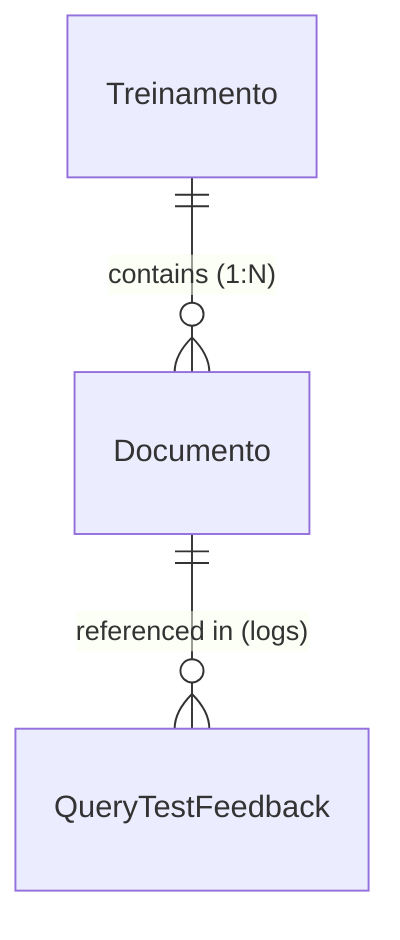

# Módulo Treinamento & IA (RAG)

Este documento descreve os modelos residentes no **Banco de Dados do Tenant** responsáveis pela base de conhecimento RAG (Retrieval-Augmented Generation), armazenamento de chunks e embeddings vetoriais, logs de testes de diálogos e o catálogo de intenções do chatbot (Query Compose).

---

## Mapeamento Vetorial com pgvector

O sistema utiliza a extensão **`pgvector`** do PostgreSQL para realizar a indexação e a busca por proximidade vetorial.
*   **Dimensão do Vetor:** 1536 dimensões (compatível com os modelos `text-embedding-3-small` e `text-embedding-ada-002` da OpenAI).
*   **Métrica de Distância:** Cosseno (`CosineDistance`). Nos testes, o limite padrão de distância aceitável para o RAG de comportamento é `distance_threshold = 0.25`.

---

## Diagrama de Entidades (Treinamento & IA)



---

## 1. Módulo: `treinamento`

### `Treinamento`
Metadados da base de conhecimento de texto inserida pelo administrador do Tenant para alimentar as respostas do Bot.

*   **Nome da Tabela:** `oraculo_treinamento`
*   **Campos:**
    *   `id` (INT, Chave Primária): ID incremental automático.
    *   `tag` (VARCHAR(40), Não Nulo): Identificador curto do contexto do treinamento (ex: `politica_trocas`, `formas_pagamento`).
        *   *Validador:* `validate_identificador`. Apenas minúsculas, números e underscores, sem espaços e máximo 40 caracteres.
    *   `grupo` (VARCHAR(40), Não Nulo): Grupo do treinamento para fins de classificação (ex: `comercial`, `sac`).
        *   *Validador:* `validate_identificador`.
    *   `conteudo` (TEXT, Opcional/Nulo): Conteúdo integral do texto bruto submetido para treinamento (antes de ser quebrado em chunks/pedaços).
    *   `treinamento_finalizado` (BOOLEAN, Padrão: `False`): Indica se o processamento/divisão em blocos de texto foi concluído.
    *   `treinamento_vetorizado` (BOOLEAN, Padrão: `False`): Se os embeddings vetoriais foram gerados com sucesso e salvos na tabela de Documentos.
    *   `data_criacao` (TIMESTAMPTZ, Não Nulo): Data/hora de submissão do texto.
    *   `data_atualizacao` (TIMESTAMPTZ, Não Nulo): Data da última modificação.
*   **Validações Manuais (`clean()`):**
    *   O valor de `grupo` não pode ser idêntico ao valor de `tag` (evita redundância semântica).
*   **Índices:**
    *   `oraculo_treinamento_tag_grupo` (tag, grupo)
    *   `oraculo_treinamento_date` (data_criacao)
    *   `oraculo_treinamento_status` (treinamento_finalizado, treinamento_vetorizado)
*   **Ordenação:** Treinamentos mais novos primeiro (`-data_criacao`).

---

### `Documento`
Chunks/blocos de texto recortados a partir do conteúdo bruto do `Treinamento`. Armazena os vetores correspondentes para busca semântica.

*   **Nome da Tabela:** `oraculo_documento`
*   **Campos:**
    *   `id` (INT, Chave Primária): ID incremental automático.
    *   `treinamento_id` (INT, Chave Estrangeira, Não Nulo): Vínculo com `Treinamento` pai. Cascade ao deletar.
    *   `conteudo` (TEXT, Opcional/Nulo): Fragmento de texto recortado (chunk de texto bruto).
    *   `metadata` (JSONB, Padrão: `{}`): Metadados gerados pelo divisor de documentos (contém tag, grupo, fonte, paginação).
    *   `embedding` (VECTOR(1536), Opcional/Nulo): Vetor de 1536 posições gerado pela API de embeddings (OpenAI ou similar).
    *   `ordem` (INTEGER, Padrão: `1`): Sequência de ordenação do chunk no documento original.
    *   `data_criacao` (TIMESTAMPTZ, Não Nulo): Data de geração.
*   **Métodos e Lógica de Negócio:**
    *   `buscar_documentos_similares(query_vec, top_k, distance_threshold) [Classmethod]`:
        1.  Realiza cálculo de similaridade cosseno utilizando `CosineDistance("embedding", query_vec)`.
        2.  Filtra apenas documentos cujo treinamento pai possua `treinamento_finalizado = True`.
        3.  Filtra por distância menor ou igual a `distance_threshold` (caso não fornecido, usa a constante de configuração do sistema `VECTOR_DISTANCE_THRESHOLD`).
        4.  Retorna o contexto formatado em blocos textuais (`"📚 Contexto relevante:\n[1] Tag - Grupo\nConteudo..."`) e uma lista com os IDs dos documentos recuperados para fins de auditoria e logs.
    *   `limpar_documentos_por_treinamento(treinamento_id) [Classmethod]`: Apaga todos os chunks de um treinamento específico antes de reprocessar.
    *   `criar_documentos_de_chunks(chunks, treinamento_id) [Classmethod]`: Recebe uma lista de objetos `Document` da biblioteca LangChain e os persiste no banco como instâncias de `Documento` mantendo a ordem numérica.
*   **Índices:**
    *   `oraculo_documento_treinamento_ordem_idx` (treinamento, ordem)
*   **Ordenação:** Ordenado por `treinamento` e pelo campo `ordem`.

---

### `QueryTestFeedback`
Registra a avaliação manual realizada por administradores sobre os diálogos e testes do bot. Essencial para avaliar a acurácia do RAG.

*   **Nome da Tabela:** `treinamento_query_test_feedback`
*   **Campos:**
    *   `id` (INT, Chave Primária): ID incremental automático.
    *   `mensagem_original` (TEXT, Não Nulo): Texto da mensagem digitada pelo usuário durante o teste.
    *   `resposta_bot` (TEXT, Não Nulo): Resposta gerada pela LLM.
    *   `resposta_corrigida` (TEXT, Opcional/Nulo): Correção em texto inserida pelo administrador caso a resposta gerada tenha sido ruim.
    *   `avaliacao` (VARCHAR(10), Não Nulo): Avaliação qualitativa. Opções comuns: `"bom"`, `"ruim"`.
    *   `confiabilidade` (FLOAT, Padrão: `0.0`): Grau de certeza retornado pela LLM (SLA de confiança).
    *   `entidades_json` (JSONB, Padrão: `{}`): Payload contendo as entidades identificadas no teste.
    *   `intents_json` (JSONB, Padrão: `{}`): Payload contendo as intenções/intents detectados.
    *   `documentos_ids` (JSONB, Padrão: `[]`): Lista com os IDs de `Documento` (chunks do RAG) que foram injetados no prompt de contexto da LLM para gerar a resposta.
    *   `created_at` (TIMESTAMPTZ, Não Nulo): Data/hora do teste.
*   **Ordenação:** Registros mais novos primeiro (`-created_at`).

---

### `QueryCompose`
Cadastro de intenções (Intents). Mapeia frases e descrições semânticas para prompts de sistema direcionados, permitindo que o bot mude de comportamento dependendo do que o cliente deseja.

*   **Nome da Tabela:** `treinamento_querycompose`
*   **Campos:**
    *   `id` (INT, Chave Primária): ID incremental automático.
    *   `tag` (VARCHAR(40), Não Nulo): Identificador da intenção (ex: `faturamento`, `compras`, `suporte`).
        *   *Validador:* `validate_identificador`.
    *   `grupo` (VARCHAR(40), Não Nulo): Classificador de grupo da intenção.
        *   *Validador:* `validate_identificador`.
    *   `descricao` (TEXT, Não Nulo): Explicação detalhada da intenção. É a base de texto usada para gerar o embedding vetorial.
    *   `exemplo` (TEXT, Não Nulo): Exemplo de frase falada pelo cliente que representa a intenção (ex: *"quero segunda via do boleto"*).
    *   `comportamento` (TEXT, Não Nulo): Prompt system customizado injetado na LLM caso esta intenção seja detectada (ex: *"Você deve solicitar o CNPJ e transferir para o Financeiro"*).
    *   `embedding` (VECTOR(1536), Opcional/Nulo): Vetor gerado a partir da concatenação de tag, descrição e exemplo (obtido via `to_embedding_text()`).
    *   `created_at` (TIMESTAMPTZ, Não Nulo): Data de inclusão.
    *   `updated_at` (TIMESTAMPTZ, Não Nulo): Data da última modificação.
*   **Métodos e Lógica de Negócio:**
    *   `to_embedding_text() -> str`: Gera o texto padronizado para enviar à API de embeddings. Concatena de forma estruturada:
        *   `"Categoria: <tag>"`
        *   `<descricao>`
        *   `"Exemplo: <exemplo>"`
    *   `buscar_comportamento_similar(query_vec, top_k, distance_threshold) [Classmethod]`:
        1.  Realiza busca de similaridade cosseno no banco de dados.
        2.  Aplica o filtro de distância diretamente no banco (`distance__lte=distance_threshold`) para otimização de performance.
        3.  Retorna o prompt formatado com as diretrizes da intenção mais próxima: `"📚 Comportamento que deve ser seguido:\n<comportamento>"`.
    *   `build_intent_types_config() [Classmethod]`: Gera uma string contendo um payload JSON estruturado com todas as intenções ativas agrupadas para alimentar o prompt do classificador de intents da LLM. Estrutura de retorno:
        ```json
        {
          "intent_types": {
            "financeiro": {
              "boleto": "Descrição do boleto...\nExemplos:\n- quero boleto"
            }
          }
        }
        ```
*   **Índices:**
    *   `treinamento_querycompose_tag_idx` (tag)
    *   `treinamento_querycompose_date_idx` (created_at)
