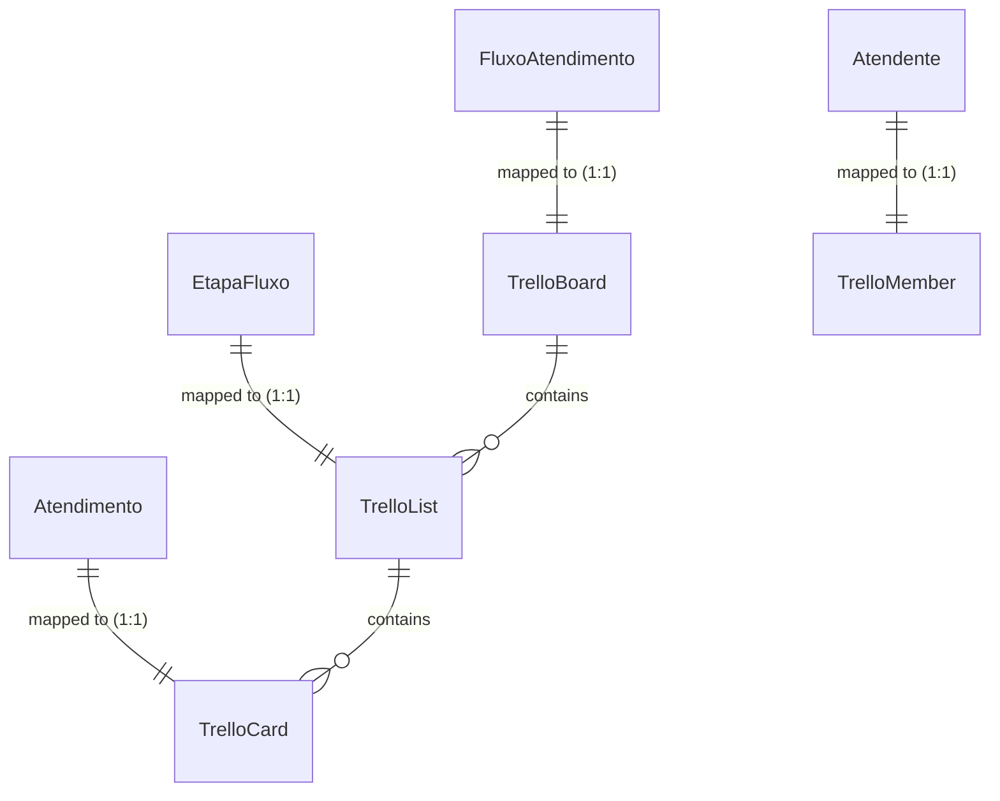
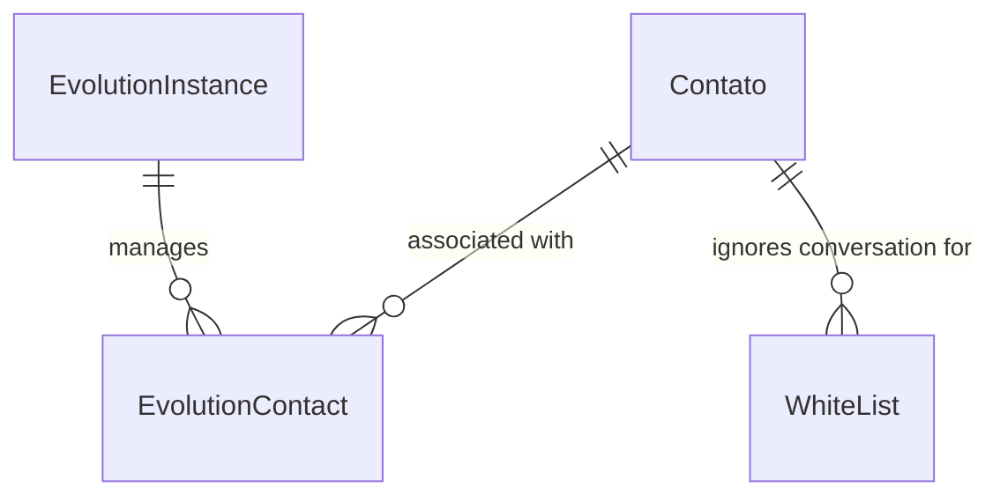

# Módulo Sincronizadores & Integrações (Trello/WhatsApp)

Este documento descreve os modelos residentes no **Banco de Dados do Tenant** responsáveis pelo controle e sincronização com serviços externos de terceiros: a ferramenta Kanban **Trello** e a API do WhatsApp **Evolution API**.

---

## 1. Integração: Trello Sync (`trello_sync`)

Este módulo implementa a sincronização bidirecional. As colunas e cards do Kanban interno do sistema são sincronizados em tempo real com listas e quadros físicos no Trello de cada cliente corporativo.

### Diagrama de Relacionamento (Trello Sync)

---

### `TrelloBoard`
Mapeia um fluxo de atendimento (`FluxoAtendimento`) do sistema para um Quadro (Board) físico no Trello.

*   **Nome da Tabela:** `trello_board_sync`
*   **Campos:**
    *   `id` (INT, Chave Primária): ID incremental automático.
    *   `fluxo_id` (INT, Chave Estrangeira, Não Nulo, Único): Relação um para um com `FluxoAtendimento`. Cascade ao deletar.
    *   `external_id` (VARCHAR(64), Não Nulo, Único): ID único do quadro gerado pelo Trello (obtido via API).
    *   `name` (VARCHAR(200), Não Nulo): Nome do quadro no Trello.
    *   `url` (VARCHAR(200) / URL, Opcional/Nulo): URL pública de acesso ao quadro do Trello.
    *   `metadata` (JSONB, Padrão: `{}`): Metadados estruturados de controle.
    *   `webhook_id` (VARCHAR(64), Padrão: `""`): ID do webhook cadastrado no Trello para escutar movimentações físicas ocorridas diretamente neste quadro.
    *   `created_at` (TIMESTAMPTZ, Não Nulo): Data de criação da sincronização.
    *   `updated_at` (TIMESTAMPTZ, Não Nulo): Data da última modificação.
*   **Índices:**
    *   `trello_board_sync_ext_idx` (external_id)

---

### `TrelloList`
Mapeia uma etapa de fluxo (`EtapaFluxo`) para uma coluna/lista física dentro do quadro do Trello.

*   **Nome da Tabela:** `trello_list_sync`
*   **Campos:**
    *   `id` (INT, Chave Primária): ID incremental automático.
    *   `etapa_id` (INT, Chave Estrangeira, Não Nulo, Único): Relação um para um com `EtapaFluxo`. Cascade ao deletar.
    *   `board_id` (INT, Chave Estrangeira, Não Nulo): Relação com o `TrelloBoard` pai. Cascade ao deletar. related_name: `"lists"`.
    *   `external_id` (VARCHAR(64), Não Nulo, Único): ID da coluna gerado pelo Trello.
    *   `name` (VARCHAR(200), Não Nulo): Nome da coluna no Trello.
    *   `position` (DOUBLE PRECISION, Padrão: `0.0`): Posição numérica da lista para ordenação no quadro do Trello.
    *   `metadata` (JSONB, Padrão: `{}`): Metadados estruturados.
*   **Índices:**
    *   `trello_list_sync_ext_board_idx` (external_id, board)

---

### `TrelloMember`
Mapeia um operador humano (`Atendente`) para um usuário (Membro) físico do Trello, permitindo a atribuição automática de cartões ao operador.

*   **Nome da Tabela:** `trello_member_sync`
*   **Campos:**
    *   `id` (INT, Chave Primária): ID incremental automático.
    *   `atendente_id` (INT, Chave Estrangeira, Não Nulo, Único): Relação um para um com `Atendente`. Cascade ao deletar.
    *   `external_id` (VARCHAR(64), Opcional/Nulo, Único): ID único do membro gerado pelo Trello.
    *   `username` (VARCHAR(100), Padrão: `""`): Username de login do atendente no Trello.
    *   `full_name` (VARCHAR(200), Não Nulo): Nome completo do usuário do Trello.
    *   `email` (VARCHAR(254), Opcional/Nulo): E-mail do usuário do Trello.
    *   `metadata` (JSONB, Padrão: `{}`): Parâmetros adicionais do membro.
    *   `is_invited` (BOOLEAN, Padrão: `False`): Se o usuário já recebeu convite por e-mail para participar da área de trabalho do Trello.
    *   `invite_sent_at` (TIMESTAMPTZ, Opcional/Nulo): Data de envio do convite.
*   **Índices:**
    *   `trello_member_sync_ext_idx` (external_id)

---

### `TrelloCard`
Mapeia um atendimento ativo (`Atendimento`) para um cartão (Card) físico na lista correspondente do Trello.

*   **Nome da Tabela:** `trello_card_sync`
*   **Campos:**
    *   `id` (INT, Chave Primária): ID incremental automático.
    *   `atendimento_id` (INT, Chave Estrangeira, Não Nulo, Único): Relação um para um com `Atendimento`. Cascade ao deletar.
    *   `list_sync_id` (INT, Chave Estrangeira, Não Nulo): Coluna física do Trello na qual o cartão reside (relaciona com `TrelloList`). Cascade ao deletar. related_name: `"cards"`.
    *   `external_id` (VARCHAR(64), Não Nulo, Único): ID único do cartão gerado pelo Trello.
    *   `name` (VARCHAR(200), Não Nulo): Título do cartão no Trello (normalmente mapeado no formato *"Nome do Cliente (Telefone)"*).
    *   `url` (VARCHAR(200) / URL, Opcional/Nulo): Link direto do cartão no Trello.
    *   `metadata` (JSONB, Padrão: `{}`): Parâmetros adicionais do cartão.
    *   `created_at` (TIMESTAMPTZ, Não Nulo): Data de criação.
    *   `updated_at` (TIMESTAMPTZ, Não Nulo): Data da última movimentação/atualização.
*   **Índices:**
    *   `trello_card_sync_ext_list_idx` (external_id, list_sync)

---

### `TrelloWebhookEvent`
Registro histórico e persistente de todos os payloads de webhook de alteração/movimentação recebidos das APIs do Trello. Usado para evitar perdas de sincronização.

*   **Nome da Tabela:** `trello_webhook_event`
*   **Campos:**
    *   `id` (INT, Chave Primária): ID incremental automático.
    *   `action_id` (VARCHAR(64), Não Nulo): ID da ação gerado pelo Trello.
    *   `model_type` (VARCHAR(32), Não Nulo): Tipo de modelo afetado pelo evento (ex: `card`, `list`).
    *   `payload` (JSONB, Não Nulo): Dados brutos do webhook recebido.
    *   `received_at` (TIMESTAMPTZ, Não Nulo): Timestamp do recebimento (gerado automaticamente).
*   **Índices:**
    *   `trello_webhook_event_action_idx` (action_id, model_type)

---

## 2. Integração: WhatsApp Sync (`evolution_sync`)

Este módulo gerencia as instâncias físicas do Evolution API e faz o mapeamento do JID/LID (identificadores do WhatsApp) para a estrutura de contatos do CRM.

### Diagrama de Relacionamento (WhatsApp Sync)

---

### `MediaStorageBackend`
Configurações de armazenamento de mídias suportadas pelo servidor WhatsApp.

*   *Opções do Enum (TextChoices):*
    *   `none` (Sem storage): Download de mídias sob demanda (o painel precisa chamar a API `/message/downloadmedia`).
    *   `s3` (S3/MinIO): O servidor Evolution já grava e disponibiliza a URL direta da mídia no payload (`mediaUrl`), dispensando requisições extras de download.

---

### `EvolutionInstance`
Configuração técnica da instância de conexão física com o WhatsApp na Evolution API.

*   **Nome da Tabela:** `evolution_sync_instance`
*   **Campos:**
    *   `id` (INT, Chave Primária): ID incremental automático.
    *   `tenant_id` (UUID, Opcional/Nulo, db_index=True): UUID de referência ao `Tenant` proprietário. Armazenado como UUID bruto sem FK física para evitar constraint cross-database.
    *   `name` (VARCHAR(100), Não Nulo): Nome de exibição amigável da instância.
    *   `instance_id` (VARCHAR(100), Opcional/Nulo, Único): Identificador de string da instância gerado pela Evolution API.
    *   `api_key` (VARCHAR(256), Não Nulo): Chave/Token de API de segurança da instância específica.
    *   `phone_number` (VARCHAR(20), Opcional/Nulo): Número do WhatsApp conectado.
    *   `active` (BOOLEAN, Padrão: `True`): Flag de ativação.
    *   `connection_state` (VARCHAR(20), Padrão: `"unknown"`): Estado da conexão (ex: `open`, `close`, `unknown`).
    *   `last_state_check` (TIMESTAMPTZ, Opcional/Nulo): Data da última checagem de integridade.
    *   `media_storage_backend` (VARCHAR(10), Padrão: `"s3"`): Provedor de mídias (Enum `MediaStorageBackend`).
    *   `subscribed_events` (JSONB, Padrão: `[]`): Lista com os nomes dos eventos assinados via Webhook (ex: `["MESSAGE", "MESSAGE_UPDATE", "CONNECTION"]`).
    *   `last_connection_state` (VARCHAR(50), Opcional/Nulo): Último estado recebido pelo webhook de conexão, dispensando queries recorrentes de polling de status.
    *   `created_at` (TIMESTAMPTZ, Não Nulo): Data de inclusão.
*   **Propriedades de Código:**
    *   `has_s3 -> bool`: Retorna verdadeiro se o backend da instância é `"s3"`.
*   **Ordenação:** Instâncias mais novas primeiro (`-created_at`).

---

### `EvolutionContact`
Mapeia um contato físico do WhatsApp (JID/LID) para o contato de CRM cadastrado no sistema.

*   **Nome da Tabela:** `evolution_sync_contact`
*   **Campos:**
    *   `id` (INT, Chave Primária): ID incremental automático.
    *   `contact_id` (INT, Chave Estrangeira, Opcional/Nulo): Relação física com `Contato`. Seta nulo em deleção. related_name: `"evolution_links"`.
    *   `instance_id` (INT, Chave Estrangeira, Não Nulo): Relação com `EvolutionInstance` que gerencia a conversa. Cascade ao deletar. related_name: `"contacts"`.
    *   `jid` (VARCHAR(100), Opcional/Nulo): ID oficial do WhatsApp JID do usuário final (ex: `5511999999999@s.whatsapp.net`).
    *   `lid` (VARCHAR(100), Opcional/Nulo): LID do contato (Linked Device ID, usado em novas APIs de aparelhos vinculados).
    *   `addressing_mode` (VARCHAR(8), Opcional/Nulo): Modo de endereçamento do WhatsApp.
    *   `active` (BOOLEAN, Padrão: `True`): Define se o mapeamento está ativo.
    *   `metadados` (JSONB, Padrão: `{}`): Metadados brutos recebidos da Evolution API.
    *   `created_at` (TIMESTAMPTZ, Não Nulo): Data do primeiro mapeamento.
    *   `updated_at` (TIMESTAMPTZ, Não Nulo): Última atualização do registro.
*   **Índices:**
    *   `evolution_sync_contact_jid_idx` (jid)
    *   `evolution_sync_contact_lid_idx` (lid)
    *   `evolution_sync_contact_crm_idx` (contact)
    *   `evolution_sync_contact_inst_idx` (instance)
*   **Ordenação:** Registros atualizados recentemente primeiro (`-updated_at`).

---

### `WhiteList`
Cadastro de números de WhatsApp (como telefones dos sócios da empresa ou grupos internos) que devem ser completamente ignorados pelas automações do Bot de IA, evitando consumo de tokens ou disparos de mensagens automáticas indevidas.

*   **Nome da Tabela:** `evolution_sync_whitelist`
*   **Campos:**
    *   `id` (INT, Chave Primária): ID incremental automático.
    *   `contact_id` (INT, Chave Estrangeira, Opcional/Nulo): Relação física opcional com `Contato` cadastrado. Seta nulo em deleção.
    *   `name` (VARCHAR(100), Não Nulo): Nome descritivo da entrada (ex: "Número Diretor", "Grupo Comercial").
    *   `phone_number` (VARCHAR(20), Não Nulo, Único): Telefone a ser ignorado.
    *   `active` (BOOLEAN, Padrão: `True`): Se o filtro está ativo.
    *   `created_at` (TIMESTAMPTZ, Não Nulo): Data de inclusão.
*   **Ordenação:** Ordenado alfabeticamente por `name`.
