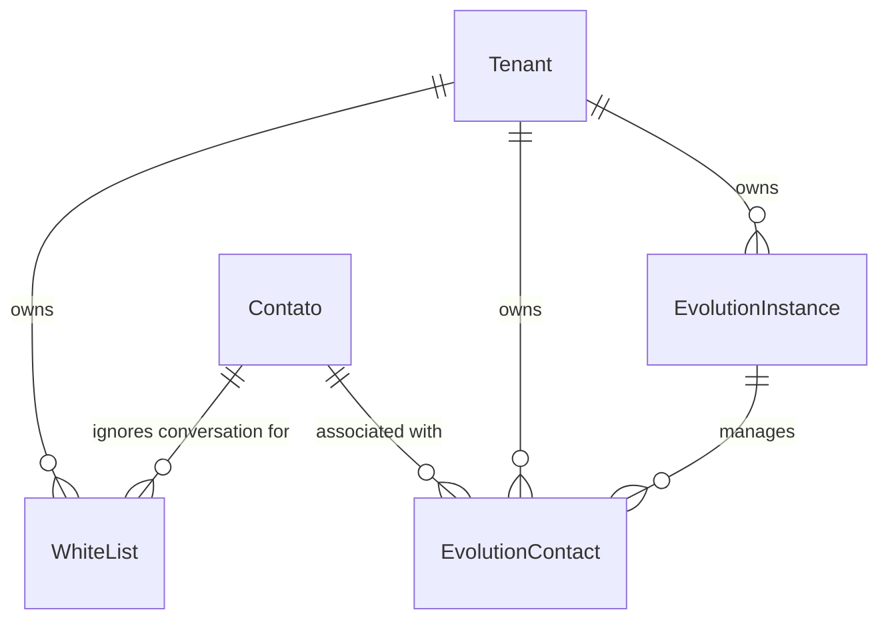

# Módulo Sincronizadores & Integrações

Este documento descreve as integrações do sistema com o mundo externo. Desde a
fase N13 elas são **duas famílias**, com direções opostas:

| Família | Direção | Quem inicia | Credencial |
|---|---|---|---|
| **WhatsApp / Evolution** (§1) | nós → provedor | o sistema | `apikey` da instância, por tenant |
| **Servidor MCP** (§4) | agente externo → nós | um cliente de IA de terceiro | OAuth 2.1 por usuário |

A distinção importa porque o risco é diferente. Na primeira, nós somos o cliente
e a credencial é do tenant. Na segunda, **nós somos o provedor**: quem chega é
software de terceiro agindo em nome de uma pessoa, e a credencial é dela — o que
exige consentimento explícito, escopo por usuário e revogação na mão do dono.

A parte de WhatsApp descreve os modelos que controlam as instâncias conectadas via
**Evolution API**, residindo no **banco de dados único** e isolados logicamente por
`tenant_id`.

---

## 1. Integração: WhatsApp Sync (`evolution_sync`)

Este módulo gerencia as instâncias físicas de comunicação e faz o mapeamento do JID/LID (identificadores do WhatsApp) para a estrutura de contatos do CRM.

### Diagrama de Relacionamento (WhatsApp Sync)

---

### `MediaStorageBackend`
Configurações de armazenamento de mídias suportadas pelo servidor WhatsApp.

*   *Opções do Enum (TextChoices):*
    *   `none` (Sem storage): Download de mídias sob demanda (o painel precisa chamar a API `/message/downloadmedia`).
    *   `s3` (S3-compatible/R2): O servidor Evolution já grava e disponibiliza a URL direta da mídia no payload (`mediaUrl`), dispensando requisições extras de download.

---

### `EvolutionInstance`
Configuração técnica da instância de conexão física com o WhatsApp na Evolution API centralizada.

*   **Nome da Tabela:** `evolution_sync_instance`
*   **Campos:**
    *   `id` (INT, Chave Primária): ID incremental automático.
    *   `tenant_id` (UUID, Chave Estrangeira, Não Nulo): Relacionamento físico com `Tenant`. Cascade ao deletar.
    *   `name` (VARCHAR(100), Não Nulo): Nome de exibição amigável da instância (ex: "Suporte Principal").
    *   `instance_id` (VARCHAR(100), Opcional/Nulo, Único): Identificador de string da instância gerado pela Evolution API.
    *   `api_key` (VARCHAR(256), Não Nulo): Chave/Token de API de segurança da instância específica.
    *   `phone_number` (VARCHAR(20), Opcional/Nulo): Número do WhatsApp conectado.
    *   `active` (BOOLEAN, Padrão: `True`): Flag de ativação no painel.
    *   `connection_state` (VARCHAR(20), Padrão: `"unknown"`): Estado da conexão (ex: `open`, `close`, `unknown`).
    *   `last_state_check` (TIMESTAMPTZ, Opcional/Nulo): Data da última checagem de integridade.
    *   `media_storage_backend` (VARCHAR(10), Padrão: `"s3"`): Provedor de mídias (Enum `MediaStorageBackend`).
    *   `subscribed_events` (JSONB, Padrão: `[]`): Lista com os nomes dos eventos assinados via Webhook (ex: `["MESSAGE", "MESSAGE_UPDATE", "CONNECTION"]`).
    *   `last_connection_state` (VARCHAR(50), Opcional/Nulo): Último estado recebido pelo webhook de conexão.
    *   `created_at` (TIMESTAMPTZ, Não Nulo): Data de inclusão.
*   **Restrições e Unicidade:**
    *   Unicidade composta: A combinação de `tenant_id` e `name` deve ser única.
*   **Propriedades de Código:**
    *   `has_s3 -> bool`: Retorna verdadeiro se o backend da instância é `"s3"`.
*   **Indices:**
    *   `evolution_sync_instance_tenant_state` (tenant_id, active, connection_state)
*   **Ordenação:** Instâncias mais novas primeiro (`-created_at`).

---

### `EvolutionContact`
Mapeia um contato físico do WhatsApp (JID/LID) para o contato de CRM cadastrado no sistema do Tenant.

*   **Nome da Tabela:** `evolution_sync_contact`
*   **Campos:**
    *   `id` (INT, Chave Primária): ID incremental automático.
    *   `tenant_id` (UUID, Chave Estrangeira, Não Nulo): Relacionamento físico com `Tenant`. Cascade ao deletar.
    *   `contact_id` (INT, Chave Estrangeira, Opcional/Nulo): Relação física com `Contato`. Seta nulo em deleção. related_name: `"evolution_links"`.
    *   `instance_id` (INT, Chave Estrangeira, Não Nulo): Relação física com `EvolutionInstance` que gerencia a conversa. Cascade ao deletar. related_name: `"contacts"`.
    *   `jid` (VARCHAR(100), Opcional/Nulo): ID oficial do WhatsApp JID do usuário final (ex: `5511999999999@s.whatsapp.net`).
    *   `lid` (VARCHAR(100), Opcional/Nulo): LID do contato (Linked Device ID).
    *   `addressing_mode` (VARCHAR(8), Opcional/Nulo): Modo de endereçamento do WhatsApp.
    *   `active` (BOOLEAN, Padrão: `True`): Define se o mapeamento está ativo.
    *   `metadados` (JSONB, Padrão: `{}`): Metadados brutos recebidos da Evolution API.
    *   `created_at` (TIMESTAMPTZ, Não Nulo): Data do primeiro mapeamento.
    *   `updated_at` (TIMESTAMPTZ, Não Nulo): Última atualização do registro.
*   **Restrições e Unicidade:**
    *   Unicidade composta: A combinação de `tenant_id`, `instance_id` e `jid` deve ser única.
*   **Índices:**
    *   `evolution_sync_contact_tenant_jid` (tenant_id, jid)
    *   `evolution_sync_contact_tenant_lid` (tenant_id, lid)
    *   `evolution_sync_contact_tenant_crm` (tenant_id, contact_id)
*   **Ordenação:** Registros atualizados recentemente primeiro (`-updated_at`).

---

### `WhiteList`
Cadastro de números de WhatsApp que devem ser completamente ignorados pelas automações do Bot de IA de um Tenant específico (evitando consumo de tokens e triggers indesejados).

*   **Nome da Tabela:** `evolution_sync_whitelist`
*   **Campos:**
    *   `id` (INT, Chave Primária): ID incremental automático.
    *   `tenant_id` (UUID, Chave Estrangeira, Não Nulo): Relacionamento físico com `Tenant`. Cascade ao deletar.
    *   `contact_id` (INT, Chave Estrangeira, Opcional/Nulo): Relação física opcional com `Contato` cadastrado no tenant. Seta nulo em deleção.
    *   `name` (VARCHAR(100), Não Nulo): Nome descritivo da entrada (ex: "Número Diretor", "Grupo Comercial").
    *   `phone_number` (VARCHAR(20), Não Nulo): Telefone a ser ignorado.
    *   `active` (BOOLEAN, Padrão: `True`): Se o filtro está ativo.
    *   `created_at` (TIMESTAMPTZ, Não Nulo): Data de inclusão.
*   **Restrições e Unicidade:**
    *   Unicidade composta: A combinação de `tenant_id` e `phone_number` deve ser única.
*   **Ordenação:** Ordenado alfabeticamente por `name`.

---

## 4. Integração: Servidor MCP (agentes de IA externos)

Fase **N13**. Permite que um agente de IA externo — Claude (web, desktop, mobile,
Cowork, Code), Cursor, ChatGPT — configure e opere o tenant **em nome do usuário
que autorizou**.

### 4.1 Inversão de papel

Nas integrações anteriores nós chamamos alguém. Aqui alguém nos chama, e o
"alguém" é um modelo de linguagem executando instruções em linguagem natural. As
consequências de desenho:

* **A autorização é por pessoa, não por tenant.** O `api_key` do tenant não serve:
  ele não distingue quem pediu, e o limite do módulo é "o agente nunca faz nada
  que o usuário que o autorizou não pudesse fazer no painel".
* **Consentimento é explícito e revogável.** O usuário vê o que está concedendo e
  pode desconectar — o que não existe numa chave de tenant.
* **A superfície é descrita, não documentada.** A descrição de cada operação é
  lida pelo modelo e determina se ele acerta. Descrição ruim não gera erro: gera
  agente que erra com confiança.

### 4.2 Modelo de dados

Uma tabela nova, `mcp_oauth_grant` (migration `0030`) — o consentimento de um
usuário a um cliente:

| Coluna | Nota |
|---|---|
| `tenant_id`, `user_id` | RLS por tenant; toda consulta filtra também por usuário |
| `client_id` | URL do Client ID Metadata Document. Na spec MCP, o `client_id` **é** a URL — não há registro prévio de aplicativo (DCR foi deprecado) |
| `client_name` | Nome exibido, vindo do documento do terceiro. **Texto não confiável**: escapado na renderização e limitado a 200 caracteres |
| `redirect_uri` | O exato usado, para a trilha |
| `scopes` | Escopos concedidos (catálogo do doc 09 §3) |
| `refresh_token_hash` | SHA-256 do segredo, rotacionado a cada uso. Reapresentar um hash antigo **derruba o grant inteiro** |
| `revoked_at` | Revogação soft — a trilha de auditoria referencia `grant_id` |

O **access token** não é persistido em lugar nenhum: é um JWT RS256 de ~15 min. O
**código de autorização** vive no Redis, com TTL de ~60s e consumo atômico por
`GETDEL` (uso único).

### 4.3 Componentes

| Componente | Papel OAuth | Onde vive |
|---|---|---|
| `control_plane` (módulo `oauth/`) | **Authorization server** | `auth.smartcoreassistant.com.br` |
| `mcp_server` (Python) | **Resource server** | `mcp.smartcoreassistant.com.br` |

Os tokens são assinados com **par de chaves RSA**: o `control_plane` tem a
privada, o `mcp_server` só a pública. Assimétrico de propósito — o `mcp_server` é
o processo exposto à internet e o que executa entrada de terceiros, e ele
**confere** tokens sem poder **emitir** nenhum.

### 4.4 Dois invariantes

**O `mcp_server` não alcança o banco.** Sem `DATABASE_URL`, fora da rede
`internal`, numa rede própria (`mcp_net`) onde os nomes `postgres`,
`data_postgres` e `data_redis` não resolvem. Toda leitura e escrita passa pelo
`runtime_api`, herdando o interceptor de autenticação, a RLS e a auditoria que já
existem. É topologia, não convenção — e há teste provando.

**O token do cliente nunca é repassado.** Ele é trocado por um JWT interno de vida
curta antes de qualquer chamada ao backend. Exigência normativa da spec MCP:
*"The MCP server MUST NOT pass through the token it received from the MCP
client."*

### 4.5 Trilha de auditoria

Sem tabela nova. Os eventos entram no `audit_log` existente:

* `oauth.consentimento_concedido` (INFO), com `client_id`, `client_name` e escopos;
* `oauth.grant_revogado` (INFO);
* `oauth.refresh_reutilizado` (**WARN** — sinal de roubo de token);
* as ações em si (`mensagem.enviada`, `<entidade>.desativada`) já eram auditadas;
  o que muda é o campo `user_agent`, que passa a carregar
  `SmartCoreAssistant-MCP/<tool>`. É por ele que se distingue ação de agente de
  ação humana com um filtro só.

**Nunca na trilha:** código de autorização, `code_verifier`, refresh token, access
token, hash, conteúdo de mensagem, telefone ou nome de contato, chave de provedor.

### 4.6 Referências

* Guia do usuário final: `doc_dev/apis/mcp-guia-do-usuario.md`
* README técnico do módulo: `mcp_server/README.md`
* Plano da fase: `.context/plans/n13-mcp-agentes.md`
