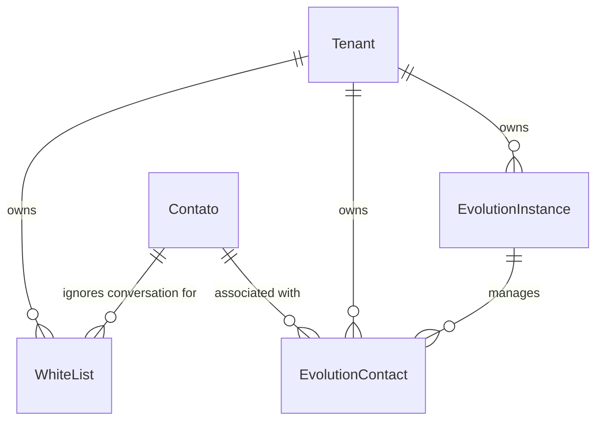

# Módulo Sincronizadores & Integrações (WhatsApp)

Este documento descreve os modelos responsáveis pelo controle das instâncias do WhatsApp conectadas via **Evolution API** no único servidor central, residindo no **banco de dados único** do sistema e isolados logicamente por `tenant_id`.

---

## 1. Integração: WhatsApp Sync (`evolution_sync`)

Este módulo gerencia as instâncias físicas de comunicação e faz o mapeamento do JID/LID (identificadores do WhatsApp) para a estrutura de contatos do CRM.

### Diagrama de Relacionamento (WhatsApp Sync)

---

### `MediaStorageBackend`
Configurações de armazenamento de mídias suportadas pelo servidor WhatsApp.

*   *Opções do Enum (TextChoices):*
    *   `none` (Sem storage): Download de mídias sob demanda (o painel precisa chamar a API `/message/downloadmedia`).
    *   `s3` (S3-compatible/R2): O servidor Evolution já grava e disponibiliza a URL direta da mídia no payload (`mediaUrl`), dispensando requisições extras de download.

---

### `EvolutionInstance`
Configuração técnica da instância de conexão física com o WhatsApp na Evolution API centralizada.

*   **Nome da Tabela:** `evolution_sync_instance`
*   **Campos:**
    *   `id` (INT, Chave Primária): ID incremental automático.
    *   `tenant_id` (UUID, Chave Estrangeira, Não Nulo): Relacionamento físico com `Tenant`. Cascade ao deletar.
    *   `name` (VARCHAR(100), Não Nulo): Nome de exibição amigável da instância (ex: "Suporte Principal").
    *   `instance_id` (VARCHAR(100), Opcional/Nulo, Único): Identificador de string da instância gerado pela Evolution API.
    *   `api_key` (VARCHAR(256), Não Nulo): Chave/Token de API de segurança da instância específica.
    *   `phone_number` (VARCHAR(20), Opcional/Nulo): Número do WhatsApp conectado.
    *   `active` (BOOLEAN, Padrão: `True`): Flag de ativação no painel.
    *   `connection_state` (VARCHAR(20), Padrão: `"unknown"`): Estado da conexão (ex: `open`, `close`, `unknown`).
    *   `last_state_check` (TIMESTAMPTZ, Opcional/Nulo): Data da última checagem de integridade.
    *   `media_storage_backend` (VARCHAR(10), Padrão: `"s3"`): Provedor de mídias (Enum `MediaStorageBackend`).
    *   `subscribed_events` (JSONB, Padrão: `[]`): Lista com os nomes dos eventos assinados via Webhook (ex: `["MESSAGE", "MESSAGE_UPDATE", "CONNECTION"]`).
    *   `last_connection_state` (VARCHAR(50), Opcional/Nulo): Último estado recebido pelo webhook de conexão.
    *   `created_at` (TIMESTAMPTZ, Não Nulo): Data de inclusão.
*   **Restrições e Unicidade:**
    *   Unicidade composta: A combinação de `tenant_id` e `name` deve ser única.
*   **Propriedades de Código:**
    *   `has_s3 -> bool`: Retorna verdadeiro se o backend da instância é `"s3"`.
*   **Indices:**
    *   `evolution_sync_instance_tenant_state` (tenant_id, active, connection_state)
*   **Ordenação:** Instâncias mais novas primeiro (`-created_at`).

---

### `EvolutionContact`
Mapeia um contato físico do WhatsApp (JID/LID) para o contato de CRM cadastrado no sistema do Tenant.

*   **Nome da Tabela:** `evolution_sync_contact`
*   **Campos:**
    *   `id` (INT, Chave Primária): ID incremental automático.
    *   `tenant_id` (UUID, Chave Estrangeira, Não Nulo): Relacionamento físico com `Tenant`. Cascade ao deletar.
    *   `contact_id` (INT, Chave Estrangeira, Opcional/Nulo): Relação física com `Contato`. Seta nulo em deleção. related_name: `"evolution_links"`.
    *   `instance_id` (INT, Chave Estrangeira, Não Nulo): Relação física com `EvolutionInstance` que gerencia a conversa. Cascade ao deletar. related_name: `"contacts"`.
    *   `jid` (VARCHAR(100), Opcional/Nulo): ID oficial do WhatsApp JID do usuário final (ex: `5511999999999@s.whatsapp.net`).
    *   `lid` (VARCHAR(100), Opcional/Nulo): LID do contato (Linked Device ID).
    *   `addressing_mode` (VARCHAR(8), Opcional/Nulo): Modo de endereçamento do WhatsApp.
    *   `active` (BOOLEAN, Padrão: `True`): Define se o mapeamento está ativo.
    *   `metadados` (JSONB, Padrão: `{}`): Metadados brutos recebidos da Evolution API.
    *   `created_at` (TIMESTAMPTZ, Não Nulo): Data do primeiro mapeamento.
    *   `updated_at` (TIMESTAMPTZ, Não Nulo): Última atualização do registro.
*   **Restrições e Unicidade:**
    *   Unicidade composta: A combinação de `tenant_id`, `instance_id` e `jid` deve ser única.
*   **Índices:**
    *   `evolution_sync_contact_tenant_jid` (tenant_id, jid)
    *   `evolution_sync_contact_tenant_lid` (tenant_id, lid)
    *   `evolution_sync_contact_tenant_crm` (tenant_id, contact_id)
*   **Ordenação:** Registros atualizados recentemente primeiro (`-updated_at`).

---

### `WhiteList`
Cadastro de números de WhatsApp que devem ser completamente ignorados pelas automações do Bot de IA de um Tenant específico (evitando consumo de tokens e triggers indesejados).

*   **Nome da Tabela:** `evolution_sync_whitelist`
*   **Campos:**
    *   `id` (INT, Chave Primária): ID incremental automático.
    *   `tenant_id` (UUID, Chave Estrangeira, Não Nulo): Relacionamento físico com `Tenant`. Cascade ao deletar.
    *   `contact_id` (INT, Chave Estrangeira, Opcional/Nulo): Relação física opcional com `Contato` cadastrado no tenant. Seta nulo em deleção.
    *   `name` (VARCHAR(100), Não Nulo): Nome descritivo da entrada (ex: "Número Diretor", "Grupo Comercial").
    *   `phone_number` (VARCHAR(20), Não Nulo): Telefone a ser ignorado.
    *   `active` (BOOLEAN, Padrão: `True`): Se o filtro está ativo.
    *   `created_at` (TIMESTAMPTZ, Não Nulo): Data de inclusão.
*   **Restrições e Unicidade:**
    *   Unicidade composta: A combinação de `tenant_id` e `phone_number` deve ser única.
*   **Ordenação:** Ordenado alfabeticamente por `name`.
