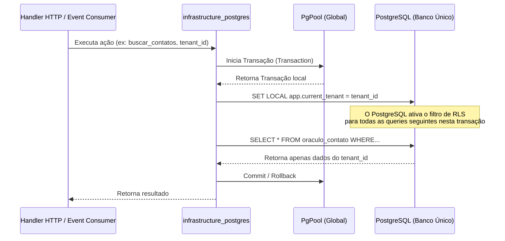

# Estratégia de Implementação de Banco de Dados em Rust (Crate `infrastructure_postgres`)

Este documento descreve a arquitetura técnica revisada e detalhada para a implementação da persistência de dados na crate `server/crates/infrastructure_postgres/`, cobrindo banco de dados único com Row-Level Security (RLS), mapeamento de modelos, gerenciamento de cache de configurações em memória e busca vetorial (IA) em **Rust**.

---

## 1. Stack Tecnológica de Banco de Dados

A stack do backend Rust foi selecionada para priorizar a validação estática de queries, segurança de tipos e alta performance de concorrência com o banco unificado.

| Crate Rust | Versão | Função Principal | Justificativa Técnica |
| :--- | :--- | :--- | :--- |
| **`sqlx`** | `0.8.2` | Driver PostgreSQL Assíncrono | Validação estática de queries SQL em tempo de compilação. Sem overhead de ORM tradicional. |
| **`pgvector`** | `0.4.0` | Integração Vetorial | Suporte nativo ao tipo `vector` no PostgreSQL e compatibilidade com macros do SQLx. |
| **`dashmap`** | `6.1.0` | Cache Concorrente em Memória | Usado para manter as configurações resolvidas de IA de cada tenant em memória de forma thread-safe, evitando queries repetidas ao PostgreSQL. |
| **`redis`** | `0.27.5` | Ponte Redis para `ia_engine` | Publica configs resolvidas no Redis para consumo do Python; gerenciado pela crate `infrastructure_redis`. |
| **`rust_decimal`**| `1.36.0`| Precisão Monetária | Manipulação de valores financeiros (`NUMERIC` no PostgreSQL) nas tabelas de faturamento. |
| **`chrono`** | `0.4.38`| Controle Temporal | Mapeamento nativo de campos `TIMESTAMPTZ` com fuso horário UTC consistente. |
| **`serde` / `serde_json`**| `1.0.219`| Serialização | Processamento de campos estruturados JSONB (`metadata` do RAG e payloads de integrações). |
| **`aes-gcm`** | `0.10.3`| Criptografia | Descriptografia simétrica das chaves de API locais salvas na tabela `TenantConfig`. |

---

## 2. Arquitetura de Banco Único e Isolamento Lógico (RLS)

O sistema adota uma arquitetura de **Isolamento Lógico via Row-Level Security (RLS)** no PostgreSQL. Toda a aplicação conecta-se a um único pool global de conexões (`PgPool`) conectado ao banco de dados unificado.

### 2.1 O Fluxo de Isolamento de Transação RLS

Antes de executar qualquer leitura ou escrita que afete tabelas de negócio do tenant, a transação SQLx deve configurar o contexto do `tenant_id` atual:



### 2.2 Padrão de Execução de Queries com Contexto RLS no SQLx

Abaixo está o padrão recomendado para encapsular a inicialização da transação com a injeção obrigatória do contexto do tenant:

```rust
use sqlx::{PgPool, Transaction, Postgres};
use uuid::Uuid;
use crate::errors::DbError;

/// Executa um bloco de código sob transação configurada com o tenant_id para RLS
pub async fn run_in_tenant_transaction<F, T, Fut>(
    pool: &PgPool,
    tenant_id: Uuid,
    callback: F,
) -> Result<T, DbError>
where
    F: FnOnce(Transaction<'_, Postgres>) -> Fut,
    Fut: std::future::Future<Output = Result<(T, Transaction<'_, Postgres>), DbError>>,
{
    // 1. Iniciar transação no pool global
    let mut tx = pool.begin().await.map_err(DbError::SqlxError)?;

    // 2. Seta o contexto do tenant na sessão local da transação
    // O valor fica restrito a esta transação devido ao modificador LOCAL
    sqlx::query("SET LOCAL app.current_tenant = $1")
        .bind(tenant_id)
        .execute(&mut *tx)
        .await
        .map_err(DbError::SqlxError)?;

    // 3. Executar o callback que contém as queries específicas
    let (result, tx_final) = callback(tx).await?;

    // 4. Efetuar o commit final
    tx_final.commit().await.map_err(DbError::SqlxError)?;

    Ok(result)
}
```

---

## 3. Cache Concorrente de Configurações (`TenantConfigCache`)

Como as requisições HTTP e webhooks consultam constantemente os dados de persona, chaves de API locais e thresholds de IA, buscar esses parâmetros no banco a cada mensagem geraria latência excessiva. A crate `infrastructure_postgres` mantém um cache concorrente em memória via `DashMap`.

**Responsabilidades duplas do cache:**
1. **Cache local DashMap** — serve as próprias queries Rust com latência zero.
2. **Ponte Redis** — publica o `RuntimeConfig` resolvido no Redis para consumo do `ia_engine` Python (que não acessa o PostgreSQL diretamente). Este papel pertence formalmente à crate `infrastructure_redis`, mas a resolução de fallbacks (Tenant > CoreSettings) acontece aqui.

```rust
// Localização: server/crates/infrastructure_postgres/src/config_cache.rs
use std::sync::Arc;
use dashmap::DashMap;
use sqlx::PgPool;
use uuid::Uuid;
use serde::{Deserialize, Serialize};
use crate::errors::DbError;

/// Config completa resolvida após aplicar a cascata Tenant > CoreSettings.
/// Todos os campos são Not-Null aqui — os fallbacks já foram aplicados.
#[derive(Debug, Clone, Serialize, Deserialize)]
pub struct RuntimeConfig {
    pub tenant_id: Uuid,

    // --- Prompts de IA ---
    pub dados_empresa: String,
    pub persona_bot: String,
    pub bot_agent_name: String,

    // --- Mensagens automáticas ---
    pub msg_fallback: String,
    pub msg_sem_info: String,
    pub msg_transferencia: String,

    // --- LLM ---
    pub llm_class: String,       // ex: "ChatGroq", "ChatOpenAI"
    pub model: String,           // ex: "llama-3.3-70b-versatile"
    pub llm_temperature: f64,

    // --- Transcrição ---
    pub transcription_provider: String,  // ex: "groq", "openai"
    pub transcription_model: String,     // ex: "whisper-large-v3-turbo"

    // --- Visão ---
    pub vision_provider: String,   // ex: "google", "openai"
    pub vision_model: String,      // ex: "gemini-2.5-flash"

    // --- Embeddings e RAG ---
    pub embeddings_class: String,  // ex: "OpenAIEmbeddings"
    pub embeddings_model: String,  // ex: "text-embedding-3-small"
    pub chunk_size: i32,
    pub chunk_overlap: i32,

    // --- Thresholds ---
    pub similarity_threshold: f64,
    pub vector_distance_threshold: f64,

    // --- Chaves de API (descriptografadas, prontas para uso) ---
    pub openai_api_key: String,
    pub groq_api_key: String,
    pub google_api_key: String,
}

pub struct TenantConfigCache {
    pool: PgPool,
    cache: DashMap<Uuid, Arc<RuntimeConfig>>,
}

impl TenantConfigCache {
    pub fn new(pool: PgPool) -> Self {
        Self { pool, cache: DashMap::new() }
    }

    /// Obtém configurações do tenant com fallback Tenant > CoreSettings.
    /// Primeiro tenta o DashMap local; em cache miss, busca do PostgreSQL.
    pub async fn get_config(&self, tenant_id: Uuid) -> Result<Arc<RuntimeConfig>, DbError> {
        if let Some(config_ref) = self.cache.get(&tenant_id) {
            return Ok(config_ref.clone());
        }

        let config = Arc::new(self.resolve_from_db(tenant_id).await?);
        self.cache.insert(tenant_id, config.clone());
        Ok(config)
    }

    /// Resolve a configuração do banco aplicando a cascata Tenant > CoreSettings.
    /// Chamado em cache miss ou após invalidação.
    async fn resolve_from_db(&self, tenant_id: Uuid) -> Result<RuntimeConfig, DbError> {
        // 1. Lê CoreSettings (base global)
        let core = self.load_core_settings().await?;

        // 2. Lê TenantConfig (sobrescreve campos não nulos)
        let tenant = sqlx::query!(
            r#"
            SELECT dados_empresa, persona_bot, bot_agent_name,
                   msg_fallback, msg_sem_info, msg_transferencia,
                   llm_class, model, llm_temperature,
                   transcription_provider, transcription_model,
                   vision_provider, vision_model,
                   embeddings_class, embeddings_model,
                   chunk_size, chunk_overlap,
                   similarity_threshold, vector_distance_threshold,
                   api_keys
            FROM tenants_tenantconfig
            WHERE tenant_id = $1
            "#,
            tenant_id
        )
        .fetch_one(&self.pool)
        .await
        .map_err(DbError::SqlxError)?;

        // 3. Aplica precedência: usa valor do tenant se preenchido, caso contrário usa o global
        let api_keys: serde_json::Value = tenant.api_keys.unwrap_or_default();

        Ok(RuntimeConfig {
            tenant_id,
            dados_empresa: tenant.dados_empresa.unwrap_or_default(),
            persona_bot: tenant.persona_bot.unwrap_or_default(),
            bot_agent_name: tenant.bot_agent_name.unwrap_or_default(),
            msg_fallback: tenant.msg_fallback.unwrap_or_else(|| core.msg_fallback.clone()),
            msg_sem_info: tenant.msg_sem_info.unwrap_or_else(|| core.msg_sem_info.clone()),
            msg_transferencia: tenant.msg_transferencia.unwrap_or_else(|| core.msg_transferencia.clone()),
            llm_class: tenant.llm_class.filter(|s| !s.is_empty()).unwrap_or(core.llm_class),
            model: tenant.model.filter(|s| !s.is_empty()).unwrap_or(core.model),
            llm_temperature: tenant.llm_temperature.map(|v| v.to_f64().unwrap_or(0.7)).unwrap_or(core.llm_temperature),
            transcription_provider: tenant.transcription_provider.filter(|s| !s.is_empty()).unwrap_or(core.transcription_provider),
            transcription_model: tenant.transcription_model.filter(|s| !s.is_empty()).unwrap_or(core.transcription_model),
            vision_provider: tenant.vision_provider.filter(|s| !s.is_empty()).unwrap_or(core.vision_provider),
            vision_model: tenant.vision_model.filter(|s| !s.is_empty()).unwrap_or(core.vision_model),
            embeddings_class: tenant.embeddings_class.filter(|s| !s.is_empty()).unwrap_or(core.embeddings_class),
            embeddings_model: tenant.embeddings_model.filter(|s| !s.is_empty()).unwrap_or(core.embeddings_model),
            chunk_size: tenant.chunk_size.unwrap_or(core.chunk_size),
            chunk_overlap: tenant.chunk_overlap.unwrap_or(core.chunk_overlap),
            similarity_threshold: tenant.similarity_threshold.map(|v| v.to_f64().unwrap_or(0.40)).unwrap_or(core.similarity_threshold),
            vector_distance_threshold: tenant.vector_distance_threshold.map(|v| v.to_f64().unwrap_or(0.25)).unwrap_or(core.vector_distance_threshold),
            // Chave local do tenant tem prioridade; fallback para a global
            openai_api_key: decrypt_from_jsonb(&api_keys, "openai_api_key").unwrap_or(core.openai_api_key),
            groq_api_key: decrypt_from_jsonb(&api_keys, "groq_api_key").unwrap_or(core.groq_api_key),
            google_api_key: decrypt_from_jsonb(&api_keys, "google_api_key").unwrap_or(core.google_api_key),
        })
    }

    /// Invalida o DashMap local. Deve ser chamado pela crate infrastructure_redis
    /// ao receber o evento de invalidação do Redis Pub/Sub.
    pub fn invalidate(&self, tenant_id: &Uuid) {
        self.cache.remove(tenant_id);
    }
}
```

### 3.1 Publicação no Redis (Ponte para o `ia_engine` Python)

Após resolver a configuração do banco, o backend Rust publica o `RuntimeConfig` no Redis para que o `ia_engine` Python o consuma sem acesso direto ao PostgreSQL. Esta lógica fica na crate `infrastructure_redis`:

```rust
// Localização: server/crates/infrastructure_redis/src/config_publisher.rs
use infrastructure_postgres::config_cache::RuntimeConfig;
use uuid::Uuid;

pub async fn publish_config(
    redis: &mut redis::aio::MultiplexedConnection,
    config: &RuntimeConfig,
) -> Result<(), redis::RedisError> {
    let tenant_id = config.tenant_id;
    let key = format!("tenant:config:{}", tenant_id);
    let json = serde_json::to_string(config).expect("RuntimeConfig é sempre serializável");

    // Salva a config resolvida (TTL de 24h, renovado a cada leitura do Python)
    redis::cmd("SET")
        .arg(&key)
        .arg(&json)
        .arg("EX")
        .arg(86400_u64)
        .query_async(redis)
        .await?;

    // Notifica o ia_engine para invalidar o cache local em memória
    redis::cmd("PUBLISH")
        .arg("tenant:config:invalidate")
        .arg(tenant_id.to_string())
        .query_async(redis)
        .await?;

    Ok(())
}
```

---

## 4. Gerenciamento de Migrações e Inicialização

Diferente da arquitetura de múltiplos bancos em que precisávamos provisionar em runtime, na arquitetura de banco de dados único **todas as migrações (Core e tabelas do Tenant) são embutidas e aplicadas na inicialização da aplicação** de forma sequencial.

```rust
/// Inicializa e atualiza o banco de dados unificado aplicando as migrations
pub async fn inicializar_banco_dados(pool: &PgPool) -> Result<(), sqlx::migrate::MigrateError> {
    // Aplica as migrations do diretório unificado
    sqlx::migrate!("./migrations")
        .run(pool)
        .await?;

    Ok(())
}
```

---

## 5. Implementação de pgvector no Banco Único

Embora o RLS esteja ativo na transação, a busca de similaridade vetorial **deve** incluir explicitamente `tenant_id = $1` para garantir uso dos índices HNSW criados com escopo do tenant. O filtro duplo (RLS + cláusula explícita) é a única forma de garantir performance adequada em buscas vetoriais multi-tenant.

### Exemplo de Busca de Similaridade Vetorial:

```rust
use pgvector::Vector;

pub async fn buscar_documentos_similares(
    tx: &mut Transaction<'_, Postgres>,
    tenant_id: Uuid,
    query_embedding: Vec<f32>,
    limit: i64,
    distance_threshold: f64,
) -> Result<Vec<(Documento, f64)>, sqlx::Error> {
    let query_vector = Vector::from(query_embedding);

    let records = sqlx::query!(
        r#"
        SELECT 
            d.id, d.treinamento_id, d.conteudo, d.metadata, d.ordem, d.data_criacao,
            (d.embedding <=> $1) as "distancia!"
        FROM oraculo_documento d
        INNER JOIN oraculo_treinamento t ON d.treinamento_id = t.id
        WHERE d.tenant_id = $2
          AND t.treinamento_finalizado = true
          AND d.embedding IS NOT NULL
          AND (d.embedding <=> $1) <= $3
        ORDER BY d.embedding <=> $1
        LIMIT $4
        "#,
        query_vector as _,
        tenant_id,
        distance_threshold,
        limit
    )
    .fetch_all(&mut **tx)
    .await?;

    // Mapeamento para struct Documento...
    Ok(documentos)
}
```

---

## 6. Próximos Passos de Implementação

1. **Scripts de Migrações do PostgreSQL (`infrastructure_postgres/migrations/`):**
   Cada tabela de negócio de tenant deve ter RLS habilitado e a política de isolamento criada:
   ```sql
   -- Exemplo: 0004_clientes_contatos.sql
   CREATE TABLE oraculo_contato ( ... );

   ALTER TABLE oraculo_contato ENABLE ROW LEVEL SECURITY;
   CREATE POLICY contato_tenant_isolation ON oraculo_contato
   USING (tenant_id = NULLIF(current_setting('app.current_tenant', true), '')::uuid);
   ```
2. **Middleware Axum de Contexto (`apps/runtime_api/src/middleware/auth.rs`):**
   Decodifica o JWT da requisição, extrai `tenant_id` e `user_id`, carrega `user_scopes` e `flow_permissions` do `TenantUser` no banco, constrói o `RequestContext` completo e o injeta como `Extension` nos handlers via `axum::middleware::from_fn`.
3. **Pre-warm de Cache na Inicialização:**
   Na inicialização dos binários `worker` e `runtime_api`, o `TenantConfigCache` deve carregar e resolver as configurações de todos os tenants ativos de uma vez, publicando no Redis. Isso garante que a primeira mensagem de cada inquilino não sofra latência de cache-miss.
4. **Listener de Invalidação Redis no `ia_engine`:**
   Implementar o subscriber Pub/Sub em `ia_engine/src/config/listener.py` para escutar o canal `tenant:config:invalidate` e chamar `cache.invalidate(tenant_id)` a cada notificação publicada pelo Rust.
