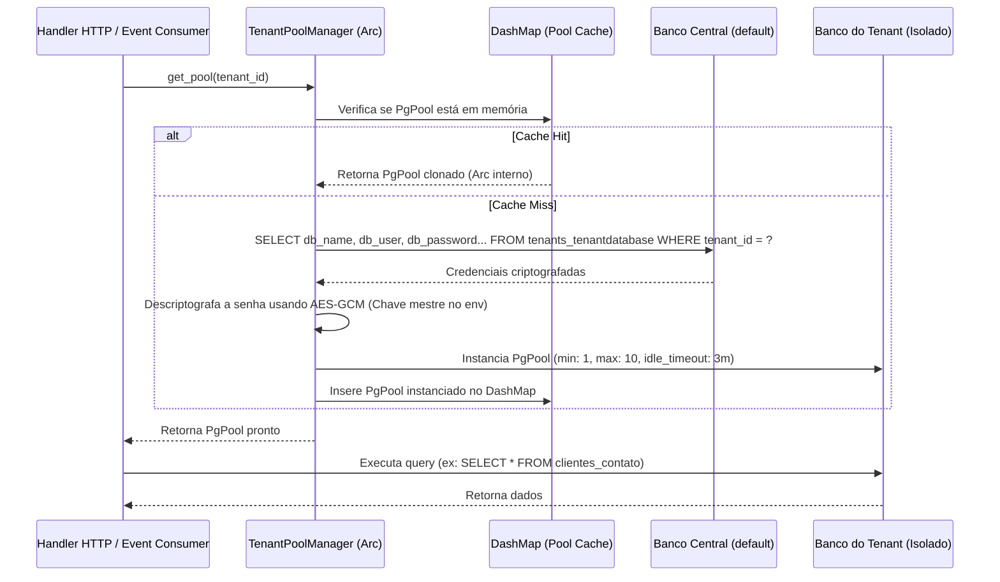

# Estratégia de Implementação de Banco de Dados em Rust

Este documento descreve a arquitetura técnica revisada e detalhada para a implementação do banco de dados, mapeamento de modelos, gerenciamento dinâmico de conexões multitenant e suporte a operações de busca vetorial (IA) utilizando a linguagem **Rust**.

---

## 1. Stack Tecnológica de Banco de Dados

A stack do backend Rust foi selecionada para priorizar concorrência assíncrona, segurança em tempo de compilação e isolamento físico rígido entre os inquilinos (tenants).

| Crate Rust | Versão | Função Principal | Justificativa Técnica |
| :--- | :--- | :--- | :--- |
| **`sqlx`** | `0.7.3` | Driver PostgreSQL Assíncrono | Validação estática de queries SQL em tempo de compilação. Sem overhead de ORM tradicional. |
| **`pgvector`** | `0.3.0` | Integração Vetorial | Suporte nativo ao tipo `vector` no PostgreSQL e compatibilidade direta com macros do SQLx. |
| **`dashmap`** | `5.5.3` | Cache Concorrente de Pools | Mapa concorrente de alto desempenho para gerenciar os pools de conexões (`PgPool`) ativos dos tenants sem gargalos de trava global. |
| **`rust_decimal`**| `1.32.0`| Precisão Monetária | Manipulação de valores financeiros (`NUMERIC` do PostgreSQL) sem perdas ou imprecisões de pontos flutuantes. |
| **`chrono`** | `0.4.31`| Controle Temporal | Mapeamento nativo de campos `TIMESTAMPTZ` com fuso horário UTC consistente. |
| **`serde` / `json`**| `1.0.108`| Serialização | Processamento de campos estruturados JSONB (`metadata` do RAG e payloads de integrações). |
| **`aes-gcm`** | `0.10.3`| Criptografia | Descriptografia simétrica em tempo de execução das credenciais de banco dos tenants salvas na base Core. |

---

## 2. Arquitetura Multitenant Dinâmica (Dynamic Connection Pooling)

O sistema adota uma arquitetura de **Isolamento Físico por Banco de Dados**. Isso significa que a aplicação mantém uma conexão ativa com o banco central (`default` ou Core) e inicializa pools dinâmicos (`PgPool`) sob demanda para cada banco de dados de tenant.

### 2.1 O Ciclo de Conexão com TenantPoolManager

A obtenção de conexões ocorre de forma assíncrona e segura para concorrência utilizando o `TenantPoolManager` compartilhado via referência inteligente `Arc`:



### 2.2 Implementação do TenantPoolManager em Rust

Abaixo é apresentada a especificação da estrutura de gerenciamento de conexões, utilizando `DashMap` para cache concorrente e configurando timeouts rígidos para evitar exaustão de conexões no cluster PostgreSQL.

```rust
use std::sync::Arc;
use std::time::Duration;
use dashmap::DashMap;
use sqlx::postgres::{PgPoolOptions, PgConnectOptions};
use sqlx::PgPool;
use uuid::Uuid;
use aes_gcm::{Aes256Gcm, KeyInit, aead::Aead};
use aes_gcm::aead::generic_array::GenericArray;

pub struct TenantPoolManager {
    core_pool: PgPool,
    tenant_pools: DashMap<Uuid, PgPool>,
    encryption_key: Vec<u8>,
}

impl TenantPoolManager {
    pub fn new(core_pool: PgPool, encryption_key: Vec<u8>) -> Self {
        Self {
            core_pool,
            tenant_pools: DashMap::new(),
            encryption_key,
        }
    }

    /// Obtém um pool de conexão existente ou inicializa um novo de forma concorrente
    pub async fn get_pool(&self, tenant_id: Uuid) -> Result<PgPool, sqlx::Error> {
        // 1. Tentar leitura rápida no cache concorrente
        // Nota: O escopo limita a vida útil da referência Ref do DashMap para evitar deadlocks
        {
            if let Some(pool_ref) = self.tenant_pools.get(&tenant_id) {
                return Ok(pool_ref.clone()); // Clonar PgPool incrementa apenas a referência Arc do SQLx
            }
        }

        // 2. Resolver as credenciais e conexão a partir do banco Core
        let connection_string = self.resolve_tenant_connection(tenant_id).await?;

        // 3. Configurar o pool do Tenant com limites rígidos e timeouts curtos
        // Isso é crucial para evitar estouro de max_connections no cluster PostgreSQL
        let connect_options = connection_string
            .parse::<PgConnectOptions>()
            .map_err(|e| sqlx::Error::Configuration(Box::new(e)))?;

        let tenant_pool = PgPoolOptions::new()
            .min_connections(1)
            .max_connections(10)
            .acquire_timeout(Duration::from_secs(5))
            .idle_timeout(Duration::from_secs(180)) // Fecha conexões ociosas após 3 minutos
            .max_lifetime(Duration::from_secs(1800)) // Rotaciona conexões a cada 30 minutos
            .connect_with(connect_options)
            .await?;

        // 4. Inserir no cache
        self.tenant_pools.insert(tenant_id, tenant_pool.clone());

        Ok(tenant_pool)
    }

    /// Limpa o pool do tenant do cache (útil se as credenciais mudarem ou em inativação)
    pub fn evict_pool(&self, tenant_id: &Uuid) {
        if let Some((_, pool)) = self.tenant_pools.remove(tenant_id) {
            // SQLx fecha as conexões ativas de forma assíncrona em background
            tokio::spawn(async move {
                pool.close().await;
            });
        }
    }

    /// Busca e decodifica as credenciais do banco Core
    async fn resolve_tenant_connection(&self, tenant_id: Uuid) -> Result<String, sqlx::Error> {
        let record = sqlx::query!(
            r#"
            SELECT db_name, db_user, db_password, db_host, db_port 
            FROM tenants_tenantdatabase 
            WHERE tenant_id = $1
            "#,
            tenant_id
        )
        .fetch_one(&self.core_pool)
        .await?;

        // Descriptografia simétrica AES-256-GCM das credenciais
        let decrypted_password = self.decrypt_db_password(&record.db_password)
            .map_err(|e| sqlx::Error::Configuration(format!("Falha ao descriptografar credencial: {}", e).into()))?;

        let conn_str = format!(
            "postgres://{}:{}@{}:{}/{}",
            record.db_user,
            decrypted_password,
            record.db_host,
            record.db_port,
            record.db_name
        );

        Ok(conn_str)
    }

    fn decrypt_db_password(&self, encrypted_hex: &str) -> Result<String, String> {
        let encrypted_bytes = hex::decode(encrypted_hex).map_err(|_| "Hex decode error")?;
        if encrypted_bytes.len() < 12 {
            return Err("Payload criptografado corrompido".to_string());
        }

        let (nonce_bytes, ciphertext) = encrypted_bytes.split_at(12);
        let key = GenericArray::from_slice(&self.encryption_key);
        let nonce = GenericArray::from_slice(nonce_bytes);
        let cipher = Aes256Gcm::new(key);

        let decrypted = cipher.decrypt(nonce, ciphertext)
            .map_err(|_| "Decryption failure (invalid key or tampered data)")?;

        String::from_utf8(decrypted).map_err(|_| "UTF-8 conversion error".to_string())
    }
}
```

---

## 3. Mapeamento de Tipos de Dados (Django $\rightarrow$ PostgreSQL $\rightarrow$ Rust)

O mapeamento abaixo descreve de forma exata a tradução dos campos e quais tipos e crates adicionais são utilizados no Rust:

| Tipo de Campo (Django) | Tipo de Dados (PostgreSQL) | Tipo de Dados (Rust) | Crate Requerida |
| :--- | :--- | :--- | :--- |
| `AutoField` / `IntegerField` | `INTEGER` | `i32` | *Nativa* |
| `BigAutoField` / `BigIntegerField` | `BIGINT` | `i64` | *Nativa* |
| `UUIDField` | `UUID` | `uuid::Uuid` | `uuid` (com feature `serde`) |
| `CharField` / `TextField` | `VARCHAR(N)` / `TEXT` | `String` | *Nativa* |
| `DateTimeField` | `TIMESTAMPTZ` | `chrono::DateTime<chrono::Utc>` | `chrono` (com feature `serde`) |
| `DecimalField` | `NUMERIC(p, s)` | `rust_decimal::Decimal` | `rust_decimal` (com `db-postgres`, `serde-float`) |
| `BooleanField` | `BOOLEAN` | `bool` | *Nativa* |
| `JSONField` | `JSONB` | `serde_json::Value` | `serde_json` |
| `VectorField` | `VECTOR(1536)` | `pgvector::Vector` | `pgvector` (com feature `sqlx`) |

---

## 4. Provisionamento Dinâmico e Migrações de Tenants

Sempre que um novo inquilino é criado na plataforma, a base central é atualizada e a aplicação Rust deve inicializar e formatar o banco de dados específico do novo tenant.

### 4.1 Ciclo de Provisionamento Programático

1. O backend Core cria o registro em `tenants_tenantdatabase`.
2. A aplicação executa uma instrução administrativa DDL para instanciar o novo banco de dados:
   ```sql
   CREATE DATABASE db_tenant_<slug>;
   ```
3. O `TenantPoolManager` cria um pool de conexão temporário para a nova base.
4. O backend executa programaticamente o conjunto de migrações embutidas no binário.

```rust
/// Aplica as migrações físicas embutidas no executável Rust no banco do tenant
pub async fn provisionar_novo_tenant(tenant_pool: &PgPool) -> Result<(), sqlx::migrate::MigrateError> {
    // A macro sqlx::migrate! embarca os arquivos .sql do diretório informado no binário compilado
    sqlx::migrate!("./migrations/tenant")
        .run(tenant_pool)
        .await?;

    Ok(())
}
```

*Vantagens:*
- **Sem Dependências Externas:** O deploy de novas réplicas ou novos inquilinos não requer a instalação do CLI do SQLx no servidor. Tudo ocorre de forma autônoma na inicialização do pool.
- **Estruturas Identificas:** Garante que todos os tenants tenham exatamente as mesmas constraints, tabelas e triggers do sistema.

---

## 5. Implementação de pgvector para Busca Semântica (RAG)

Na base do tenant, os chunks de treinamento não usam coluna `tenant_id` pois o banco já é isolado por completo. O mapeamento vetorial utiliza `pgvector` e o operador `<=>` (distância cosseno) com limites configuráveis (`distance_threshold`).

### 5.1 Estrutura do Documento RAG no Rust

```rust
use serde::{Serialize, Deserialize};
use sqlx::FromRow;
use chrono::{DateTime, Utc};

#[derive(Debug, FromRow, Serialize, Deserialize)]
pub struct Documento {
    pub id: i32,
    pub treinamento_id: i32,
    pub conteudo: Option<String>,
    pub metadata: serde_json::Value,
    #[serde(skip_serializing)] // Impede a exposição de dados brutos de alta dimensão na API
    pub embedding: Option<pgvector::Vector>,
    pub ordem: i32,
    pub data_criacao: DateTime<Utc>,
}
```

### 5.2 Query de Similaridade Vetorial

Para extrair os chunks semânticos mais próximos da dúvida do usuário:

```rust
pub async fn buscar_documentos_similares(
    tenant_pool: &PgPool,
    query_embedding: Vec<f32>,
    limit: i64,
    distance_threshold: f64,
) -> Result<Vec<(Documento, f64)>, sqlx::Error> {
    // 1. Converter payload de floats para Vector
    let query_vector = pgvector::Vector::from(query_embedding);

    // 2. Executar a query SQLx validada em tempo de compilação
    // <=> representa a distância de cosseno no pgvector. Distância de 0 = idêntico, 2 = oposto.
    let records = sqlx::query!(
        r#"
        SELECT 
            d.id, d.treinamento_id, d.conteudo, d.metadata, d.ordem, d.data_criacao,
            (d.embedding <=> $1) as "distancia!"
        FROM oraculo_documento d
        INNER JOIN oraculo_treinamento t ON d.treinamento_id = t.id
        WHERE t.treinamento_finalizado = true
          AND d.embedding IS NOT NULL
          AND (d.embedding <=> $1) <= $2
        ORDER BY d.embedding <=> $1
        LIMIT $3
        "#,
        query_vector as _,
        distance_threshold,
        limit
    )
    .fetch_all(tenant_pool)
    .await?;

    let resultados = records.into_iter().map(|row| {
        (
            Documento {
                id: row.id,
                treinamento_id: row.treinamento_id,
                conteudo: row.conteudo,
                metadata: row.metadata,
                embedding: None, // Não carregamos o vetor de floats por otimização de banda/rede
                ordem: row.ordem,
                data_criacao: row.data_criacao,
            },
            row.distancia,
        )
    }).collect();

    Ok(resultados)
}
```

---

## 6. Relações Lógicas e Integridade Cross-Database

Em uma arquitetura de múltiplos bancos físicos, chaves estrangeiras (`FOREIGN KEY`) não podem cruzar os limites das bases de dados. As relações entre tabelas centrais (Core) e tabelas do inquilino (Tenant) são tratadas de forma **lógica** na camada da aplicação:

1. **Relação Usuário (Core) $\rightarrow$ Atendente (Tenant):**
   A tabela `operacional_atendente` reside na base do tenant. Ela contém um campo `usuario_id` do tipo `i32` sem constraint física. Ao autenticar uma requisição na base Core, a aplicação recupera o `User.id` e o envia para as consultas internas do tenant.
2. **Relação Tenant (Core) $\rightarrow$ Sincronização de Integrações (Tenant):**
   Instâncias de WhatsApp (`EvolutionInstance`) ou quadros de Trello salvos na base do tenant armazenam a referência lógica `tenant_id: Uuid` correspondente ao registro na base Core. A consistência é mantida exclusivamente pelas APIs e validações do backend Rust.

---

## 7. Próximos Passos de Desenvolvimento

1. **Estruturar os Diretórios de Migrações:**
   - `./migrations/core/`: tabelas centrais da plataforma (default).
   - `./migrations/tenant/`: tabelas de negócio isoladas de cada inquilino.
2. **Desenvolver o Middleware de Resolução de Tenant:**
   Criar um extrator HTTP no Axum que identifique o inquilino a partir do header da requisição, injete a instância do `PgPool` correspondente no fluxo do request e valide se o banco correspondente está ativo.
3. **Gerenciador de Ciclo de Vida da Memória:**
   Configurar uma rotina periódica em segundo plano (`tokio::spawn` com cron) para monitorar e despejar (evict) pools de tenants inativos que não recebem tráfego há muito tempo, liberando recursos valiosos no servidor do banco de dados.
