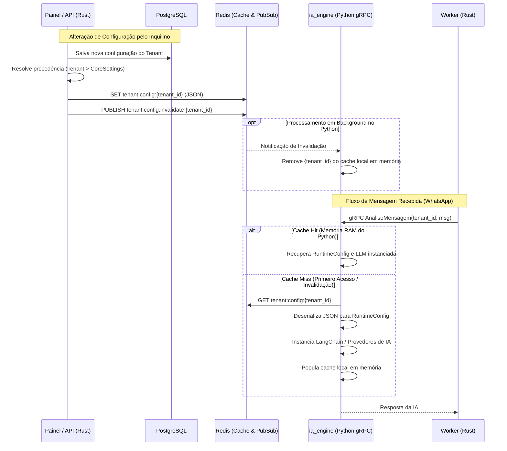

# Design de Gerenciamento de Configurações e IA (Análise de Legado e Proposta Rust)

Este documento analisa a estratégia de gerenciamento de configurações utilizada no sistema legado (`ServiceHub` e `ConfigProvider`) e define a arquitetura técnica recomendada para o novo sistema em **Rust**, visando otimização de cache, segurança de chaves em tempo de execução e tipagem estática do oráculo de IA.

---

## 1. Análise do Sistema Legado (`ServiceHub`)

No sistema Python antigo, o `ServiceHub` e o `ConfigProvider` cooperam para gerenciar parâmetros operacionais e chaves de API:

*   **Lógica de Precedência (Cascata):** O sistema utiliza configurações globais (definidas nas variáveis de ambiente ou no Core) como fallback. Se o Tenant possuir parâmetros específicos cadastrados em seu `TenantConfig` (como chave da OpenAI ou temperatura local), estes se sobrepõem ao global.
*   **Singleton de Acesso:** O `ServiceHub` é um singleton que fornece propriedades estáticas (ex: `ServiceHub.OPENAI_API_KEY`) resolvendo o contexto da thread atual.
*   **Instanciação Dinâmica:** As classes de LLM são resolvidas em tempo de execução via reflexão de strings (ex: `"ChatGroq"` vira a classe correspondente de LangChain).

### Avaliação da Abordagem:
*   **A lógica de precedência local (Tenant > Core) é excelente** e deve ser mantida. Ela garante que pequenos clientes usem o saldo global da plataforma (out of the box) enquanto clientes grandes (Enterprise) cadastram suas próprias chaves e alteram comportamentos sem interferir no ecossistema.
*   **A instanciação dinâmica de classes por string não funciona de forma nativa em Rust** devido à compilação estática da linguagem. Precisamos de um design baseado em enums tipados e Traits polimórficas.

---

## 2. Proposta de Arquitetura: Cache Coordenado Multi-Tenant (Rust + Python via Redis)

Para o novo sistema, implementaremos uma estratégia de **Cache Híbrido Coordenado** para gerenciar as configurações resolvidas. O banco PostgreSQL único é a fonte da verdade, o **Redis** atua como a ponte de dados consolidada e canal de sinalização de eventos, e o módulo **`ia_engine` (Python)** mantém um cache em memória quente para processamento de baixa latência.



---

## 3. Especificação das Camadas e Componentes

### 3.1 O Cache no Redis (A Ponte de Integração)
O backend em Rust (Control Plane / Runtime API / Worker) é o único agente responsável por ler o PostgreSQL e resolver as configurações dinâmicas aplicando a precedência (Tenant > Core). 

#### Fluxo de Resolução de Fallbacks no Rust:
1.  **Chaves Globais:** O Rust lê todas as chaves e valores decodificados da tabela `CoreSettings` (que é dinâmica e chave-valor).
2.  **Configuração do Tenant:** O Rust lê as colunas físicas da tabela `TenantConfig` do inquilino (`msg_fallback`, `model`, `similarity_threshold`, etc.) e o dicionário JSONB `api_keys` local.
3.  **Lógica de Precedência (Cascata):**
    *   Para cada campo físico do `TenantConfig` (ex: `llm_class`): se o valor estiver preenchido (`NOT NULL`), o Rust o utiliza. Se estiver em branco/nulo, o Rust busca o valor correspondente na tabela global `CoreSettings`.
    *   Para chaves de API: o Rust busca no JSONB `api_keys` local do tenant. Se encontrar, descriptografa-a com a chave mestra (`ENCRYPTION_KEY`). Se não encontrar, cai de volta para a chave de API global da tabela `CoreSettings` e a descriptografa.
4.  **Persistência no Redis:** O Rust monta o objeto consolidado com todos os campos estruturados preenchidos (resolvidos), serializa em JSON e salva no Redis sob a chave:
    *   **Chave do Redis:** `tenant:config:{tenant_id}`
    *   **TTL (Tempo de Vida):** Persistente (ou expiração longa de 24 horas, renovada a cada leitura).


### 3.2 O Cache em Memória no Módulo Python (`ia_engine`)

O módulo Python (`ia_engine`) mantém na memória RAM de seu próprio processo um cache contendo as configurações de cada tenant. O `ia_engine` **não se conecta ao PostgreSQL**; lê exclusivamente do Redis (publicado pelo backend Rust).

**Thread-safety:** O servidor gRPC pode ser executado com múltiplos workers (multi-process via `grpc.server` com `ThreadPoolExecutor`). O cache usa `threading.Lock()` para garantir atomicidade nas operações de leitura/escrita/invalidação.

```python
# ia_engine/src/config/cache.py
import json
import logging
import threading
from typing import Dict, Optional, Any
import redis
from pydantic import BaseModel

logger = logging.getLogger(__name__)


class RuntimeConfig(BaseModel):
    """Espelha o RuntimeConfig Rust publicado no Redis pelo backend.
    Todos os campos chegam já resolvidos (fallbacks aplicados no Rust).
    """
    tenant_id: str

    # Prompts de IA
    dados_empresa: str
    persona_bot: str
    bot_agent_name: str

    # Mensagens automáticas
    msg_fallback: str
    msg_sem_info: str
    msg_transferencia: str

    # LLM
    llm_class: str           # ex: "ChatGroq", "ChatOpenAI", "ChatOllama"
    model: str               # ex: "llama-3.3-70b-versatile", "gpt-4o-mini"
    llm_temperature: float

    # Transcrição de áudio
    transcription_provider: str   # ex: "groq", "openai"
    transcription_model: str      # ex: "whisper-large-v3-turbo", "whisper-1"

    # Visão computacional
    vision_provider: str    # ex: "google", "openai"
    vision_model: str       # ex: "gemini-2.5-flash", "gpt-4o"

    # Embeddings e RAG
    embeddings_class: str   # ex: "OpenAIEmbeddings", "HuggingFaceEmbeddings"
    embeddings_model: str   # ex: "text-embedding-3-small"
    chunk_size: int
    chunk_overlap: int

    # Thresholds de similaridade
    similarity_threshold: float
    vector_distance_threshold: float

    # Chaves de API (descriptografadas pelo Rust antes de publicar no Redis)
    openai_api_key: str
    groq_api_key: str
    google_api_key: str


class TenantConfigCache:
    def __init__(self, redis_client: redis.Redis):
        self.redis = redis_client
        self._lock = threading.Lock()
        self._local_cache: Dict[str, RuntimeConfig] = {}
        # Cache de instâncias LangChain prontas por tenant (evita reinstanciar a cada request)
        self._llm_instances: Dict[str, Any] = {}

    def get_config(self, tenant_id: str) -> Optional[RuntimeConfig]:
        with self._lock:
            if tenant_id in self._local_cache:
                return self._local_cache[tenant_id]

        # Cache miss: busca do Redis (fora do lock para não bloquear durante I/O)
        redis_key = f"tenant:config:{tenant_id}"
        config_data = self.redis.get(redis_key)

        if not config_data:
            logger.warning("Configuração não encontrada no Redis para o tenant %s", tenant_id)
            return None

        try:
            config_dict = json.loads(config_data)
            config = RuntimeConfig(**config_dict)
            with self._lock:
                self._local_cache[tenant_id] = config
            return config
        except Exception as e:
            logger.error("Erro ao deserializar configuração do tenant %s: %s", tenant_id, e)
            return None

    def invalidate(self, tenant_id: str) -> None:
        """Remove as configurações da memória RAM para forçar reload no próximo request."""
        with self._lock:
            self._local_cache.pop(tenant_id, None)
            self._llm_instances.pop(tenant_id, None)
        logger.info("Cache em memória invalidado para o tenant %s", tenant_id)
```

### 3.3 Mecanismo de Invalidação de Cache via Pub/Sub
Para que a alteração de um prompt no painel administrativo reflita instantaneamente nas respostas da IA sem exigir reinicialização do serviço Python, utilizamos o canal de Pub/Sub do Redis:

1.  **Canal Pub/Sub:** `tenant:config:invalidate`
2.  **Ouvinte (Subscriber) no Python:** O `ia_engine` roda uma thread/task assíncrona em background dedicada a escutar este canal.

```python
# ia_engine/src/config/listener.py
import threading
import redis
from .cache import TenantConfigCache

def start_invalidation_listener(redis_client: redis.Redis, cache: TenantConfigCache):
    def listener():
        pubsub = redis_client.pubsub()
        pubsub.subscribe("tenant:config:invalidate")
        
        logger.info("Escutando canal de invalidação de configurações no Redis...")
        for message in pubsub.listen():
            if message["type"] == "message":
                try:
                    tenant_id = message["data"].decode("utf-8")
                    cache.invalidate(tenant_id)
                except Exception as e:
                    logger.error(f"Erro ao processar mensagem de invalidação: {e}")

    thread = threading.Thread(target=listener, daemon=True)
    thread.start()
```

### 3.4 Inicialização de Configurações no Cold Start
Na inicialização do servidor backend em Rust, o sistema pode realizar um *pre-warm* do cache do Redis, carregando e resolvendo a configuração de todos os tenants ativos de uma só vez. Isso garante que a primeira mensagem de cada inquilino não sofra latência de cache-miss.

---

## 4. Benefícios do Novo Design

1.  **Tráfego gRPC Leve:** O payload enviado do Rust para o Python contém apenas o `tenant_id` e os dados dinâmicos da mensagem. Prompts de sistema pesados e chaves de API não trafegam na rede local a cada nova interação do WhatsApp.
2.  **Stateless em Relação ao Banco Relacional:** O `ia_engine` em Python não se conecta ao PostgreSQL. Ele lê a configuração do Redis (que é um armazenamento chave-valor rápido na memória do servidor local), preservando o isolamento e diminuindo o uso de conexões de banco de dados.
3.  **Invalidação Reativa em Tempo Real:** Alterações nos prompts do sistema ou na persona do bot realizadas no painel administrativo propagam-se para a memória da IA em milissegundos via Redis Pub/Sub, garantindo uma experiência dinâmica sem necessidade de restart de contêineres.
4.  **Desacoplamento de Criptografia:** O Rust descriptografa chaves de API usando a chave mestra em um ambiente seguro, gravando no Redis de cache apenas o valor final pronto. O Python apenas consome a credencial descriptografada na RAM.

