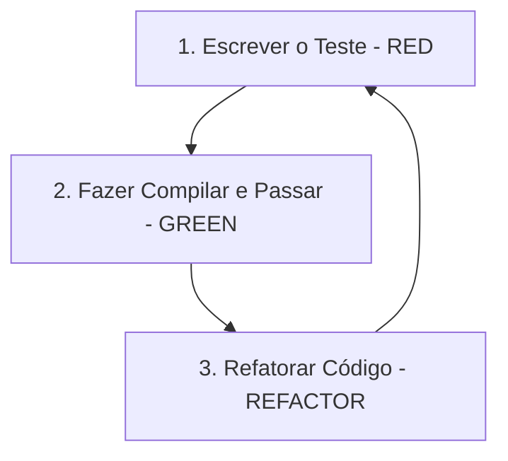

# Diretrizes de Desenvolvimento em Flutter (Clean Code e TDD)

Este documento define os padrões de codificação, arquitetura, práticas de TDD (Test-Driven Development) e ferramentas de análise estática para o frontend nativo em Flutter (inicialmente Windows Desktop — Fase 1 —, portado para Web na Fase 2).

> **Documentos relacionados:** [rust.md](./rust.md) (backend/`local_engine`
> consumido via FFI), [python.md](./python.md) (motor de IA),
> [seguranca.md](./seguranca.md) (diretrizes de segurança obrigatórias) e o
> [planejamento](../planejamento/00-planejamento-inicial.md) (decisão **D1**:
> conexão híbrida rede + FFI; **D6**: Windows primeiro, Web depois).

---

## 1. Princípios de Clean Code em Flutter/Dart

Para garantir que o frontend do Smart Core Assistant v2 permaneça ágil, performático e livre de acoplamento direto com lógica de rede ou banco de dados, devemos seguir os seguintes padrões:

### 1.1 Convenções de Nomenclatura e Arquivos
*   **Código em Inglês:** Classes, métodos, variáveis, enums, mixins e pacotes devem ser nomeados em **Inglês**.
*   **Formatos:**
    *   `camelCase` para variáveis, métodos, propriedades e parâmetros (ex: `activeTicketId`, `updateStage`).
    *   `PascalCase` para classes, enums, mixins, extensions e typedefs (ex: `KanbanBoardWidget`, `TicketState`).
    *   `lower_with_underscores` (`snake_case`) para nomes de arquivos e diretórios (ex: `kanban_view_model.dart`, `components/ticket_card.dart`).
*   **Comentários:** Comentários no código e documentações de API interna devem ser escritos em **Português** para explicar decisões visuais, animações ou fluxos de sincronização de cache de mídia local.

### 1.2 Flutter como "Cliente Fino" (Thin Client)
*   **UI Desacoplada de Regras:** Widgets do Flutter devem se preocupar exclusivamente em renderizar a tela e capturar eventos do usuário. Lógica de validação, mapeamento de payloads do gRPC/HTTP e persistência SQLite devem residir em classes de serviço puras e separadas.
*   **Imutabilidade do Estado:** O estado das telas deve ser representado por objetos imutáveis. Evite modificar propriedades mutáveis diretamente em classes globais. Prefira gerar novas instâncias de estado.
*   **Modularidade de Arquivos:** Arquivos com mais de 300 linhas devem ser divididos. Widgets com mais de 100 linhas devem ser decompostos em sub-widgets privados.

### 1.3 Abstração `DataSource` (FFI vs RemoteOnly)
Conforme definido na arquitetura (seção 8 do planejamento), o Flutter deve abstrair a origem dos dados atrás de uma interface `DataSource`:
*   **`LocalEngineFFI`:** Implementação para Windows Desktop que acessa o crate Rust `local_engine` via `flutter_rust_bridge`. Fornece cache local (SQLite), cache de mídia em disco e fila de envios offline.
*   **`RemoteOnly`:** Implementação para Web que busca todos os dados diretamente do servidor via gRPC/HTTP. Sem FFI.

Todo código de UI e controladores deve depender **apenas** da interface `DataSource`, nunca de implementações concretas. Isso garante port limpo para Web.

```dart
/// Contrato abstrato que desacopla a UI da fonte de dados.
abstract class DataSource {
  Future<List<Ticket>> fetchTickets(String tenantId);
  Future<void> cacheMedia(String hash, Uint8List bytes);
  Stream<RealtimeEvent> watchEvents();
}

/// Implementação local via FFI (somente Windows).
class LocalEngineDataSource implements DataSource {
  final LocalEngineBinding _ffi;
  // ... implementação via flutter_rust_bridge
}

/// Implementação remota (Web e fallback).
class RemoteOnlyDataSource implements DataSource {
  final ApiClient _client;
  // ... implementação via gRPC/HTTP
}
```

### 1.4 Arquitetura de Gerenciamento de Estado
*   **Padrão Controladores/ViewModels:** Use controladores específicos por tela (como BLoC, StateNotifier ou ChangeNotifier estruturados) acoplados ao ciclo de vida da UI.
*   **Injeção de Dependências:** Use contêineres de injeção simples (como `get_it` ou provider) para injetar repositórios de dados nos controladores, facilitando a substituição por Mocks nos testes.

### 1.5 Estrutura de Pastas das Aplicações Flutter

São **dois apps Flutter completamente separados** (`flutter_windows` e
`flutter_web`), com o código comum extraído para pacotes Dart em
`clients/packages/`, conforme
[01-estrutura-do-projeto.md](../planejamento/01-estrutura-do-projeto.md). Os dois
apps **nunca** são buildados a partir do mesmo `pubspec.yaml` — isso evita
misturar dependências nativas (Windows) com as limitações do ambiente Web.

```
clients/
  packages/                       # Pacotes Dart compartilhados entre os apps
    core_ui/                      # Widgets, temas, design tokens reutilizáveis
    domain_models/                # DTOs: Ticket, Mensagem, Contato, Kanban
    api_client/                   # Cliente gRPC/HTTP + WebSocket; contrato DataSource
      lib/
        data_source.dart          # Interface abstrata DataSource
        remote_only_data_source.dart  # Implementação RemoteOnly (rede pura)
    local_engine_ffi/             # Bridge flutter_rust_bridge (SÓ flutter_windows)
      lib/
        local_engine_data_source.dart # Implementação LocalEngineFFI

  flutter_windows/                # App desktop — Fase 1 (DataSource: LocalEngineFFI)
    lib/
      main.dart                   # Entry point
      app/                        # Configuração global (tema, rotas, DI)
      core/                       # Utilitários, constantes, extensões
      features/                   # Feature-first: cada feature isolada
        kanban/
          data/                   # Repositórios (consomem a interface DataSource)
          domain/                 # Entidades e regras locais (se houver)
          presentation/           # Widgets, controllers/ViewModels
            kanban_controller.dart
            kanban_page.dart
            widgets/
              ticket_card.dart
        chat/
        settings/
    test/
      unit/                       # Testes de lógica pura (controllers, services)
      widgets/                    # Testes de widgets isolados
      integration/                # Testes de fluxo completo
      helpers/                    # Mocks, fixtures e utilitários de teste
    pubspec.yaml                  # depende de core_ui, domain_models, api_client, local_engine_ffi

  flutter_web/                    # App Web — Fase 2 (DataSource: RemoteOnly; sem FFI)
    lib/
      main.dart                   # Reusa core_ui, domain_models, api_client
    test/
    pubspec.yaml                  # depende de core_ui, domain_models, api_client (sem local_engine_ffi)
```

> **Princípio de port limpo:** toda a UI e os controladores dependem **apenas**
> da interface `DataSource` (definida em `api_client`). O `flutter_windows`
> injeta `LocalEngineFFI`; o `flutter_web` injeta `RemoteOnly`. Trocar de
> plataforma é trocar a implementação injetada — sem reescrever a UI.

---

## 2. Ferramentas de Qualidade de Código

Todo código Dart/Flutter deve estar em conformidade com as ferramentas do SDK antes de ser integrado:

1.  **Formatador (`dart format`):** 
    Mantém a formatação consistente padrão da linguagem.
    ```bash
    dart format .
    ```
2.  **Linter (`dart analyze`):** 
    Analisa erros de digitação, imports não utilizados e anti-padrões.
    ```bash
    flutter analyze
    ```
3.  **Testes (`flutter test`):**
    Executa todos os testes unitários e de widget com cobertura.
    ```bash
    flutter test --coverage
    ```

### 2.1 Configuração Concreta do `analysis_options.yaml`

```yaml
include: package:flutter_lints/flutter.yaml

analyzer:
  strong-mode:
    implicit-casts: false
    implicit-dynamic: false
  errors:
    missing_return: error
    dead_code: warning
    unused_import: warning
  exclude:
    - "**/*.g.dart"       # Arquivos gerados (freezed, json_serializable)
    - "**/*.freezed.dart"

linter:
  rules:
    # Segurança de tipos
    avoid_dynamic_calls: true
    prefer_const_constructors: true
    prefer_const_declarations: true

    # Legibilidade
    always_declare_return_types: true
    annotate_overrides: true
    prefer_single_quotes: true
    sort_child_properties_last: true
    use_key_in_widget_constructors: true

    # Clean Code
    avoid_print: true       # Use logging estruturado
    prefer_final_locals: true
    prefer_final_fields: true
    unnecessary_this: true
```

---

## 3. Práticas de TDD (Test-Driven Development) em Flutter

Todo novo fluxo lógico de dados ou componente crítico de UI no Flutter deve ser desenvolvido aplicando a metodologia TDD: **Red → Green → Refactor**.



### 3.1 Organização dos Testes
*   **Testes Unitários (Unit Tests):** Focados em testar classes puras, ViewModels, Services e Repositories. Devem usar mocks para chamadas de rede e banco local. Ficam sob a pasta `test/unit/`.
*   **Testes de Widgets (Widget Tests):** Validam o comportamento visual e interações de toque de um componente de interface isolado, sem necessitar de um emulador inteiro. Ficam sob a pasta `test/widgets/`.
*   **Testes de Integração (Integration Tests):** Validam fluxos completos de usuário (ex: abrir o app, navegar até o Kanban, arrastar um ticket). Ficam sob `test/integration/` e usam `IntegrationTestWidgetsFlutterBinding`.

### 3.2 Convenções de Nomenclatura de Testes
*   **Padrão:** `should <resultado esperado> when <condição>` em `camelCase` dentro da string do `test()`.
*   Exemplos:
    *   `test('should update ticket stage and emit success state when API returns true', ...)`
    *   `test('should show error dialog when connection fails', ...)`
    *   `test('should render loading spinner when state is loading', ...)`
*   **Grupos `group()`:** Agrupar testes relacionados por funcionalidade.

### 3.3 Mock de FFI e DataSource
Para garantir que os testes unitários não dependam da existência do crate Rust compilado, a interface `DataSource` deve ser mocada:
```dart
class MockDataSource extends Mock implements DataSource {}

void main() {
  late MockDataSource mockDataSource;

  setUp(() {
    mockDataSource = MockDataSource();
  });

  test('should fetch tickets from data source regardless of implementation', () async {
    when(() => mockDataSource.fetchTickets('tenant-1'))
        .thenAnswer((_) async => [Ticket(id: 't1', subject: 'Teste')]);

    final tickets = await mockDataSource.fetchTickets('tenant-1');
    expect(tickets, hasLength(1));
  });
}
```

---

## 4. Exemplo Prático Contextualizado (Clean Code + TDD)

Vamos implementar um fluxo básico para movimentação de um ticket entre etapas no Kanban usando TDD no Flutter.

### Passo 1: Escrever o Teste Unitário (RED)
O teste simula o envio de uma ação de arrastar um ticket para a próxima etapa e valida que o estado do controlador é atualizado corretamente.

*Criamos o arquivo de teste `test/unit/kanban_controller_test.dart`:*
```dart
import 'package:flutter_test/flutter_test.dart';
import 'package:mocktail/mocktail.dart';

// Definindo mocks para dependências que ainda serão criadas
class MockKanbanRepository extends Mock implements KanbanRepository {}

void main() {
  late MockKanbanRepository mockRepository;
  late KanbanController controller;

  setUp(() {
    mockRepository = MockKanbanRepository();
    controller = KanbanController(repository: mockRepository);
  });

  test('should update ticket stage and emit new state successfully', () async {
    // Arrange (Configurar mocks e dados)
    const ticketId = 'ticket-123';
    const newStageId = 'stage-done';
    
    when(() => mockRepository.moveTicket(ticketId, newStageId))
        .thenAnswer((_) async => true);

    // Act (Executar a ação do controller)
    await controller.moveTicket(ticketId, newStageId);

    // Assert (Verificar se o estado foi atualizado e se a API foi chamada)
    expect(controller.state.status, KanbanStatus.success);
    expect(controller.state.movedTicketId, ticketId);
    verify(() => mockRepository.moveTicket(ticketId, newStageId)).called(1);
  });
}
```
*Status:* O teste não compila porque as classes `KanbanController`, `KanbanRepository` e o enum `KanbanStatus` ainda não existem.

---

### Passo 2: Implementação Mínima para Passar (GREEN)
Escrevemos o código necessário e estritamente mínimo em Dart para fazer o teste compilar e passar.

*Criamos a estrutura básica em `lib/kanban/kanban_controller.dart`:*
```dart
import 'package:flutter/foundation.dart';

enum KanbanStatus { initial, loading, success, failure }

class KanbanState {
  final KanbanStatus status;
  final String? movedTicketId;

  KanbanState({required this.status, this.movedTicketId});
}

abstract class KanbanRepository {
  Future<bool> moveTicket(String ticketId, String targetStageId);
}

class KanbanController extends ValueNotifier<KanbanState> {
  final KanbanRepository repository;

  KanbanController({required this.repository}) 
      : super(KanbanState(status: KanbanStatus.initial));

  Future<void> moveTicket(String ticketId, String targetStageId) async {
    final success = await repository.moveTicket(ticketId, targetStageId);
    if (success) {
      value = KanbanState(status: KanbanStatus.success, movedTicketId: ticketId);
    }
  }
}
```
*Status:* Rodando `flutter test`, o teste agora passa!

---

### Passo 3: Refatoração para Clean Code (REFACTOR)
Refatoramos o código para torná-lo mais limpo e seguro contra efeitos colaterais. Introduzimos estados imutáveis melhores (incluindo tratamento de erros) e desacoplamento do `ValueNotifier` por um modelo de gerência de estado formal.

*Código final refatorado:*
```dart
import 'package:flutter/foundation.dart';

enum KanbanStatus { initial, loading, success, failure }

/// Representação imutável do estado do Kanban.
@immutable
class KanbanState {
  final KanbanStatus status;
  final String? movedTicketId;
  final String? errorMessage;

  const KanbanState({
    required this.status,
    this.movedTicketId,
    this.errorMessage,
  });

  const KanbanState.initial()
      : status = KanbanStatus.initial,
        movedTicketId = null,
        errorMessage = null;

  KanbanState copyWith({
    KanbanStatus? status,
    String? movedTicketId,
    String? errorMessage,
  }) {
    return KanbanState(
      status: status ?? this.status,
      movedTicketId: movedTicketId ?? this.movedTicketId,
      errorMessage: errorMessage ?? this.errorMessage,
    );
  }
}

/// Contrato da porta de persistência/API externa do Kanban.
abstract class KanbanRepository {
  Future<bool> moveTicket(String ticketId, String targetStageId);
}

/// Controlador responsável pelo fluxo de ações do Kanban.
class KanbanController extends ValueNotifier<KanbanState> {
  final KanbanRepository _repository;

  KanbanController({required KanbanRepository repository})
      : _repository = repository,
        super(const KanbanState.initial());

  /// Move o ticket no Kanban e atualiza o estado de forma reativa e segura.
  Future<void> moveTicket(String ticketId, String targetStageId) async {
    value = value.copyWith(status: KanbanStatus.loading);

    try {
      final success = await _repository.moveTicket(ticketId, targetStageId);
      if (success) {
        value = KanbanState(
          status: KanbanStatus.success,
          movedTicketId: ticketId,
        );
      } else {
        value = value.copyWith(
          status: KanbanStatus.failure,
          errorMessage: 'Não foi possível mover o ticket no servidor.',
        );
      }
    } catch (e) {
      value = value.copyWith(
        status: KanbanStatus.failure,
        errorMessage: 'Ocorreu um erro inesperado: $e',
      );
    }
  }
}
```
*Status:* O código refatorado agora suporta tratamento de exceções, mantém o estado completamente imutável usando o método helper `copyWith` e está em conformidade com o Clean Code.

---

## 5. Segurança específica do Flutter

As diretrizes completas estão em [seguranca.md](./seguranca.md) (documento
normativo transversal). Os pontos de atenção diretos do cliente Flutter:

*   **Cliente fino, servidor autoritativo:** nenhuma regra de autorização
    confiável vive na UI. A UI apenas reflete permissões (RBAC) — toda decisão de
    acesso é verificada no `runtime_api`. Ver
    [seguranca.md §6](./seguranca.md#6-autenticação-e-autorização).
*   **Sem segredo no app:** não embuta API keys nem signing keys no binário
    (Windows) nem no bundle Web — são extraíveis. O cliente guarda apenas o token
    de sessão, em storage seguro da plataforma (nunca em texto puro em
    `SharedPreferences`).
*   **Cache local é dado sensível:** no `flutter_windows`, o SQLite e a mídia em
    disco contêm conversas de clientes. O cache é **segregado por tenant** e deve
    ser cifrado em repouso; ao logout/troca de tenant, o cache anterior fica
    inacessível. Ver [seguranca.md §9.4](./seguranca.md#94-cache-local-no-desktop-ffiwindows).
*   **Transporte cifrado:** `https://` e `wss://` sempre — nunca `ws://`/`http://`
    em produção. No `flutter_web`, atenção a XSS e ao que se persiste no browser.
*   **`avoid_print: true`** (já é regra de lint): evita vazar conteúdo sensível no
    console. Use logging estruturado sem PII em claro.

---

*Documento de padrões Flutter. Sujeito a refinamento conforme os apps evoluem.*
