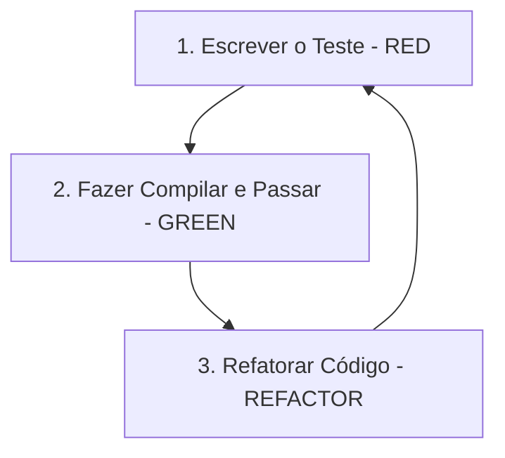

# Diretrizes de Desenvolvimento em Python (Clean Code e TDD)

Este documento define os padrões de codificação, tipagem estática estrita, práticas de TDD (Test-Driven Development) e ferramentas de análise estática para o motor de IA (`ia_engine`) desenvolvido em Python, exposto como serviço **gRPC/HTTP** e consumido pelo backend em Rust (`server/apps/worker`). A fronteira entre as duas stacks é um **contrato explícito** (protobuf + DTOs Pydantic), nunca import direto de código (ver regras de acoplamento em [01-estrutura-do-projeto.md](../planejamento/01-estrutura-do-projeto.md)).

> **Documentos relacionados:** [rust.md](./rust.md) (backend que consome a IA),
> [flutter.md](./flutter.md) (frontend), [seguranca.md](./seguranca.md)
> (diretrizes de segurança obrigatórias) e o
> [planejamento](../planejamento/00-planejamento-inicial.md) (decisão **D3**: IA
> em Python via gRPC/HTTP).

> **Nota sobre FFI:** a única FFI do projeto é entre **Flutter ↔ Rust**
> (`local_engine` via `flutter_rust_bridge`). O `ia_engine` **não usa FFI** — ele
> conversa com o Rust exclusivamente por gRPC/HTTP.

---

## 1. Princípios de Clean Code em Python

Para o módulo `ia_engine`, a legibilidade do código e o controle estrito de tipos são cruciais devido à integração com o Rust por contrato gRPC/HTTP (onde divergências entre o schema protobuf e os modelos Pydantic causam falhas na fronteira entre as stacks).

### 1.1 Convenções de Nomenclatura e PEP 8
*   **Código em Inglês:** Variáveis, parâmetros de função, nomes de métodos, classes, módulos e arquivos devem ser em **Inglês**.
*   **Formatos (PEP 8):**
    *   `snake_case` para variáveis, funções, métodos e nomes de arquivos (ex: `summarize_text`, `chat_history.py`).
    *   `PascalCase` para classes (ex: `SummarizerService`, `AiConfig`).
    *   `UPPERCASE` com sublinhados para constantes (ex: `DEFAULT_MAX_TOKENS`).
*   **Comentários:** Comentários explicativos, docstrings (PEP 257) de classes e funções devem ser escritos em **Português**, detalhando as regras de negócio dos modelos de IA ou o funcionamento de prompts complexos.

### 1.2 Tipagem Estática Obrigatória
*   **Tipos Explícitos:** Todas as assinaturas de funções e métodos devem declarar explicitamente os tipos de parâmetros e de retorno usando o módulo `typing`.
*   **Validação de Dados:** Use a biblioteca `pydantic` para validar estruturas de dados e garantir correspondência perfeita entre os dados trocados com o Rust.
*   **Proibição de `Any`:** O tipo `Any` não deve ser usado em código de produção. Use `Protocol` para tipagem estrutural quando o tipo concreto não for conhecido.

### 1.3 Isolamento e Injeção de Dependências
*   **Sem API Calls em Construtores:** Inicialize clientes de LLM (OpenAI, LangChain, Groq) de forma externa e injete-os nas classes de serviço. Isso facilita o teste lógico usando Mocks.
*   **Tratamento de Segredos:** Tokens, credenciais e chaves de API nunca devem ser inseridos diretamente no código. Use arquivos `.env` e carregue-os por meio de `pydantic-settings` ou `python-decouple`.

### 1.4 Código Assíncrono
O `ia_engine` pode expor funções assíncronas para operações de I/O (chamadas de API de LLMs, downloads de mídia). Regras:
*   Use `async def` para funções que fazem chamadas de rede.
*   Nunca misture `asyncio.run()` com `await` no mesmo nível.
*   Use `asyncio.gather()` para executar múltiplas chamadas independentes em paralelo.

### 1.5 Logging Estruturado
*   Use a biblioteca `loguru` para logging estruturado (consistente com a v1).
*   **Níveis de log:** `DEBUG` para fluxos internos de IA, `INFO` para entradas/saídas dos handlers gRPC/HTTP, `WARNING` para fallbacks de modelo, `ERROR` para falhas de provedores.
*   **Nunca use `print()`** em código de produção.
*   **Nunca logue conteúdo de mensagem do cliente, prompt completo ou credencial** (ver [seguranca.md §10](./seguranca.md#10-logging-observabilidade-e-privacidade)). Logue `tenant_id`, feature, latência e contagem de tokens — não o conteúdo da conversa.

### 1.6 Estrutura de Pastas do Módulo `ia_engine`

A organização é **feature-first**: cada operação de IA é uma feature isolada,
testável e evoluível de forma independente, conforme definido em
[01-estrutura-do-projeto.md](../planejamento/01-estrutura-do-projeto.md). A
fronteira com o Rust é o `server.py` (gRPC/HTTP) — não há código de FFI.

```
ia_engine/
  src/
    features/                  # Uma pasta por operação de IA (isolada e testável)
      transcribe_audio/        # Transcrição de áudio → texto
      interpret_media/         # Descrição de imagem/vídeo/documento
      analyse_message/         # Classificação de intents + extração de entidades
      generate_response/       # Geração de resposta multi-turn + RAG
      analyse_sentiment/       # Análise de sentimento/avaliação (feedback)
      generate_embeddings/     # Embeddings (vector(1536)) para pgvector
    llm/                       # Abstração de provedores (OpenAI, Groq, Ollama via LangChain)
      llm_provider.py
      embedding_provider.py
    contracts/                 # DTOs/modelos Pydantic espelhando o protobuf gRPC
      requests.py
      responses.py
    config.py                  # Configurações via pydantic-settings (.env)
    server.py                  # Ponto de entrada: servidor gRPC/HTTP
  tests/
    conftest.py                # Fixtures globais
    features/                  # Testes espelhando cada feature
    fixtures/                  # Dados de teste (payloads, respostas mockadas)
      sample_messages.json
  pyproject.toml               # Gerenciado com uv
  uv.lock                      # Versionado
  .env.example
```

Cada feature em `src/features/<nome>/` encapsula seu serviço, prompt e modelos
Pydantic. A camada `llm/` abstrai os provedores; o override de provedor/modelo
por tenant vem de `tenant_config` (ver [planejamento §13](../planejamento/00-planejamento-inicial.md)).

---

## 2. Ferramentas de Qualidade de Código

O `ia_engine` é gerenciado com **`uv`** (ambiente, dependências e execução). O
`pyproject.toml` e o `uv.lock` são versionados. Prefixe os comandos com
`uv run` para garantir o ambiente correto (ex.: `uv run ruff check src/`,
`uv run pyright`, `uv run pytest`).

Todo código Python deve obedecer rigorosamente às verificações a seguir:

1.  **Linter e Formatação (`ruff`):**
    Usamos o `ruff` para garantir conformidade imediata com a PEP 8 e remoção de redundâncias de importação.
    ```bash
    # Executar a verificação
    ruff check src/
    
    # Executar a formatação
    ruff format src/
    ```
2.  **Verificador de Tipos Estáticos (`pyright`):**
    Deve ser configurado e executado no modo **strict** para capturar qualquer falha de tipos em tempo de compilação ou antes de rodar os testes.
    ```bash
    pyright
    ```
3.  **Testes e Cobertura (`pytest`):**
    A cobertura mínima do módulo `ia_engine` deve ser **80%**.
    ```bash
    pytest tests/ -v --cov=src --cov-report=term-missing
    ```

### 2.1 Configuração Concreta das Ferramentas

As configurações devem residir no `pyproject.toml` do módulo `ia_engine`.

**Configuração do `ruff`:**
```toml
[tool.ruff]
line-length = 79
target-version = "py313"

[tool.ruff.lint]
extend-select = [
    "I",      # isort (ordenação de imports)
    "N",      # pep8-naming
    "UP",     # pyupgrade
    "RUF",    # ruff-specific
    "B",      # bugbear (bugs comuns)
    "SIM",    # simplify (simplificações)
    "T20",    # flake8-print (proibir print)
]
```

**Configuração do `pyright`:**
```toml
[tool.pyright]
typeCheckingMode = "strict"
include = ["src", "tests"]
reportMissingTypeArgument = "error"
reportMissingTypeStubs = false
strictParameterNoneValue = false
reportUnknownVariableType = "warning"
reportUnknownMemberType = "warning"
extraPaths = ["src"]
```

**Configuração do `pytest`:**
```toml
[tool.pytest.ini_options]
testpaths = ["tests"]
asyncio_mode = "auto"    # Permite testes async sem decorador explícito
addopts = "-v --strict-markers"
markers = [
    "slow: testes lentos (chamadas reais de API, ex: integração)",
    "integration: testes de integração com serviços externos",
]
```

---

## 3. Práticas de TDD (Test-Driven Development) em Python

O desenvolvimento de novas integrações de IA e funções matemáticas/manipulação de dados no módulo `ia_engine` deve seguir o ciclo de TDD: **Red → Green → Refactor**.



### 3.1 Testes Isolados de Redes (Mocks)
Visto que trabalhamos com APIs de LLMs de terceiros que geram custos, demoram para responder e podem falhar por latência, todos os testes unitários do `ia_engine` devem utilizar `pytest-mock` para mocar retornos de chamadas do LangChain ou OpenAI.

### 3.2 Testes Assíncronos com `pytest-asyncio`
Para funções assíncronas (chamadas de API, processamento de mídia), use `pytest-asyncio`:
```python
import pytest

@pytest.mark.asyncio
async def test_should_transcribe_audio_when_valid_file_provided(
    mocker,
):
    # Arrange
    mock_provider = mocker.AsyncMock()
    mock_provider.transcribe.return_value = "Texto transcrito do áudio."

    # Act
    result = await transcribe_audio(
        audio_bytes=b"fake-audio-data",
        provider=mock_provider,
    )

    # Assert
    assert result.success is True
    assert result.text == "Texto transcrito do áudio."
```

### 3.3 Fixtures Reutilizáveis com `conftest.py`
Defina fixtures globais para evitar duplicação de setup entre testes:
```python
# tests/conftest.py
import pytest
from unittest.mock import MagicMock

@pytest.fixture
def mock_llm_client() -> MagicMock:
    """Fixture que cria um mock padrão do cliente de LLM."""
    client = MagicMock()
    client.invoke.return_value = "Resposta padrão do LLM."
    return client

@pytest.fixture
def sample_conversation_text() -> str:
    """Fixture com texto de conversa de exemplo."""
    return "Olá, preciso de ajuda com minha impressora que não liga."
```

### 3.4 Convenções de Nomenclatura de Testes
*   **Padrão:** `test_should_<resultado_esperado>_when_<condição>` em `snake_case`.
*   Exemplos:
    *   `test_should_summarize_text_successfully_when_llm_returns_valid_response`
    *   `test_should_return_error_when_llm_client_raises_exception`
    *   `test_should_classify_intent_as_transfer_when_user_asks_for_human`
*   **Docstrings:** Cada teste complexo deve incluir uma docstring em português explicando o cenário de domínio.

### 3.5 Padrão Arrange-Act-Assert (AAA)
Todo teste deve seguir rigorosamente a estrutura de três blocos separados por comentários:
```python
def test_should_detect_negative_sentiment_when_feedback_is_bad():
    """Verifica que o analisador de sentimento classifica corretamente feedback negativo."""
    # Arrange (Preparação)
    analyzer = SentimentAnalyzer(llm_client=mock_client)
    text = "Péssimo atendimento, não resolveram meu problema."

    # Act (Execução)
    result = analyzer.analyze(text)

    # Assert (Verificação)
    assert result.sentiment == "negative"
    assert result.confidence > 0.7
```

---

## 4. Exemplo Prático Contextualizado (Clean Code + TDD)

Neste cenário de exemplo, vamos desenvolver a função de transcrição/resumo de áudio/texto de entrada para ser exposta via gRPC/HTTP e consumida pelo `worker` (Rust).

### Passo 1: Escrever o Teste Unitário (RED)
Escrevemos o teste para a função de resumo que simula (moca) a resposta de um modelo LLM.

*Criamos o arquivo de teste `tests/test_summarizer.py`:*
```python
from unittest.mock import MagicMock
from pytest_mock import MockerFixture
import pytest

def test_should_summarize_text_successfully(mocker: MockerFixture):
    # Arrange (Configurar mocks e dependências)
    mock_llm_client = MagicMock()
    # Simulando o retorno esperado da API do LLM
    mock_llm_client.invoke.return_value = "Resumo: Cliente solicita suporte com a impressora."
    
    # Act (Executar a lógica do caso de uso)
    result = summarize_conversation(
        text="Olá, preciso de ajuda com minha impressora que não liga.",
        llm_client=mock_llm_client
    )
    
    # Assert (Validar saída esperada)
    assert result.success is True
    assert result.summary == "Resumo: Cliente solicita suporte com a impressora."
    mock_llm_client.invoke.assert_called_once_with(
        "Resuma o seguinte texto em português: Olá, preciso de ajuda com minha impressora que não liga."
    )
```
*Status:* O teste falha porque a função `summarize_conversation` e a estrutura de retorno não foram definidas.

---

### Passo 2: Implementação Mínima para Passar (GREEN)
Escrevemos o código necessário para fazer o teste compilar/rodar e passar.

*Criamos o arquivo `src/ai_engine/summarizer.py`:*
```python
from typing import Any

class SummaryResult:
    def __init__(self, success: bool, summary: str):
        self.success = success
        self.summary = summary

def summarize_conversation(text: str, llm_client: Any) -> SummaryResult:
    prompt = f"Resuma o seguinte texto em português: {text}"
    response = llm_client.invoke(prompt)
    return SummaryResult(success=True, summary=response)
```
*Status:* Rodando `pytest`, o teste agora passa!

---

### Passo 3: Refatoração para Clean Code (REFACTOR)
Refatoramos o código para torná-lo em conformidade com as regras estritas de tipagem (usando `pyright` strict), usando `pydantic` para estruturas de dados formais que espelham o contrato protobuf trocado com o Rust via gRPC, e tratando erros de chamada de API externa.

*Código final refatorado:*
```python
from typing import Protocol, TypeVar
from pydantic import BaseModel, Field

# Definindo um protocolo genérico para o cliente de LLM
class LlmClient(Protocol):
    def invoke(self, input_text: str) -> str:
        """Envia o texto para processamento de IA e retorna o resultado."""
        ...

class SummaryRequest(BaseModel):
    """Payload de entrada validado via Pydantic."""
    text: str = Field(min_length=1, description="Texto de entrada que será resumido.")

class SummaryResponse(BaseModel):
    """Estrutura formal de retorno espelhando o DTO protobuf trocado via gRPC."""
    success: bool
    summary: str
    error_message: str | None = None

def summarize_conversation(request: SummaryRequest, llm_client: LlmClient) -> SummaryResponse:
    """
    Recebe um texto de conversa e utiliza um cliente LLM para gerar um resumo coeso.
    
    Esta função é exposta via gRPC/HTTP (server.py) e invocada pelo worker (Rust).
    """
    prompt = f"Resuma o seguinte texto em português: {request.text}"
    try:
        response = llm_client.invoke(prompt)
        return SummaryResponse(success=True, summary=response)
    except Exception as error:
        # Tratamento de erro robusto retornando o modelo padrão
        return SummaryResponse(
            success=False, 
            summary="", 
            error_message=f"Erro ao chamar cliente LLM: {str(error)}"
        )
```
*Status:* O código refatorado está fortemente tipado, passa na análise estrita do `pyright` sem perder flexibilidade, trata erros de execução de rede no LLM sem lançar exceções inesperadas e possui validação automática de dados de entrada com Pydantic.

---

## 5. Segurança específica do Python

As diretrizes completas estão em [seguranca.md](./seguranca.md) (documento
normativo transversal). Os pontos de atenção diretos do `ia_engine`:

*   **Segredos via `.env`:** API keys de LLM, credenciais e tokens carregados por
    `pydantic-settings`/`python-decouple` — nunca hardcoded, nunca em log, nunca
    em mensagem de erro (`error_message` é genérico, ver exemplo acima). Ver
    [seguranca.md §4](./seguranca.md#4-gestão-de-segredos-e-credenciais).
*   **Conteúdo do cliente é input não confiável:** o texto da mensagem nunca é
    tratado como instrução para o modelo. Separe instrução do sistema (persona)
    do conteúdo do usuário para mitigar **prompt injection**. Intents/entidades
    extraídas são dados sugeridos — a decisão de ação fica nas regras de domínio
    (Rust). Ver [seguranca.md §8](./seguranca.md#8-segurança-da-camada-de-ia).
*   **Mínimo necessário ao provedor:** envie ao LLM só o contexto da tarefa, não
    histórico completo nem dados de outros contatos. A key do tenant A nunca é
    usada para o tenant B (override por `tenant_config`).
*   **Sem `Any` em produção** e validação estrita com Pydantic na fronteira
    gRPC/HTTP: payload malformado é rejeitado antes de processar (fail closed).
*   **Higiene de logs:** sem conteúdo de conversa, transcrição, prompt ou key em
    `INFO`; telefone mascarado quando aparecer. Ver
    [seguranca.md §10](./seguranca.md#10-logging-observabilidade-e-privacidade).

---

*Documento de padrões Python. Sujeito a refinamento conforme o `ia_engine`
evolui.*
