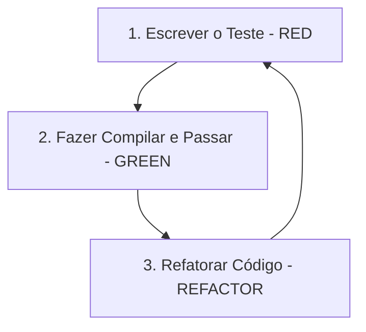

# Diretrizes de Desenvolvimento em Rust (Clean Code e TDD)

Este documento define os padrões, práticas de Clean Code, fluxo de TDD (Test-Driven Development) e ferramentas de qualidade de código para todo o desenvolvimento do backend em Rust no projeto Smart Core Assistant v2.

> **Documentos relacionados:** [python.md](./python.md) (motor de IA consumido
> via gRPC/HTTP), [flutter.md](./flutter.md) (frontend que consome o
> `local_engine` via FFI), [seguranca.md](./seguranca.md) (diretrizes de
> segurança obrigatórias) e o
> [planejamento](../planejamento/00-planejamento-inicial.md) (arquitetura,
> decisões D1–D6).

---

## 1. Princípios de Clean Code em Rust

Rust possui características únicas de tipagem e gerenciamento de memória. As diretrizes a seguir devem ser aplicadas para manter a base de código modular, legível e livre de erros em tempo de execução:

### 1.1 Convenções de Nomenclatura e Comentários
*   **Padrão das Lógicas:** Todas as variáveis, funções, métodos, structs, enums, traits e arquivos devem ser nomeados em **Inglês**.
*   **Formatos:**
    *   `snake_case` para variáveis, funções, parâmetros, arquivos e submódulos (ex: `tenant_id`, `create_ticket`).
    *   `PascalCase` para structs, enums, traits e tipos associados (ex: `MessageQuota`, `TicketStatus`).
    *   `SCREAMING_SNAKE_CASE` para constantes estáticas (ex: `MAX_RETRIES`).
*   **Comentários:** Escreva comentários e documentação de código (`/// doc comments`) em **Português** para explicar lógicas de negócio complexas, fluxos de concorrência ou tomadas de decisão arquiteturais importantes.

### 1.2 Tratamento de Erros Sem Pânico
*   **Proibição de `unwrap` e `expect`:** Nunca utilize `.unwrap()` ou `.expect()` em código de produção. Falhas devem ser propagadas de forma segura e explícita usando o operador `?` ou tratadas através de casamento de padrões (`match`, `if let`).
*   **Tratamento Centralizado com `Result<T, E>`:** Use a crate `thiserror` para definir enums de erros coesos para cada módulo de domínio e `anyhow` apenas nas camadas de aplicação e binários executáveis (`apps/`) para erros genéricos.
*   **Opções Seguras:** Para valores que podem estar ausentes, use `Option<T>` e combine-o com métodos combinadores limpos como `.map()`, `.and_then()`, ou `.unwrap_or_else()`.
*   **Pattern Matching Exaustivo:** Sempre use `match` exaustivo em enums. Nunca use `_ =>` (wildcard) em enums internas do projeto — novos variantes devem forçar revisão em todos os pontos de uso.

### 1.3 Proibição de `unsafe`
*   **Regra Zero:** O uso de blocos `unsafe` é **proibido** em todo o código de produção do projeto, incluindo crates de domínio, aplicação e infraestrutura.
*   **Exceção Única:** Apenas a crate `local_engine` pode usar `unsafe` nos pontos estritamente necessários para a FFI (`flutter_rust_bridge`), e cada uso deve ser acompanhado de um comentário `// SAFETY:` explicando por que é seguro.

### 1.4 Código Assíncrono (Tokio / Axum)
O backend inteiro é assíncrono sobre o runtime **Tokio**. As regras a seguir evitam deadlocks, bloqueios acidentais e vazamentos de recursos:
*   **Nunca bloquear o runtime:** Proibido usar `std::thread::sleep()`, `std::io::Read` ou qualquer operação blocante dentro de uma task `async`. Use `tokio::time::sleep()`, `tokio::fs` e adaptadores assíncronos.
*   **`spawn_blocking` para CPU-bound:** Se uma operação for inevitavelmente síncrona e pesada (ex: hashing, serialização de payloads grandes), use `tokio::task::spawn_blocking()`.
*   **Cancelamento seguro:** Toda task de longa duração (ex: consumidor do Redis Streams no `worker`) deve respeitar `CancellationToken` ou `tokio::select!` com sinal de shutdown para encerramento gracioso.
*   **Timeouts explícitos:** Toda chamada de rede (gRPC/HTTP para o `ia_engine`, API do Evolution Go) deve ter `tokio::time::timeout()` configurado.

### 1.5 Padrões de Envelope para o Event Bus
Toda mensagem publicada no Redis Streams deve seguir o formato padronizado do envelope:
```rust
/// Envelope padrão para eventos internos no barramento.
pub struct TenantEnvelope<T> {
    pub tenant_id: Uuid,
    pub event_id: Uuid,
    pub event_type: String,
    pub timestamp: chrono::DateTime<chrono::Utc>,
    pub payload: T,
}
```
*   Nenhum evento pode ser publicado sem `tenant_id` no envelope.
*   O `event_id` (UUID v7) garante idempotência no consumo.

### 1.6 Arquitetura de Domínio Isolada (DDD)
*   **Crates Altamente Coesas:** Mantenha as regras de negócio puras dentro de `crates/domain_*`. Essas crates não devem ter acoplamento direto com banco de dados ou redes (IO externo). Elas definem structs, enums de estado e interfaces (Traits).
*   **Injeção de Dependências (Portas e Adaptadores):** Use Traits para definir interfaces de persistência (ex: `TenantRepository`) e injete essas dependências via polimorfismo estático (generics/impl Trait) ou dinâmico (`Box<dyn Trait>`) quando necessário.
*   **Separação de Camadas:** `domain_*` nunca importa `infrastructure_*`. A camada `application` orquestra os Use Cases e é a única que combina domínio + infraestrutura.
*   **Modularidade de Arquivos:** Arquivos com mais de 300 linhas devem ser divididos em submódulos. Funções com mais de 40 linhas devem ser decompostas.

---

## 2. Ferramentas de Qualidade de Código

Todo código Rust deve obrigatoriamente estar em conformidade com as seguintes ferramentas de análise estática antes de qualquer pull request:

1.  **Formatador (`rustfmt`):** 
    Garante a consistência de estilo. O código deve ser formatado antes do commit.
    ```bash
    cargo fmt --all
    ```
2.  **Linter Estrito (`cargo clippy`):** 
    Previne anti-padrões e sugere otimizações idiomáticas em Rust. Deve rodar tratando avisos como erros.
    ```bash
    cargo clippy --workspace --all-targets -- -D warnings
    ```
3.  **Cobertura de Código (`cargo-tarpaulin` ou `llvm-cov`):**
    A cobertura mínima das crates `domain_*` deve ser **80%**. Use `cargo-tarpaulin` ou `cargo llvm-cov` para gerar relatórios.
    ```bash
    cargo tarpaulin --workspace --out Html
    ```

### 2.1 Configuração Concreta das Ferramentas

Arquivos de configuração devem residir na raiz do workspace Rust.

**`rustfmt.toml`:**
```toml
edition = "2021"
max_width = 100
tab_spaces = 4
use_field_init_shorthand = true
use_try_shorthand = true
newline_style = "Unix"
```

**`clippy.toml`:**
```toml
max-fn-params = 5
cognitive-complexity-threshold = 15
```

**Regras de `clippy` ativadas no `Cargo.toml` do workspace (nível `[workspace.lints.clippy]`):**
```toml
[workspace.lints.clippy]
unwrap_used = "deny"
expect_used = "deny"
panic = "deny"
todo = "warn"
dbg_macro = "warn"
print_stdout = "warn"
large_enum_variant = "warn"
```

---

## 3. Práticas de TDD (Test-Driven Development) em Rust

O desenvolvimento de novas funcionalidades em Rust deve seguir o ciclo clássico de TDD: **Red → Green → Refactor**.



### 3.1 Onde os Testes Devem Ficar
*   **Testes Unitários:** Devem residir no mesmo arquivo da implementação, protegidos pelo atributo `#[cfg(test)]` em um submódulo privado chamado `tests`.
*   **Testes de Integração:** Devem residir no diretório `tests/` na raiz de cada crate (ex: `crates/domain_tenant/tests/tenant_flows.rs`). São ideais para validar fluxos de casos de uso (Use Cases) e integrações.

### 3.2 Convenções de Nomenclatura de Testes
*   **Padrão:** `test_should_<resultado_esperado>_when_<condição>` em `snake_case`.
*   Exemplos:
    *   `test_should_reject_message_when_quota_is_exhausted`
    *   `test_should_create_new_ticket_when_no_active_ticket_exists`
    *   `test_should_block_bot_when_human_agent_sends_message`
*   **Docstrings:** Cada teste complexo deve incluir um comentário breve em português explicando o cenário de domínio.

### 3.3 Testes Assíncronos com `#[tokio::test]`
Para testar código assíncrono (handlers do Axum, consumidores de evento, chamadas gRPC), use o macro `#[tokio::test]`:
```rust
#[cfg(test)]
mod tests {
    use super::*;

    /// Valida que o gateway rejeita webhooks com assinatura inválida.
    #[tokio::test]
    async fn test_should_reject_webhook_when_signature_is_invalid() {
        let gateway = WebhookHandler::new(mock_validator(false));
        let result = gateway.handle(fake_payload()).await;
        assert!(result.is_err());
    }
}
```

### 3.4 Testes de Integração com Banco Real (PostgreSQL)
Conforme a estratégia de testes do projeto, **testes de infraestrutura de banco NÃO usam mocks** — mocks escondem divergências de schema e RLS.
*   Use um banco PostgreSQL de teste (via Docker no CI ou instância local).
*   Cada teste de integração deve rodar dentro de uma **transação revertida** (`BEGIN ... ROLLBACK`) para garantir isolamento.
*   Valide que queries sem `tenant_id` no contexto são rejeitadas pela RLS.

```rust
// Em crates/infrastructure_postgres/tests/tenant_repo_test.rs

/// Valida que a RLS impede acesso a dados de outro tenant.
#[tokio::test]
async fn test_should_deny_cross_tenant_access() {
    let pool = setup_test_db().await;
    let mut tx = pool.begin().await.unwrap();

    // Configurar RLS no contexto com tenant_id do tenant A
    sqlx::query("SET LOCAL app.current_tenant = $1")
        .bind(TENANT_A_ID)
        .execute(&mut *tx)
        .await
        .unwrap();

    // Inserir ticket do tenant B (via query de admin sem RLS)
    insert_ticket_for_tenant(&mut tx, TENANT_B_ID).await;

    // Consultar como tenant A — deve retornar vazio
    let tickets = fetch_tickets(&mut tx).await;
    assert!(tickets.is_empty(), "RLS falhou: tenant A viu dados do tenant B");

    tx.rollback().await.unwrap();
}
```

### 3.5 Padrão Arrange-Act-Assert (AAA)
Todo teste deve seguir rigorosamente a estrutura de três blocos separados por linhas em branco e comentários:
```rust
#[test]
fn test_should_create_ticket_when_no_active_exists() {
    // Arrange (Preparação de dados e dependências)
    let contact = Contact::new(/* ... */);
    let policy = TicketPolicy::default();

    // Act (Execução da ação sob teste)
    let result = policy.decide(&contact, None);

    // Assert (Verificação do resultado)
    assert!(matches!(result, TicketDecision::CreateNew { .. }));
}
```

---

## 4. Exemplo Prático Contextualizado (Clean Code + TDD)

Neste cenário de exemplo, vamos desenvolver a funcionalidade de validação de quota de mensagens para um inquilino (`Tenant`) na crate `domain_tenant`. 

### Passo 1: Escrever o Teste Primário (RED)
O teste deve tentar instanciar um `Tenant` e validar se ele impede o envio caso a cota de mensagens (`MessageQuota`) esteja zerada ou excedida.

*Arquivo de teste unitário preliminar:*
```rust
// Em crates/domain_tenant/src/tenant.rs

#[cfg(test)]
mod tests {
    use super::*;

    #[test]
    fn test_should_fail_to_send_message_when_quota_is_exhausted() {
        // Arrange (Configuração inicial)
        let tenant = Tenant::new(
            "uuid-tenant-1".to_string(), 
            "Paulo Ecoprint".to_string(), 
            0 // Quota de mensagens zerada
        );

        // Act (Ação que queremos testar)
        let result = tenant.consume_message_quota();

        // Assert (Verificação de erro esperado)
        assert!(result.is_err());
        assert_eq!(result.unwrap_err(), TenantError::QuotaExhausted);
    }
}
```
*Status:* O código nem compila porque as structs `Tenant`, `TenantError` e o método `consume_message_quota` ainda não existem.

---

### Passo 2: Implementação Mínima para Passar (GREEN)
Escrevemos o código necessário e estritamente mínimo para fazer o teste compilar e passar com sucesso.

*Implementação mínima:*
```rust
// Em crates/domain_tenant/src/tenant.rs

#[derive(Debug, PartialEq)]
pub enum TenantError {
    QuotaExhausted,
}

pub struct Tenant {
    pub id: String,
    pub name: String,
    pub quota: u32,
}

impl Tenant {
    pub fn new(id: String, name: String, quota: u32) -> Self {
        Self { id, name, quota }
    }

    pub fn consume_message_quota(&self) -> Result<(), TenantError> {
        if self.quota == 0 {
            return Err(TenantError::QuotaExhausted);
        }
        Ok(())
    }
}
```
*Status:* Rodando `cargo test`, o teste agora compila e passa.

---

### Passo 3: Refatoração para Clean Code (REFACTOR)
Melhoramos a estrutura do código. A propriedade de cota de mensagens (`quota`) deve ser encapsulada em um tipo próprio (`MessageQuota`) para obedecer ao princípio de responsabilidade única, garantir imutabilidade e encapsular regras internas.

*Código refatorado final:*
```rust
// Em crates/domain_tenant/src/tenant.rs

use thiserror::Error;

#[derive(Error, Debug, PartialEq, Eq)]
pub enum TenantError {
    #[error("Inquilino está sem saldo de mensagens disponível.")]
    QuotaExhausted,
    #[error("Quantidade inválida para quota.")]
    InvalidQuota,
}

#[derive(Debug, Clone, PartialEq, Eq)]
pub struct MessageQuota {
    limit: u32,
    used: u32,
}

impl MessageQuota {
    pub fn new(limit: u32) -> Self {
        Self { limit, used: 0 }
    }

    pub fn has_available(&self) -> bool {
        self.used < self.limit
    }

    pub fn increment(&mut self) -> Result<(), TenantError> {
        if !self.has_available() {
            return Err(TenantError::QuotaExhausted);
        }
        self.used += 1;
        Ok(())
    }
}

pub struct Tenant {
    id: String,
    name: String,
    quota: MessageQuota,
}

impl Tenant {
    /// Construtor de Tenant que inicializa a quota de mensagens.
    pub fn new(id: String, name: String, limit: u32) -> Self {
        Self {
            id,
            name,
            quota: MessageQuota::new(limit),
        }
    }

    pub fn id(&self) -> &str {
        &self.id
    }

    pub fn name(&self) -> &str {
        &self.name
    }

    /// Consome uma unidade de quota para envio de mensagem.
    /// Retorna erro se a quota estiver esgotada.
    pub fn consume_message_quota(&mut self) -> Result<(), TenantError> {
        self.quota.increment()
    }
}

#[cfg(test)]
mod tests {
    use super::*;

    #[test]
    fn test_should_fail_to_send_message_when_quota_is_exhausted() {
        let mut tenant = Tenant::new(
            "uuid-tenant-1".to_string(), 
            "Paulo Ecoprint".to_string(), 
            0
        );

        let result = tenant.consume_message_quota();

        assert!(result.is_err());
        assert_eq!(result.unwrap_err(), TenantError::QuotaExhausted);
    }

    #[test]
    fn test_should_consume_quota_successfully_when_limit_not_reached() {
        let mut tenant = Tenant::new(
            "uuid-tenant-1".to_string(), 
            "Paulo Ecoprint".to_string(), 
            5
        );

        let result = tenant.consume_message_quota();

        assert!(result.is_ok());
        assert_eq!(tenant.quota.used, 1); // Validando alteração de estado interno
    }
}
```
*Status:* O código final está modular, encapsulado, altamente testado, as propriedades estão protegidas (privadas com acessores públicos explicitados apenas para o necessário) e os erros são amigáveis e estruturados via `thiserror`.

---

## 5. Segurança específica do Rust

O backend Rust é a **fonte da verdade multi-tenant** — é onde a maior parte das
garantias de segurança vive. As diretrizes completas estão em
[seguranca.md](./seguranca.md) (documento normativo transversal). Pontos de
atenção diretos:

*   **Isolamento multi-tenant (duas barreiras):** `tenant_id` explícito em toda
    query **e** RLS no banco. Use `SET LOCAL app.current_tenant` por transação —
    **nunca** `SET` global (vaza contexto entre tenants no pool de conexões). Todo
    evento usa `TenantEnvelope<T>`. Ver
    [seguranca.md §3](./seguranca.md#3-isolamento-multi-tenant).
*   **Sem `unwrap`/`expect`/`panic`** (já é regra clippy `deny`): um panic em
    handler é vetor de DoS. Propague com `Result` + `?`.
*   **Sem `unsafe`** salvo a FFI do `local_engine` com `// SAFETY:` — superfície de
    memória mantida em zero.
*   **SQL parametrizado sempre** (`sqlx` com bind); nunca concatene input em SQL.
*   **Segredos:** credenciais por tenant cifradas em repouso (AEAD); use
    `secrecy`/`zeroize` para master key e tokens decifrados (evita vazamento em
    `Debug`/log). Ver [seguranca.md §4](./seguranca.md#4-gestão-de-segredos-e-credenciais).
*   **Fronteiras (fail closed):** o `messaging_gateway` valida assinatura/origem
    do webhook antes de qualquer coisa; a `runtime_api` deriva o `tenant_id` do
    token (nunca do corpo) e aplica RBAC no servidor. Ver
    [seguranca.md §6–§7](./seguranca.md#6-autenticação-e-autorização).
*   **`local_engine` sem dado sensível:** nada multi-tenant ou de webhook entra no
    crate compilado para FFI (regra de acoplamento).
*   **Logs com `tracing`:** `tenant_id` no span, **nunca** conteúdo de mensagem,
    `mediaKey` ou credencial. Ver
    [seguranca.md §10](./seguranca.md#10-logging-observabilidade-e-privacidade).
*   **`cargo audit`/`cargo deny`** no CI para CVEs em dependências; `Cargo.lock`
    versionado.

---

*Documento de padrões Rust. Sujeito a refinamento conforme o backend evolui.*
