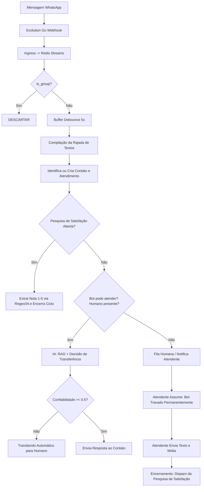

# Relatório Arquitetural Crítico e Comparativo: Smart Core Assistant v1 (Old) × v2 (Revisão Aprofundada)

> **Data:** 2026-09-06  
> **Autor:** Arquiteto de Software Sênior  
> **Objetivo:** Auditoria minuciosa, crítica e atualizada entre o monólito legado em Django (`old`) e os microsserviços distribuídos (`v2` em Rust, Flutter e IA Engine em Python). O relatório reflete com fidelidade o código vivo do repositório, corrigindo o status de rotinas recém-implementadas e detalhando todos os pontos que quebram o fluxo de atendimento e degradam a Experiência do Usuário (UX).

---

## 1. Visão Geral dos Projetos

### 1.1 O Projeto Legado (`old` — Django Monolith)
O projeto legado é composto por:
- **`old/paulo-ecoprint-server`**: Infraestrutura Docker de produção do cliente piloto (Ecoprint), contendo instâncias dedicadas de PostgreSQL (com pgvector), Redis e instâncias do WhatsApp via **Evolution Go** (`evoapicloud/evolution-go`).
- **`old/smart-core-assistant-painel`**: Monólito Python/Django estruturado em 14 apps e submódulos de serviços e IA:
  - **Atendimento e Conversa:** `atendimentos` (máquina de estados, orquestrador, transbordo, avaliação CSAT/NPS), `chat_evolution` (chat em tempo real do operador), `atendimento_unificado` (workspace com Server-Sent Events - SSE e extração assíncrona de campos).
  - **Operacional e Kanban:** `operacional` (departamentos, atendentes, instâncias WhatsApp, fluxos e etapas), `gestao_kanban` (quadro kanban interativo, drag-and-drop, notas e etiquetas).
  - **WhatsApp e Contatos:** `evolution_sync` (gestão de instâncias, QR code, keepalive a cada 60s via Celery Beat, whitelist, sincronização de avatares), `clientes` (CRM completo com Contatos e Clientes PJ com validação de CNPJ/CPF/CEP).
  - **IA e Treinamento:** `treinamento` (RAG com upload de documentos PDF/DOCX/XLS, vetorização pgvector, oráculo de testes), `modules/ai_engine` (`FeaturesCompose` com análise prévia, transcrição de áudio via Whisper/Groq, interpretação multimodal via Gemini/OpenAI Vision, extração de campos estruturados).
  - **Gestão e Integrações:** `tenants` (multi-tenancy, planos, assinaturas, convites com e-mail transacional), `settings_manager` (`CoreSettings` criptografado), `trello_sync` (sincronização bidirecional com Trello).

### 1.2 O Projeto v2 (`smart-core-assistant-v2` — Distributed Microservices)
A v2 modernizou a infraestrutura para eliminar o gargalo de provisionar bancos e contêineres individuais por cliente:
- **Backend Rust (`server/`)**: Cargo Workspace com 10 apps (`runtime_api`, `worker`, `control_plane`, `webhook_ingress`, `data_postgres`, `data_redis`, `data_storage`, `data_whatsapp`, `healthcheck`, `watchdog`) e 14 crates modulares (`contracts`, `transport`, `infrastructure_*`, `observability`, `error_core`, `domain_whatsapp`, `local_engine`). Comunicação via gRPC (Tonic), FlatBuffers e filas em Redis Streams.
- **Frontend Flutter (`clients/`)**: Monorepo Dart/Flutter com 12 módulos (`operacional_module`, `tenant_module`, `admin_module`, `onboarding_module`, `treinamento_module`, `login_module`, `design_system_module`, etc.) servindo duas aplicações: `smart-core-admin` (Superusuário / Web) e `smart-core-tenant` (Operação do Tenant / Windows Desktop e Web).
- **Motor de IA (`ia_engine/`)**: Microsserviço Python assíncrono consumido via gRPC pelo `worker` e `runtime_api`, com RAG pgvector, modelos de linguagem e visão multimodal.

---

## 2. O Fluxo de Atendimento Ponta a Ponta: v1 × v2



---

## 3. Matriz Crítica Atualizada: O Que Está Resolvido e O Que Falta

Após inspeção minuciosa dos arquivos-fonte (`server/apps/worker/src/main.rs`, `server/apps/worker/src/buffer_mensagens.rs`, `server/apps/worker/src/config_tenant.rs`, `data_postgres`, e módulos Flutter), detalhamos o status real de cada item:

### 🟢 Gaps Resolvidos Recentemente no Pipeline (Vitórias da Arquitetura v2)

1. **Buffer e Agregação de Rajada de Mensagens (Antigo D1 - RESOLVIDO):**
   - O módulo `buffer_mensagens.rs` está implementado e ativo no `main.rs` do `worker` (linhas 1326-1387). O worker aguarda a janela configurada (default 5s), drena o Redis e compila o bloco (`\n.join`), evitando respostas fragmentadas a monossílabos.
2. **Ciclo da Pesquisa de Satisfação (Antigo D3 - RESOLVIDO):**
   - Implementado via migração `0028_pesquisa_satisfacao.sql`, evento `pesquisa_solicitada` e rotina `tentar_registrar_avaliacao`. Aceita notas isoladas (1 a 5), estrelas (⭐⭐⭐⭐⭐), comentários e fallback semântico com IA via `ia_engine.Sentimento`.
3. **Fallback Customizado do Tenant (Antigo D4 - RESOLVIDO):**
   - Implementado via `config_tenant.rs`. O worker consulta o cache Redis publicado pelo `data_postgres` e honra `msg_fallback`, `msg_sem_info` e `msg_pesquisa_satisfacao` do tenant antes de aplicar constantes globais.

---

### 🔴 Categoria 1: Defeitos Críticos no Fluxo de Mensagens e WhatsApp

| # | Problema | Comportamento na v1 | Comportamento na v2 | Impacto no Usuário / Negócio |
|---|---|---|---|---|
| **D1** | **Envio de Mídia Outbound Quebrado no Worker** | Atendente enviava imagem/PDF pelo chat e a Evolution disparava `POST /message/sendMedia`. | Em `main.rs` (`processar_mensagem_persistida`), o worker **sempre monta payload com `"text": conteudo` e chama `SendWhatsappMessage`**, ignorando o campo `"midia"` do outbox! O método `SendWhatsappMedia` existe no `data_whatsapp`, mas **nunca é chamado pelo worker**. | Mesmo que o atendente tente enviar um anexo, o cliente no WhatsApp nunca recebe a foto ou documento (recebe texto vazio ou dá erro de envio). |
| **D2** | **Mensagens de Grupo Virando Atendimentos Individuais** | Descartava explicitamente mensagens cujo JID terminava em `@g.us` (`_is_group_message`). | O campo `is_group` é extraído no `domain_whatsapp`, mas **nem o `webhook_ingress` nem o `worker` o verificam**. | Mensagens de grupos geram atendimentos individuais no Kanban, poluindo a operação com conversas fora de contexto e expondo dados. |
| **D3** | **Status de Conexão WhatsApp Estático** | O evento `CONNECTION_UPDATE` atualizava em tempo real o status no banco e na interface. | O evento chega ao Redis Streams, mas **o worker não tem handler para ele**. O status só atualiza se forçado via polling manual. | O operador não sabe se o WhatsApp caiu ou deslogou, acumulando clientes sem resposta. |
| **D4** | **Ausência de Keepalive WhatsApp (Queda Silenciosa)** | Celery Beat executava a cada 60s `keepalive_evolution_instances`, reconectando instâncias ociosas. | Não há job de keepalive no `worker` ou `watchdog`. | O WhatsMeow (Evolution Go) derruba conexões inativas; números desconectam silenciosamente após períodos sem tráfego. |

---

### 🔴 Categoria 2: Quebra da Experiência no Chat Operacional (A Conversa é Manca)

| # | Funcionalidade Faltante | O que ocorria na v1 | O que ocorre na v2 | Impacto no Usuário |
|---|---|---|---|---|
| **C1** | **Atendente Sem Botão e Fluxo de Envio de Mídia na UI** | O atendente clicava no ícone de anexo, selecionava arquivo ou colava imagem da área de transferência. | O gateway do Flutter possui o método `enviarMidia`, mas **não existe controller, usecase e nem botão na tela de chat** (`chat_view.dart`). | O atendente é obrigado a usar o celular físico da empresa para enviar uma arte, boleto ou comprovante. |
| **C2** | **Atendente Não Vê Mídia Recebida no Chat** | Áudio, fotos e PDFs apareciam com player, preview e download. | O chat do Flutter exibe **apenas o resumo textual da IA** (`resumo_midia`). Não há exibição da imagem nem áudio player. | O atendente não consegue conferir comprovantes de pagamento nem escutar áudios de clientes. |
| **C3** | **Sem Marcação de Lido e Contador de Não Lidas** | Abrir a conversa sincronizava os ticks azuis no WhatsApp e zerava badges. | `MarkWhatsappMessageRead` está implementado no backend sem chamador no Flutter. Não há contador na lista de conversas. | Operadores perdem controle de quais conversas precisam de atendimento prioritário. |
| **C4** | **Sem Citação de Mensagem (Quote/Reply) no gRPC** | Operador respondia citando uma mensagem específica para dar contexto. | Colunas existem no banco, mas não foram expostas no `.proto` do gRPC. | Em conversas longas, o cliente não sabe a qual pergunta o atendente está respondendo. |
| **C5** | **Realtime Inativo no Aplicativo Desktop Windows** | SSE atualizava mensagens e cards em tempo real na tela. | `LocalEngineGateway` no Flutter desktop emite apenas eventos locais e não consome o `streamAtendimentos` gRPC do servidor. | O atendente no Windows precisa pressionar F5/Reload manualmente para ver mensagens novas. |

---

### 🟡 Categoria 3: Inteligência Artificial Desconectada da Decisão

| # | Problema | Como era na v1 | Como está na v2 | Impacto no Fluxo |
|---|---|---|---|---|
| **I1** | **Score de Confiabilidade Ignorado** | RAG com confiança `< 0.5` transferia imediatamente para a fila humana. | `ResponderResponse` retorna `confiabilidade`, mas o worker **descarta o valor e não persiste no banco**. | O bot responde com convicção mesmo quando tem 10% de certeza, induzindo o cliente ao erro e impedindo o transbordo automático. |
| **I2** | **`IaEngineService.Analyse` Morto no Fluxo Vivo** | Analisava a mensagem para extrair intenção, sentimento e entidades antes de responder. | O método gRPC `Analyse` está pronto no Python e no proto, mas **o worker não tem uma única chamada a ele**. | O atendimento fica sem assunto automático, sem etiquetas sugeridas e sem enriquecimento cadastral. |
| **I3** | **Campos Personalizados Sem Write-Back e Ocultos na Ficha** | A IA extraía campos dinâmicos (tamanho, prazo, material) e salvava em `ValorCampoAtendimento`. | Os campos são enviados apenas como leitura para o `Responder`; o worker não extrai novos valores e o `PainelFicha` do Flutter **nem sequer exibe campos personalizados** (mostra apenas etiquetas e notas). | O atendente precisa reescrever especificações do cliente manualmente em anotações soltas. |
| **I4** | **Treinamento RAG Sem Upload de Arquivos** | Aceitava upload de PDFs, DOCX, XLS/CSV com extração automática. | A tela do Flutter só aceita inserção manual de texto digitado ou colado. | O cliente não consegue carregar seus catálogos e manuais com facilidade. |

---

### 🟡 Categoria 4: Operação, Kanban e Gestão de Contatos/Clientes

| # | Funcionalidade | Situação na v1 | Situação na v2 | Consequência |
|---|---|---|---|---|
| **O1** | **Ausência de Módulo de Clientes (CRM PJ com CNPJ/Razão Social)** | App `clientes` completo com cadastro de empresas PJ, validação de CNPJ/CPF/CEP, múltiplos contatos vinculados e endereços. | As tabelas `oraculo_cliente` e `oraculo_cliente_contatos` existem no banco, mas **não há rotas no `runtime_api` e nenhuma tela no Flutter**. Só existe a lista simples de telefones (`ContatosPage`). | Impossível gerenciar cadastros de clientes corporativos, consultar dados fiscais ou relacionar contatos ao mesmo CNPJ. |
| **O2** | **Roteamento Cego de Conexões WhatsApp** | Cada instância de WhatsApp era ligada a um departamento específico (ex: Comercial, Suporte). | O roteamento usa cegamente **o primeiro fluxo ativo do tenant**. | Se a empresa tiver dois números (Vendas e Pós-Venda), todas as mensagens caem no mesmo fluxo indistintamente. |
| **O3** | **Sem Botão para Pausar o Bot por Conexão / Instância** | Havia um botão na interface para pausar o bot de uma linha inteira (`AppInstance.resposta_bot`). | Não existe toggle de bot por conexão nem no gRPC e nem no Flutter. | Impossível pausar o bot em plantões ou campanhas manuais sem desligar o contêiner do sistema. |
| **O4** | **Atribuição Automática de Atendentes Desligada** | Distribuía atendimentos via round-robin respeitando a carga máxima (`max_atendimentos_simultaneos`). | As colunas existem, mas a atribuição só acontece se o operador arrastar manualmente o card no Kanban. | Atendimentos ficam parados na fila até que alguém decida puxar o atendimento. |
| **O5** | **Storage Leak: Sem Expiração/Purga de Mídias Antigas** | Celery Beat rodava diariamente `purge_old_media_all_tenants` apagando arquivos com mais de 30 dias (`MEDIA_RETENTION_DAYS`). | Não há job de expiração no `worker` ou no Cloudflare R2/Storage. | O volume de armazenamento cresce sem limites, onerando custos de infraestrutura. |

---

### ⚪ Categoria 5: Usuários, Acessos e Configurações

| # | Funcionalidade | Situação na v1 | Situação na v2 | Consequência |
|---|---|---|---|---|
| **U1** | **Zero Envio de E-mails (Sem Cliente SMTP no Rust)** | Enviava convites, ativações e resets de senha por e-mail transacional. | Não há biblioteca SMTP (`lettre` ou similar) em todo o backend Rust. | Convites geram links relativos que o administrador precisa copiar e enviar manualmente por WhatsApp. |
| **U2** | **Recuperação de Senha Inexistente** | Fluxo completo de esqueci minha senha via e-mail e token. | Não existe endpoint nem tela de esqueci minha senha. | Usuário que esquecer a senha fica permanentemente trancado fora do sistema. |
| **U3** | **Atendente Não Ganha Login Automaticamente** | Atendente era associado diretamente a uma conta de usuário (`User`). | Cadastrar atendente cria apenas um registro operacional com `usuario_id = NULL`. | O atendente cadastrado não tem acesso ao sistema; o admin precisa convidá-lo separadamente em outra tela. |
| **U4** | **Permissões por Módulo Inertes no Backend** | Controle rigoroso por módulo (`PAINEL_ADMIN`, `TREINAMENTO`, `CONFIGURACOES`). | `module_permissions` é gravado no banco, mas o backend valida apenas `role` (`admin`/`staff`). | Permissões personalizadas não têm efeito protetivo real no backend. |
| **U5** | **Painel de Configurações Incompleto (6 de 33 Campos)** | Interface abrangente para parâmetros de LLM, RAG, transcrição e identidade visual. | Tela de configurações do Flutter expõe 6 campos básicos; 27 parâmetros técnicos estão ocultos. | O contratante não consegue customizar a experiência e os parâmetros de IA sem intervenção técnica. |

---

## 4. Plano de Ação Priorizado (Roteiro de Implementação)

Com base nas correções e novas descobertas, o roteiro de implementação deve seguir a seguinte ordem técnica de precedência:

```mermaid
graph TD
    subgraph Fase 1: Correção do Pipeline de Mensagens e WhatsApp
        F1[Conectar SendWhatsappMedia no processar_mensagem_persistida do Worker]
        F2[Descartar Mensagens de Grupo no ingress ou worker]
        F3[Vincular Instância do WhatsApp a Departamento/Fluxo]
        F4[Adicionar Job de Keepalive 60s para Evolution Go no Worker]
    end

    subgraph Fase 2: Experiência Completa do Chat Operacional
        C1[Criar Botão de Anexo e Envio de Mídia no Chat Flutter]
        C2[Implementar Visualizador de Imagem, PDF e Áudio no Chat]
        C3[Conectar Marcar Como Lido e Contador de Mensagens Não Lidas]
        C4[Conectar Stream gRPC Realtime no LocalEngineGateway Desktop]
    end

    subgraph Fase 3: Inteligência e Automação de Fila
        I1[Ativar Avaliação de Confiabilidade para Transbordo Humano < 0.5]
        I2[Ativar IaEngine.Analyse para Assunto e Tags Automáticas]
        I3[Ativar Extração e Exibição de Campos Personalizados na Ficha]
        I4[Ativar Distribuição Round-Robin de Atendimentos na Fila]
    end

    subgraph Fase 4: Gestão do Tenant, CRM e Sustentabilidade
        U1[Criar Telas e RPCs para Módulo de Clientes PJ/CNPJ]
        U2[Integrar Cliente SMTP lettre para Envio Real de Convites e Reset]
        U3[Implementar Job Diário de Purga de Mídias Antigas no Storage]
        U4[Toggle de Pausa de Bot por Conexão na Interface]
        U5[Habilitar Upload de Arquivos no Treinamento RAG]
```

### Detalhamento das Entregas:

1. **Fase 1 — Estabilidade do Pipeline e WhatsApp:**
   - Em `worker/src/main.rs` (`processar_mensagem_persistida`): verificar se o evento contém objeto `midia`. Se contiver, chamar `data_whatsapp::SendWhatsappMedia` passando `chave`, `mimetype` e `nome_arquivo` em vez de `SendWhatsappMessage`.
   - Adicionar checagem `if msg_normalized.is_group { return Ok(()); }` logo após a normalização do payload.
   - Adicionar `departamento_id` na tabela `whatsapp_instance` e utilizá-lo na resolução de fluxo em vez de pegar o primeiro do tenant.
   - Criar rotina periódica no `scheduler.rs` do worker para verificar o status das instâncias e acionar reconnect caso estejam inativas.

2. **Fase 2 — Chat Operacional Completo:**
   - Adicionar botão de upload de mídia no `chat_view.dart`, disparando `enviarMidia` do repositório com barra de progresso.
   - Exibir miniaturas com link pré-assinado do Cloudflare R2 e player de áudio para mensagens com `tipo in ('imageMessage', 'audioMessage', 'documentMessage')`.
   - Chamar `MarkWhatsappMessageRead` ao abrir a conversa e renderizar badges numéricos na lista de conversas.
   - Ajustar `LocalEngineGateway` para assinar o streaming gRPC no Windows Desktop.

3. **Fase 3 — Decisão por IA e Gestão de Fila:**
   - No `responder_via_ia`, ler `resposta.confiabilidade`. Se `< 0.5`, desativar `bot_pode_atender` e acionar transbordo para fila humana. Gravar o valor na coluna `confianca_resposta`.
   - Invocar `ia_client.analyse` para popular `assunto` e sugerir tags da conversa.
   - Exibir campos personalizados no `PainelFicha` do Flutter e permitir edição manual.
   - Habilitar atribuição automática por menor carga entre atendentes ativos do departamento.

4. **Fase 4 — CRM de Clientes, E-mail e Storage:**
   - Criar telas de CRUD de Clientes (PJ/PF) no `tenant_module` do Flutter consumindo RPCs de clientes do `runtime_api`.
   - Adicionar crate `lettre` no `runtime_api` ou `worker` para entrega de convites e recuperação de senha.
   - Adicionar tarefa agendada no `scheduler.rs` para remover mídias com mais de 30 dias do storage R2.
   - Implementar toggle na tela de conexões para pausar/ativar respostas do bot individualmente por linha do WhatsApp.

---

## 5. Conclusão

A v2 do Smart Core Assistant possui uma **arquitetura de microsserviços robusta, moderna e de alto desempenho**, superando amplamente a v1 em isolamento de dados (RLS), segurança criptográfica e escalabilidade horizontal.

Esta auditoria atualizada comprova que marcos fundamentais já foram conquistados (como o buffer de rajadas N8.5/E2 e a pesquisa de satisfação N8.5/E3). As lacunas restantes — com destaque para a correção do envio de mídia no worker, a habilitação do botão de envio no chat, a implementação da tela de Clientes PJ e a ativação da confiabilidade da IA — são pontuais e cirúrgicas. A execução do roteiro acima garantirá paridade funcional plena e uma experiência de usuário excepcional.

---

## 6. Auditoria deste relatório (2026-09-06)

> Este documento foi produzido por outra ferramenta. Cada linha foi **reverificada
> contra o código** antes de virar plano. O resultado está abaixo: **11 achados
> confirmados** (vários que os docs 29 e 30 não tinham), **5 vencidos ou
> incorretos**, e **uma correção a um erro meu** no doc 30.

### Confirmados — e valiosos

| # | Veredito | Evidência |
|---|---|---|
| **D1** | ✅ **Confirmado — grave** | O `data_postgres` monta o outbox com o objeto `midia` e o comentário explícito *"O worker precisa saber que é mídia para chamar SendWhatsappMedia"* (`atendimento.rs:562`). O worker monta `{"id","to_number","text": conteudo}` e chama **sempre** `SendWhatsappMessage` (`main.rs:2584`). `SendWhatsappMedia` **não é chamado em lugar nenhum** fora do próprio `data_whatsapp`. O anexo do atendente não chega ao cliente. |
| **C1** | ✅ Confirmado | `enviarMidia` existe no gateway, no gateway local e no contrato do domínio — e **nenhum controller ou página chama**. Só aparece em gateways e no fake de teste. |
| **C2** | ✅ Confirmado | `chat_message_bubble.dart:51` renderiza **apenas** `mensagem.resumoMidia`. Nenhum `Image`, nenhum player. |
| **C3** | ✅ Confirmado | `MarkWhatsappMessageRead` só existe no `data_whatsapp`; zero chamadores no Flutter. |
| **C5** | ✅ Confirmado | É o F8 do doc 30, já diagnosticado por outro caminho. |
| **I1** | ✅ **Confirmado — e pior do que o relatório diz** | Ver a correção abaixo. |
| **I2** | ✅ Confirmado | Nenhuma chamada a `Analyse` no worker. É a causa raiz do F4 (assunto e tags automáticos). |
| **I3** | ✅ Confirmado | Coerente com I2 — sem `Analyse` não há extração de campos. |
| **I4** | ⚠️ Confirmado com ressalva | `file_picker` está declarado **só** no `operacional_module` — e lá nem é usado (ver C1). O módulo de treinamento não o declara. |
| **O1** | ✅ **Confirmado — tabela morta** | `oraculo_cliente` existe desde a migração `0004`, com RLS ativa e índice único por CNPJ. **Zero RPCs** no `admin.proto`, zero referência no `data_postgres`, zero telas. Schema completo sem uma linha de código que o use. |
| **O2/O3/O4** | ✅ Confirmados | São F5, F2 e F3 do doc 30. |
| **U1..U5** | ✅ Confirmados | São L1, L5, L2, L3 e L6 do doc 29 — com a ressalva do U4 abaixo. |

### Vencidos ou incorretos — **não** levar para o plano

| # | Afirmação do relatório | Realidade |
|---|---|---|
| **D2** | *"Mensagens de grupo viram atendimentos individuais"* | ❌ **Falso.** `evento_de_grupo` (`webhook_ingress/src/main.rs:157`) faz checagem **dupla** — flag `isGroup`/`Info.IsGroup` **e** fallback pelo sufixo `@g.us` — e descarta na ingestão (linha 410), com 8 testes. A decisão está documentada no código: *"não existe atendimento de grupo na v2, nem como opção"*. |
| **D3** | *"Worker não tem handler para CONNECTION_UPDATE"* | ❌ **Vencido.** O handler existe (`worker/src/main.rs:813`) e publica `whatsapp.conexao` no realtime. |
| **D4** | *"Não há job de keepalive"* | ❌ **Vencido nesta sessão.** `reconciliar_conexoes_whatsapp` foi acrescentada ao `scheduler.rs`, junto da correção do `provider.rs` que tratava socket morto como conectado. |
| **O5** | *"Sem expiração/purga de mídias antigas"* | ❌ **Falso.** `processar_midia_expirada` (`scheduler.rs:233`) roda com `SMARTCORE_SCHEDULER_MEDIA_IDADE_MAX_DIAS`, padrão **30 dias** — exatamente o `MEDIA_RETENTION_DAYS` da v1. |
| **C4** | *"Citação não foi exposta no `.proto`"* | ❌ **Falso.** `mensagem_citada_id`, `citada_remetente` e `citada_preview` estão no `admin.proto` (linhas 514–516 e 569). O que falta é uso na interface, não contrato. |
| **U4** | *"`module_permissions` inerte; backend valida só `role`"* | ❌ **Falso** — e eu repeti o mesmo erro no doc 29. `derivar_escopos` lê o campo e ele **é** a fonte dos escopos do JWT. Ver a L3 revisada. |

### Correção a um erro meu no doc 30 (F1)

O relatório está certo e eu estava errado. Eu havia escrito que *"a v2 **grava** `confianca_resposta` mas ninguém lê"*. O correto:

- `responder_via_ia` (`worker/src/main.rs:543`) retorna **só** `resposta.resposta_texto`. O campo `confiabilidade`, que vem preenchido do `ia_engine`, é **descartado ali mesmo** — a palavra não aparece uma única vez em `worker/src/main.rs`.
- `registrar_resposta_bot`, o único `UPDATE` que grava `confianca_resposta`, é chamado **exclusivamente por um teste de integração** (`tests/atendimentos/mod.rs:161`). Nenhum caminho de produção o invoca.
- Logo, `oraculo_mensagem.confianca_resposta` é **sempre nulo** em produção — e `resposta_bot` e `respondida` também não são preenchidos por esse caminho.

**Nuance que nenhum dos dois documentos tinha:** a v2 não deixou a decisão órfã — ela a **moveu para dentro do LLM**. O `ia_engine` devolve `transferir_atendimento` + `fluxo_transferencia`, e o worker aplica isso em `aplicar_transferencia_ia` (N6.3), com auditoria. O comentário no código chama isso de *"safety-net de transferência"*.

→ Isso muda a decisão de produto nº 1: não se trata de "religar" as faixas da v1 num vazio, e sim de decidir **quem manda** quando o LLM diz "não transferir" e a confiança está em 0.2. A recomendação é a faixa numérica ter **poder de veto** sobre o flag do LLM — um número calibrável é auditável; a auto-avaliação do modelo, não.
