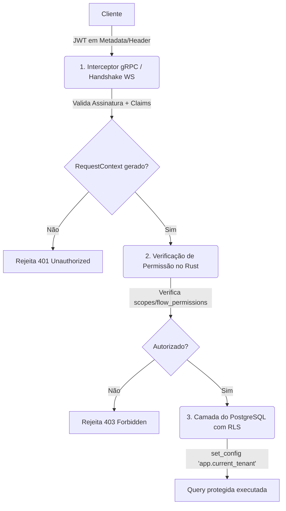

# 03 — Comunicação Front↔Back e Encaixe da Autenticação

> Status: **Atualizado & Detalhado** (Junho de 2026).
> A fundação Redis (`infrastructure_redis`) já está implementada e validada (incluindo rotação de Refresh Tokens e Blocklist de Access Tokens).
> Este documento consolida a arquitetura de transporte, o modelo de segurança e resolve as decisões em aberto para a implementação da autenticação.

## 1. Transporte Front↔Back

O transporte de dados entre o cliente (Flutter) e o servidor (`runtime_api`) dar-se-á através de dois protocolos especializados de rede:

### 1.1 gRPC (tonic) — Comandos e Consultas (Request-Response)
* **Protocolo:** HTTP/2 puro (gRPC padrão).
* **Escopo:** Operações síncronas de escrita (comandos) e leitura (consultas).
* **Tonic em Rust:** A `runtime_api` atuará como um servidor gRPC utilizando o crate `tonic`.
* **Multiplexação/Portas:** O servidor gRPC rodará em uma porta dedicada (ex.: `50051`). Isso isola o tráfego HTTP/2 de alta performance do tráfego WebSocket.

### 1.2 WebSockets — Realtime e Eventos Push
* **Protocolo:** WebSocket (HTTP/1.1 Upgrade ou HTTP/2 Extended Connect).
* **Escopo:** Atualizações bidirecionais e pushes em tempo real (novas mensagens, digitação, presença, atualizações no Kanban, etc.).
* **Mecanismo:** Hospedado no `runtime_api` utilizando `axum::extract::ws` (ou similar integrado ao stack de rede).
* **Escalabilidade (Redis Pub/Sub):** Para suportar múltiplas réplicas do `runtime_api`, eventos recebidos pelo Worker são publicados no Redis Pub/Sub. Cada réplica do `runtime_api` assina os canais correspondentes aos clientes conectados nela e propaga as mensagens via WebSocket.
* **Handshake e Auth:** A conexão WebSocket exige autenticação. Como os cabeçalhos HTTP convencionais podem não ser customizáveis em todos os clientes WebSocket (como navegadores), a autenticação será aceita tanto via cabeçalho `Authorization: Bearer <JWT>` quanto via Query Parameter `?token=<JWT>`. O token é validado imediatamente no handshake; se inválido, a conexão é rejeitada (status HTTP 401).

---

## 2. JWT & Gerenciamento de Sessão

O sistema de autenticação utilizará JSON Web Tokens (JWT) baseados no algoritmo **HS256** (HMAC com SHA-256).

### 2.1 Estrutura das Claims (Access Token)
A biblioteca Rust recomendada é a `jsonwebtoken`. O payload conterá as seguintes chaves padrão e personalizadas:

```json
{
  "iss": "smartcore",
  "sub": "42",                  // ID do usuário (auth_user.id) convertido para string
  "email": "user@tenant.com",   // E-mail do usuário
  "tenant_id": "uuid-do-tenant", // UUID do tenant (null para superuser)
  "role": "staff",              // Role principal do usuário (admin, manager, staff, viewer)
  "scopes": ["clientes:read", "atendimentos:write"], // Escopos de permissão resolvidos
  "jti": "uuid-identificador-unico-do-token", // Para identificação na blocklist
  "exp": 1780339200             // Timestamp de expiração (15 minutos a partir da emissão)
}
```

### 2.2 Ciclo de Vida dos Tokens
1. **Access Token (JWT):** Curta duração (**15 minutos**). Não é persistido no banco; validado de forma stateless pela assinatura criptográfica.
2. **Refresh Token (Opaque Token):** Longa duração (**7 dias**). Gerado como uma string aleatória criptograficamente segura (32 bytes em base64).
   * O cliente envia o Refresh Token em claro.
   * O servidor valida calculando o hash SHA-256 do token e buscando no Redis (`infrastructure_redis::auth_tokens::RefreshTokenStore`).
   * **Rotação por Família:** A cada uso, o Refresh Token antigo é invalidado e um novo par (Access + Refresh) é emitido. Caso um token já rotacionado seja enviado novamente, o Redis detecta reuso fraudulento e revoga toda a família associada (logout forçado em todos os dispositivos daquele login).
3. **Revogação (Logout):** O `jti` do Access Token é inserido na blocklist do Redis (`infrastructure_redis::auth_tokens::TokenBlocklist`) com o TTL correspondente ao tempo de vida restante do token. O Refresh Token é deletado.

---

## 3. Resolução das Decisões em Aberto

### 3.1 Escopo da Entrega do Auth
* **Decisão:** **Opção B — Camada de serviço de domínio + `runtime_api` mínimo.**
* **Racional:** Implementar apenas as bibliotecas de domínio sem um ponto de entrada gRPC real impede a validação da integração do fluxo do cliente. Desenvolveremos um servidor gRPC mínimo em `apps/runtime_api` expondo o serviço de autenticação (`AuthService`) com os métodos gRPC:
  * `Register` (cadastro do tenant owner)
  * `Login` (autenticação por e-mail/senha)
  * `RefreshToken` (rotação de tokens)
  * `Logout` (invalidação de sessão)
  * Um interceptor gRPC para validar o JWT e injetar o `RequestContext`.

### 3.2 Resolução Multi-tenant no Login
* **Decisão:** **Resolução automática no Login (Relação 1-para-1).**
* **Racional:** A tabela `tenants_tenantuser` do banco de dados possui uma restrição `UNIQUE` na coluna `user_id`:
  ```sql
  CREATE TABLE tenants_tenantuser (
      id SERIAL PRIMARY KEY,
      user_id INT NOT NULL UNIQUE REFERENCES auth_user(id) ON DELETE CASCADE,
      tenant_id UUID NOT NULL REFERENCES tenants_tenant(id) ...
  );
  ```
  Isso significa que, no banco de dados atual, um usuário do sistema pode pertencer a no máximo um único tenant. Portanto:
  1. No momento do login, o servidor autentica o usuário global em `auth_user`.
  2. Em seguida, busca o registro correspondente em `tenants_tenantuser` (usando o pool administrativo, pois RLS impede busca cross-tenant direta).
  3. Se encontrado, extrai o `tenant_id` e as permissões (`role`, `module_permissions`, `flow_permissions`).
  4. Se o usuário for um superuser (`is_superuser = true` em `auth_user` e não possuir registro em `tenants_tenantuser`), o login é bem-sucedido e o `tenant_id` nas claims do JWT será `null` (acesso administrativo global).
  5. Não há necessidade de fluxo de seleção de tenant pelo cliente, pois a associação é unívoca.

### 3.3 Parâmetros do Argon2id e Política de Senhas
* **Decisão:** Uso do **`Argon2::default()`** conforme já implementado em `infrastructure_postgres/src/auth/password.rs` (m_cost = 19456, t_cost = 3, p_cost = 1).
* **Política de Complexidade de Senhas:** A validação será executada na camada de aplicação Rust durante a criação de usuários/cadastro. Requisitos obrigatórios:
  * Mínimo de 8 caracteres.
  * Pelo menos uma letra maiúscula (A-Z).
  * Pelo menos uma letra minúscula (a-z).
  * Pelo menos um caractere numérico (0-9).
  * Pelo menos um caractere especial (ex: `@`, `#`, `$`, `%`, `!`, `*`).

---

## 4. Defesa em 3 Camadas e RLS

A arquitetura de segurança é baseada no princípio de defesa em profundidade:



### Camada 1: Interceptor gRPC (Middleware)
O interceptor Tonic intercepta cada chamada gRPC no `runtime_api`.
* **Ações:**
  1. Extrai o cabeçalho `Authorization` (formato `Bearer <JWT>`).
  2. Valida a expiração (`exp`), o emissor (`iss`) e a assinatura do JWT contra o `JWT_SECRET` da aplicação.
  3. Verifica se o `jti` do token está na blocklist do Redis. Se estiver, rejeita a requisição.
  4. Carrega as `flow_permissions` associadas do **Redis** (onde são cacheadas com TTL de 60 segundos) para evitar queries redundantes ao banco.
  5. Constrói o `RequestContext` e o insere nas extensões da requisição gRPC (no `tonic::Request::extensions_mut`).

### Camada 2: Validação de Escopos na Aplicação Rust
Antes de interagir com o banco de dados, os handlers do gRPC ou os casos de uso verificam a permissão na camada Rust usando as funções auxiliares de `RequestContext`:
* `RequestContext::has_permission("recurso:write")` (ex.: fail-fast antes de chamar o repositório).
* `RequestContext::has_flow_permission(flow_id)` (validação específica para acessar fluxos e visualizações do Kanban).

### Camada 3: Isolamento Multi-tenant no Banco via RLS
Como garantia final e intransponível contra vazamento de dados, todas as consultas ao PostgreSQL rodam com Row-Level Security (RLS) habilitado.
* Ao abrir uma transação no PostgreSQL, a camada de infraestrutura/repositório Rust executa a query:
  ```sql
  SELECT set_config('app.current_tenant', $1, true);
  ```
  (onde `$1` é o `tenant_id` obtido exclusivamente do `RequestContext`).
* A propriedade `true` do `set_config` garante que a variável tenha escopo local à transação atual (`SET LOCAL`), sendo automaticamente resetada após o commit ou rollback da transação.
* Consultas executadas sem definir essa variável de sessão retornarão zero registros ou falharão, pois a policy do RLS (`USING (tenant_id = NULLIF(current_setting('app.current_tenant', true), '')::uuid)`) é ativada em modo "fail-closed".

---

## 5. Fluxos Detalhados de Autenticação

### 5.1 Fluxo de Cadastro de Tenant (Owner)
1. O cliente faz chamada gRPC `AuthService/Register` passando dados do usuário (username, e-mail, senha, nome completo) e do tenant (nome da empresa, slug).
2. O serviço valida a complexidade da senha e se o e-mail/username já existem (`buscar_por_email`/`buscar_por_username`).
3. O hash da senha é gerado usando Argon2id.
4. Abre-se uma transação no banco de dados:
   * Cria o `auth_user` global.
   * Cria o `tenants_tenant` (cujo ID é gerado automaticamente).
   * Configura temporariamente o `app.current_tenant` com o novo ID para satisfazer a constraint RLS.
   * Cria o `tenants_tenantuser` associando o usuário ao tenant com a role `admin`.
5. Comita a transação.
6. Emite o par de tokens (Access Token JWT + Refresh Token opaque salvo no Redis) e retorna ao cliente.

### 5.2 Fluxo de Login
1. O cliente faz chamada gRPC `AuthService/Login` com e-mail/username e senha.
2. O serviço busca o usuário global em `auth_user` usando `buscar_por_email` ou `buscar_por_username` (usando o admin pool do banco, sem RLS).
3. Se o usuário não existir ou estiver inativo, retorna erro genérico de autenticação (evitando vazamento de usuários existentes).
4. O hash da senha é verificado usando `verify_password`. Se inválido, retorna erro.
5. O serviço busca o vínculo do usuário em `tenants_tenantuser` (usando o admin pool, pois o RLS da tabela impede lookups sem tenant).
6. Gera o payload de claims do JWT (incluindo o `tenant_id` do vínculo e a `role` + escopos correspondentes).
7. Gera um novo `family_id` (UUIDv4) para esta sessão.
8. Gera um Refresh Token opaco e armazena seu hash SHA-256 no Redis via `RefreshTokenStore::armazenar` com o TTL configurado (7 dias) e o `family_id` gerado.
9. Registra o último login em `auth_user` (assincronamente ou na mesma transação).
10. Retorna o Access Token e o Refresh Token.

### 5.3 Fluxo de Rotação de Token (Refresh)
1. O cliente envia o Refresh Token anterior e solicita um novo par (chamada gRPC `AuthService/RefreshToken`).
2. O serviço calcula o hash SHA-256 do token recebido.
3. Chama `RefreshTokenStore::validar_e_rotacionar(hash)` no Redis.
   * Se o Redis retornar `NotFound` (token expirou ou foi revogado), retorna erro de sessão inválida (HTTP/gRPC 401).
   * Se retornar `TokenReuse` (indicação de roubo de sessão), o Redis revoga imediatamente a família de tokens inteira e o servidor retorna erro 401.
4. Se a rotação for bem-sucedida, o Redis marca o token anterior como rotacionado e retorna os dados originais (incluindo o `family_id`, `user_id` e `tenant_id`).
5. O servidor gera um novo Access Token JWT e um novo Refresh Token opaco.
6. Armazena o hash do novo Refresh Token no Redis, mantendo o mesmo `family_id` e renovando o TTL.
7. Retorna o novo par de tokens ao cliente.

### 5.4 Fluxo de Logout
1. O cliente chama gRPC `AuthService/Logout` passando o Access Token e o Refresh Token.
2. O servidor extrai o `jti`, a expiração (`exp`) e o `family_id` das claims do Access Token.
3. O `jti` é adicionado na blocklist do Redis (`TokenBlocklist::bloquear`) com TTL igual a `exp - NOW()`.
4. O servidor chama `RefreshTokenStore::revogar_familia(family_id)` para revogar todos os refresh tokens ativos dessa sessão no Redis.
5. Retorna sucesso.

---

## 6. Próximos Passos de Implementação

Com a fundação `infrastructure_redis` e as decisões estratégicas definidas:

1. **Adicionar Dependência de JWT:** Adicionar a biblioteca `jsonwebtoken` e `lazy_static` ou `once_cell` ao `Cargo.toml` do workspace para gerenciamento do segredo do token.
2. **Definir Contrato Proto:** Criar o arquivo `auth.proto` em `crates/contracts` com as definições de gRPC para login, cadastro, logout e refresh.
3. **Desenvolver o Crate de Aplicação (ou extensões no `infrastructure_postgres`):** Criar serviços que orquestrem as chamadas de banco e criptografia de senha.
4. **Criar a App `runtime_api`:**
   * Iniciar a aplicação `apps/runtime_api/src/main.rs`.
   * Configurar o servidor Tonic gRPC.
   * Desenvolver e injetar o middleware/interceptor de autenticação (`AuthInterceptor`).
   * Configurar a infraestrutura inicial para WebSockets.
