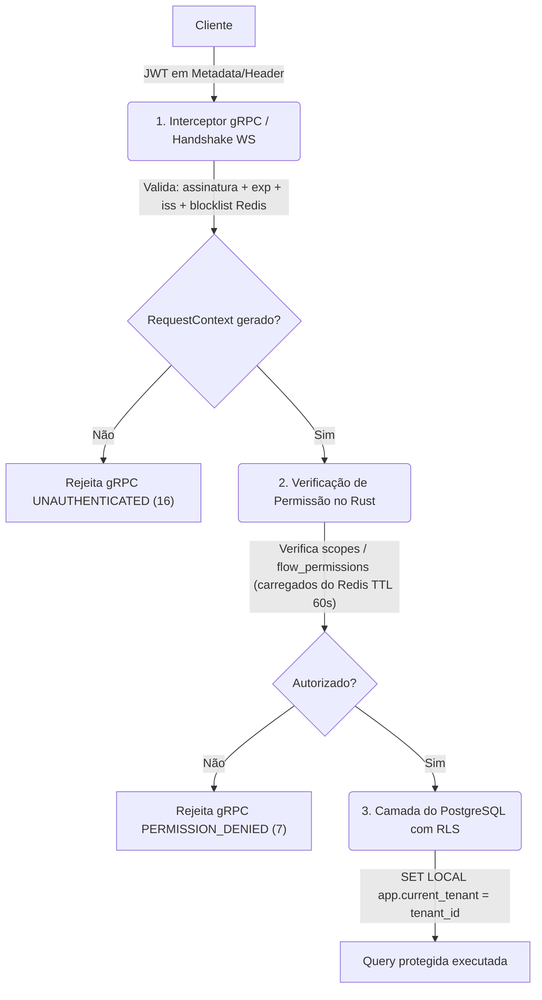

# 09 — Comunicação Front↔Back e Encaixe da Autenticação

> **Histórico.** Este documento foi canonizado pela skill `plan-restructuring` para o dotcontext.
> A fonte da verdade passa a ser o plano canônico em
> `.context/plans/user-auth-module.md` (+ `plano_completo` e `info_aux` na pasta
> `.context/plans/user-auth-module/`). Mantido aqui como registro original.

> Status: **Atualizado & Detalhado** (Junho de 2026).
> A fundação Redis (`infrastructure_redis`) já está implementada e validada (incluindo rotação de Refresh Tokens e Blocklist de Access Tokens).
> Este documento consolida a arquitetura de transporte, o modelo de segurança e resolve as decisões em aberto para a implementação da autenticação.

---

## 1. Transporte Front↔Back

O transporte de dados entre o cliente (Flutter) e o servidor (`runtime_api`) dar-se-á através de dois protocolos especializados de rede:

### 1.1 gRPC (tonic) — Comandos e Consultas (Request-Response)
* **Protocolo:** HTTP/2 puro (gRPC padrão).
* **Escopo:** Operações síncronas de escrita (comandos) e leitura (consultas).
* **Tonic em Rust:** A `runtime_api` atuará como um servidor gRPC utilizando o crate `tonic`.
* **Multiplexação/Portas:** O servidor gRPC rodará em uma porta dedicada (ex.: `50051`), atendendo tanto comandos/consultas unários quanto o **Server Streaming** de realtime. O Nginx/Caddy na frente termina o TLS, fala **HTTP/2** com o backend e traduz **gRPC-Web** para o cliente Flutter Web; o gRPC nativo do Flutter Desktop chega direto.
* **Erros gRPC:** O interceptor retorna `Status::unauthenticated(msg)` (código 16) para JWT ausente/inválido/blocklisted e `Status::permission_denied(msg)` (código 7) para escopos insuficientes. O cliente Flutter mapeia esses códigos nos interceptors do `api_client`.

### 1.2 Realtime e Eventos Push

> ⚠️ **Superado (decisão D7 — junho/2026).** O realtime foi **padronizado em
> gRPC Server Streaming**, não mais WebSocket. Ver
> [00-planejamento-inicial.md §8](./00-planejamento-inicial.md#8-comunicação-com-o-flutter-cliente-fino--ffi-híbrido)
> e a Fase 6.2 do [doc 02](./02-fases-desenvolvimento.md). O cliente abre um
> stream gRPC (ex.: `StreamAtendimentos`); o servidor empurra eventos; o fan-out
> multi-réplica continua por **Redis pub/sub**. A **validação do JWT** descrita
> abaixo permanece válida, porém aplicada na **abertura do stream** (mesmo
> interceptor das chamadas unárias), e o token viaja no **metadata gRPC** — não há
> handshake WebSocket nem token em query param. O texto WebSocket a seguir é
> mantido apenas como registro histórico.

* **Protocolo:** WebSocket (HTTP/1.1 Upgrade ou HTTP/2 Extended Connect).
* **Escopo:** Atualizações bidirecionais e pushes em tempo real (novas mensagens, digitação, presença, atualizações no Kanban, etc.).
* **Mecanismo:** Hospedado no `runtime_api` utilizando `axum::extract::ws` (ou similar integrado ao stack de rede).
* **Escalabilidade (Redis Pub/Sub):** Para suportar múltiplas réplicas do `runtime_api`, eventos recebidos pelo Worker são publicados no Redis Pub/Sub. Cada réplica do `runtime_api` assina os canais correspondentes aos clientes conectados nela e propaga as mensagens via WebSocket.
* **Handshake e Auth:** A conexão WebSocket exige autenticação. Como os cabeçalhos HTTP convencionais podem não ser customizáveis em todos os clientes WebSocket (incluindo alguns navegadores), a autenticação será aceita tanto via cabeçalho `Authorization: Bearer <JWT>` quanto via Query Parameter `?token=<JWT>`. O token é validado imediatamente no handshake; se inválido, a conexão é rejeitada (close code 4401).

  > **Atenção — Segurança do Query Param:** Tokens em query string aparecem em logs de servidor, histórico do navegador e no cabeçalho `Referer`. Mitigações obrigatórias:
  > 1. O token WS deve ser de **curta duração** (use o Access Token de 15 min, nunca o Refresh Token).
  > 2. O Nginx deve ser configurado com `proxy_hide_header Referer` e logs anonimizados para URLs de WebSocket.
  > 3. Prefira o cabeçalho `Authorization` em clientes onde for suportado (Flutter Desktop).

---

## 2. JWT & Gerenciamento de Sessão

O sistema de autenticação utilizará JSON Web Tokens (JWT) baseados no algoritmo **HS256** (HMAC com SHA-256). A chave secreta (`JWT_SECRET`) é uma string de no mínimo 256 bits lida exclusivamente via variável de ambiente — nunca hardcoded.

> **Nota sobre HS256 vs RS256:** HS256 é adequado para este sistema pois há um único serviço que tanto emite quanto valida os tokens (`runtime_api`). Se no futuro outros serviços precisarem validar JWTs sem passar pela `runtime_api`, deve-se migrar para RS256 (assimétrico) — a migração é simples na biblioteca `jsonwebtoken`.

### 2.1 Estrutura das Claims (Access Token)
A biblioteca Rust recomendada é a `jsonwebtoken`. O payload conterá as seguintes chaves padrão e personalizadas:

```json
{
  "iss": "smartcore",
  "sub": "42",                    // ID do usuário (auth_user.id) convertido para string
  "iat": 1780338300,              // Timestamp de emissão (Unix seconds)
  "exp": 1780339200,              // Timestamp de expiração (15 minutos a partir do iat)
  "email": "user@tenant.com",    // E-mail do usuário
  "tenant_id": "uuid-do-tenant", // UUID do tenant (null para superuser)
  "role": "staff",               // Role principal do usuário (admin, manager, staff, viewer)
  "scopes": ["clientes:read", "atendimentos:write"], // Escopos de permissão resolvidos
  "jti": "uuid-identificador-unico-do-token",        // Para identificação na blocklist
  "family_id": "uuid-da-familia-de-sessao"           // Para revogação de família no logout
}
```

> **`family_id` nas claims:** Necessário para que o logout revogue todos os refresh tokens da sessão sem exigir que o Refresh Token seja válido no momento da chamada. O `family_id` é gerado no servidor no momento do login e mantido constante durante toda a vida da família de rotação.

### 2.2 Ciclo de Vida dos Tokens
1. **Access Token (JWT):** Curta duração (**15 minutos**). Não é persistido no banco; validado de forma stateless pela assinatura criptográfica. Carrega `family_id` para facilitar o logout.
2. **Refresh Token (Opaque Token):** Longa duração (**7 dias**). Gerado como `32 bytes` lidos de `rand::rngs::OsRng` e codificados em **base64url** (sem padding), resultando em uma string de ~43 caracteres.
   * O cliente envia o Refresh Token em claro.
   * O servidor valida calculando o hash SHA-256 do token e buscando no Redis (`infrastructure_redis::auth_tokens::RefreshTokenStore`).
   * **Rotação por Família:** A cada uso, o Refresh Token antigo é invalidado e um novo par (Access + Refresh) é emitido. Caso um token já rotacionado seja enviado novamente, o Redis detecta reuso fraudulento e revoga toda a família associada (logout forçado em todos os dispositivos daquele login).
3. **Revogação (Logout):** O `jti` do Access Token é inserido na blocklist do Redis (`infrastructure_redis::auth_tokens::TokenBlocklist`) com o TTL correspondente ao tempo de vida restante do token. O Refresh Token é deletado via `revogar_familia(family_id)` — o `family_id` vem das claims do Access Token.

### 2.3 Geração do Refresh Token
```
refresh_token_claro  = base64url(OsRng::fill_bytes(32))  // enviado ao cliente
refresh_token_hash   = hex(SHA-256(refresh_token_claro)) // armazenado no Redis
```
O hash é computado com a crate `sha2` (já no ecossistema Rust). Nunca use MD5 ou SHA-1.

---

## 3. Resolução das Decisões em Aberto

### 3.1 Escopo da Entrega do Auth
* **Decisão:** **Opção B — Camada de serviço de domínio + `runtime_api` mínimo.**
* **Racional:** Implementar apenas as bibliotecas de domínio sem um ponto de entrada gRPC real impede a validação da integração do fluxo do cliente. Desenvolveremos um servidor gRPC mínimo em `apps/runtime_api` expondo o serviço de autenticação (`AuthService`) com os métodos gRPC:
  * `Register` (cadastro do tenant owner)
  * `Login` (autenticação por e-mail/senha)
  * `RefreshToken` (rotação de tokens)
  * `Logout` (invalidação de sessão)
  * Um interceptor gRPC para validar o JWT e injetar o `RequestContext`.

### 3.2 Resolução Multi-tenant no Login
* **Decisão:** **Resolução automática no Login (Relação 1-para-1).**
* **Racional:** A tabela `tenants_tenantuser` do banco de dados possui uma restrição `UNIQUE` na coluna `user_id`:
  ```sql
  CREATE TABLE tenants_tenantuser (
      id SERIAL PRIMARY KEY,
      user_id INT NOT NULL UNIQUE REFERENCES auth_user(id) ON DELETE CASCADE,
      tenant_id UUID NOT NULL REFERENCES tenants_tenant(id) ...
  );
  ```
  Isso significa que, no banco de dados atual, um usuário do sistema pode pertencer a no máximo um único tenant. Portanto:
  1. No momento do login, o servidor autentica o usuário global em `auth_user`.
  2. Em seguida, busca o registro correspondente em `tenants_tenantuser` via `TenantUserRepository::buscar_por_user_id(admin_pool, user_id)` — usa o `admin_pool` com `BYPASSRLS`, pois RLS impede busca cross-tenant direta sem `app.current_tenant` definido.
  3. Se encontrado, extrai o `tenant_id` e as permissões (`role`, `module_permissions`, `flow_permissions`).
  4. Se o usuário for um superuser (`is_superuser = true` em `auth_user` e não possuir registro em `tenants_tenantuser`), o login é bem-sucedido e o `tenant_id` nas claims do JWT será `null` (acesso administrativo global).
  5. Não há necessidade de fluxo de seleção de tenant pelo cliente, pois a associação é unívoca.

### 3.3 Parâmetros do Argon2id e Política de Senhas
* **Decisão:** Uso do **`Argon2::default()`** conforme já implementado em `infrastructure_postgres/src/auth/password.rs` (m_cost = 19456, t_cost = 3, p_cost = 1).
* **Política de Complexidade de Senhas:** A validação será executada na camada de aplicação Rust durante a criação de usuários/cadastro. Requisitos obrigatórios:
  * Mínimo de 8 caracteres.
  * Pelo menos uma letra maiúscula (A-Z).
  * Pelo menos uma letra minúscula (a-z).
  * Pelo menos um caractere numérico (0-9).
  * Pelo menos um caractere especial (ex: `@`, `#`, `$`, `%`, `!`, `*`).

### 3.4 Bootstrap de Permissão no Cadastro (Decisão Arquitetural)
* **Problema:** `TenantUserRepository::criar` exige `ctx: &RequestContext` com `ctx.has_permission("tenant:admin")`. Durante o cadastro inicial de um tenant owner, não existe `RequestContext` ainda.
* **Decisão:** Adicionar um método separado `criar_owner(tx, user_id, tenant_id) -> Result<TenantUser>` em `TenantUserRepository` que **não exige** `RequestContext` e apenas cria o vínculo com `role = "admin"`. Esse método é internal ao crate, sem `pub` no nível do trait externo, e só deve ser chamado pelo serviço de registro. O método existente `criar` (que exige permissão) continua sendo usado para convidar membros adicionais por um admin logado.

### 3.5 Limitação de Taxa (Brute Force)
* **Decisão:** O `runtime_api` implementará rate limiting simples no endpoint `Login` usando Redis com a chave `auth:rate_limit:<ip_hash>` (contador com `INCR`/`EXPIRE`).
* **Regra:** máximo de **10 tentativas de login em 60 segundos** por IP. Após o limite, retornar `Status::resource_exhausted("too_many_login_attempts")`.
* Nota: rate limiting por IP é básico; em produção considerar também rate limiting por `email` (username enumeration mitigation).

---

## 4. Defesa em 3 Camadas e RLS

A arquitetura de segurança é baseada no princípio de defesa em profundidade:



### Camada 1: Interceptor gRPC (Middleware)
O interceptor Tonic intercepta cada chamada gRPC no `runtime_api`.
* **Ações:**
  1. Extrai o cabeçalho `Authorization` (formato `Bearer <JWT>`).
  2. Valida a expiração (`exp`), o emissor (`iss`) e a assinatura do JWT contra o `JWT_SECRET` da aplicação.
  3. Verifica se o `jti` do token está na blocklist do Redis. Se estiver, rejeita a requisição com `UNAUTHENTICATED`.
  4. Carrega as `flow_permissions` associadas do **Redis** (onde são cacheadas com TTL de 60 segundos via `CachePermissoes`) para evitar queries redundantes ao banco.
  5. Constrói o `RequestContext` e o insere nas extensões da requisição gRPC (no `tonic::Request::extensions_mut`).
* **Rotas públicas (sem interceptor):** `AuthService/Register`, `AuthService/Login` e `AuthService/RefreshToken` — esses endpoints operam antes de um JWT válido existir.

### Camada 2: Validação de Escopos na Aplicação Rust
Antes de interagir com o banco de dados, os handlers do gRPC ou os casos de uso verificam a permissão na camada Rust usando as funções auxiliares de `RequestContext` (já implementadas em `infrastructure_postgres/src/security.rs`):
* `RequestContext::has_permission("recurso:write")` (ex.: fail-fast antes de chamar o repositório).
* `RequestContext::has_flow_permission(flow_id)` (validação específica para acessar fluxos e visualizações do Kanban). Admins com `kanban:admin` ou `tenant:admin` têm acesso irrestrito.

### Camada 3: Isolamento Multi-tenant no Banco via RLS
Como garantia final e intransponível contra vazamento de dados, todas as consultas ao PostgreSQL rodam com Row-Level Security (RLS) habilitado.
* Ao abrir uma transação no PostgreSQL, a camada de infraestrutura/repositório Rust executa a query:
  ```sql
  SELECT set_config('app.current_tenant', $1, true);
  ```
  (onde `$1` é o `tenant_id` obtido exclusivamente do `RequestContext`).
* A propriedade `true` do `set_config` garante que a variável tenha escopo local à transação atual (`SET LOCAL`), sendo automaticamente resetada após o commit ou rollback da transação.
* Consultas executadas sem definir essa variável de sessão retornarão zero registros ou falharão, pois a policy do RLS (`USING (tenant_id = NULLIF(current_setting('app.current_tenant', true), '')::uuid)`) é ativada em modo "fail-closed".

---

## 5. Fluxos Detalhados de Autenticação

### 5.1 Fluxo de Cadastro de Tenant (Owner)
1. O cliente faz chamada gRPC `AuthService/Register` passando dados do usuário (username, e-mail, senha, nome completo) e do tenant (nome da empresa, slug).
2. O serviço valida:
   * Complexidade da senha (seção 3.3).
   * Formato do slug: apenas letras minúsculas, números e hífens; sem espaços; único no banco.
   * Unicidade de e-mail e username (`buscar_por_email`/`buscar_por_username` via admin pool).
3. O hash da senha é gerado usando `hash_password` (Argon2id).
4. Abre-se uma transação no banco de dados:
   * Cria o `auth_user` global via `AuthUserRepository::criar`.
   * Gera o UUID do tenant e chama `TenantRepository::criar` (já seta `app.current_tenant` internamente para satisfazer RLS FORCE).
   * Chama `TenantUserRepository::criar_owner(tx, user_id, tenant_id)` — método bootstrap que não exige `RequestContext` (ver §3.4).
5. Comita a transação.
6. Gera um `family_id` (UUIDv4) para esta sessão inicial.
7. Emite o par de tokens (Access Token JWT + Refresh Token opaque) e armazena o hash do Refresh Token no Redis via `RefreshTokenStore::armazenar`.
8. Retorna o par de tokens ao cliente.

### 5.2 Fluxo de Login
1. O cliente faz chamada gRPC `AuthService/Login` com e-mail/username e senha.
2. O serviço verifica o rate limiting (Redis `auth:rate_limit:<ip_hash>`); se excedido, retorna `RESOURCE_EXHAUSTED`.
3. Busca o usuário global em `auth_user` usando `buscar_por_email` ou `buscar_por_username` (admin pool, sem RLS).
4. Se o usuário não existir ou estiver inativo (`is_active = false`), retorna erro genérico de autenticação (evitando enumeração de usuários — mesmo delay, mesma mensagem).
5. O hash da senha é verificado usando `verify_password`. Se inválido, incrementa o contador de rate limit e retorna erro genérico.
6. O serviço busca o vínculo do usuário em `tenants_tenantuser` via `buscar_por_user_id(admin_pool, user_id)`.
7. Gera o payload de claims do JWT (incluindo `tenant_id`, `role`, `scopes`, `jti`, `iat`, `exp`, `family_id`).
8. Gera um novo `family_id` (UUIDv4) para esta sessão.
9. Gera o Refresh Token (32 bytes OsRng → base64url) e armazena seu hash SHA-256 no Redis via `RefreshTokenStore::armazenar` com TTL de 7 dias e o `family_id` gerado.
10. Atualiza o último login em `auth_user` via `atualizar_ultimo_login` (pode ser feito de forma assíncrona com `tokio::spawn` para não bloquear a resposta).
11. Retorna o Access Token e o Refresh Token.

### 5.3 Fluxo de Rotação de Token (Refresh)
1. O cliente envia o Refresh Token anterior e solicita um novo par (chamada gRPC `AuthService/RefreshToken`).
2. O serviço calcula o hash SHA-256 do token recebido.
3. Chama `RefreshTokenStore::validar_e_rotacionar(hash)` no Redis.
   * Se o Redis retornar `NotFound` (token expirou ou foi revogado), retorna `UNAUTHENTICATED` com mensagem de sessão inválida.
   * Se retornar `TokenReuse` (indicação de roubo de sessão), o Redis revoga imediatamente a família de tokens inteira e o servidor retorna `UNAUTHENTICATED`.
4. Se a rotação for bem-sucedida, o Redis marca o token anterior como rotacionado (com `KEEPTTL`) e retorna o `RegistroRefresh` original (contendo `user_id`, `tenant_id`, `family_id`).
5. O servidor gera um novo Access Token JWT (novos `jti` e `iat`; mesmo `family_id` do `RegistroRefresh`).
6. Gera um novo Refresh Token opaco e armazena seu hash no Redis, mantendo o mesmo `family_id` e renovando o TTL.
7. Retorna o novo par de tokens ao cliente.

### 5.4 Fluxo de Logout
1. O cliente chama gRPC `AuthService/Logout` passando o Access Token (no header `Authorization`) — o interceptor já o validou.
2. O servidor extrai `jti`, `exp` e `family_id` das claims do Access Token injetadas no `RequestContext`.
3. Calcula `ttl_restante = exp - now()` em segundos (mínimo 1 segundo para não gravar TTL inválido).
4. Insere o `jti` na blocklist do Redis via `TokenBlocklist::bloquear(jti, ttl_restante)`.
5. Revoga todos os Refresh Tokens da família via `RefreshTokenStore::revogar_familia(family_id)`.
6. Retorna `OK` (gRPC status 0). O cliente descarta os tokens localmente.

### 5.5 Fluxo de Cadastro de Usuário via Convite
> Usa a infraestrutura `TenantInviteRepository` já implementada em `infrastructure_postgres`.

1. **Criação do convite (admin logado):** Admin chama `AuthService/InviteUser` com e-mail, nome e role do convidado. O servidor cria um `TenantInvite` no banco com um `token` UUID aleatório e `expires_at = now() + 72h`. Envia o link de convite por e-mail (fora do escopo desta entrega; o link contém apenas o token).
2. **Aceite do convite (novo usuário):** O convidado chama `AuthService/AcceptInvite` passando o `token` do convite e seus dados (username, senha).
3. O servidor valida o token via `TenantInviteRepository::buscar_por_token(admin_pool, token)` — usa admin pool pois o contexto de tenant não existe ainda.
4. Verifica que `expires_at > now()` e `used = false`.
5. Em uma transação: cria o `auth_user`, chama `TenantUserRepository::criar_owner` com o `tenant_id` do convite e a `role` do convite, marca o convite como usado via `marcar_usado(admin_pool, invite_id)`.
6. Emite o par de tokens e retorna ao cliente (login automático após aceite).

---

## 6. Próximos Passos de Implementação

Com a fundação `infrastructure_redis` e as decisões estratégicas definidas, os próximos passos em ordem:

### 6.1 Adicionar Dependências ao Workspace
No `server/Cargo.toml`:
```toml
[workspace.dependencies]
jsonwebtoken = "9"
sha2 = "0.10"
rand = "0.8"          # OsRng para geração do refresh token
base64 = "0.22"       # base64url encoding
```
Para carregar o `JWT_SECRET` uma única vez, usar `std::sync::OnceLock` (estável desde Rust 1.70; não requer `once_cell` ou `lazy_static`).

### 6.2 Definir o Contrato Proto
Criar `server/crates/contracts/proto/auth.proto` com:
```protobuf
syntax = "proto3";
package smartcore.auth.v1;

service AuthService {
  rpc Register (RegisterRequest) returns (AuthResponse);
  rpc Login    (LoginRequest)    returns (AuthResponse);
  rpc Refresh  (RefreshRequest)  returns (AuthResponse);
  rpc Logout   (LogoutRequest)   returns (google.protobuf.Empty);
  rpc InviteUser   (InviteUserRequest)   returns (google.protobuf.Empty);
  rpc AcceptInvite (AcceptInviteRequest) returns (AuthResponse);
}

message AuthResponse {
  string access_token  = 1;
  string refresh_token = 2;
}
```
A geração de código Tonic é feita via `build.rs` com `tonic-build`.

### 6.3 Adicionar `criar_owner` ao `TenantUserRepository`
Método de bootstrap (ver §3.4) que não exige `RequestContext`. Deve ser `pub(crate)` ou exposto apenas para a crate de aplicação.

### 6.4 Criar o Crate de Aplicação (`application`)
O crate `server/crates/application` orquestra os casos de uso de auth:
* `AuthService` — implementa os handlers gRPC de Register, Login, Refresh, Logout, InviteUser, AcceptInvite.
* Depende de `infrastructure_postgres` e `infrastructure_redis`.
* Valida regras de negócio (complexidade de senha, slug único, rate limit) antes de delegar aos repositórios.

### 6.5 Criar a App `runtime_api`
* `apps/runtime_api/src/main.rs`: inicializar pools de banco (admin + tenant), `ConnectionManager` do Redis, carregar `JWT_SECRET` via `OnceLock`.
* Configurar o servidor Tonic gRPC na porta configurável via `GRPC_PORT` (padrão 50051).
* Desenvolver e injetar `AuthInterceptor` (excluindo as rotas públicas listadas em §4 Camada 1).
* Realtime via **gRPC Server Streaming** no mesmo servidor Tonic (decisão D7) —
  habilitar `tonic-web` (`GrpcWebLayer`) + CORS para o app Flutter Web. *(O
  servidor WebSocket `axum` descrito originalmente foi superado.)*

---

## 7. Variáveis de Ambiente Requeridas

| Variável | Obrigatória | Padrão | Descrição |
|---|---|---|---|
| `JWT_SECRET` | ✅ | — | Chave HMAC-SHA256 (mínimo 32 chars). Gerada com `openssl rand -hex 32`. |
| `JWT_EXPIRY_SECS` | ✗ | `900` | Duração do Access Token em segundos (15 min). |
| `REFRESH_TOKEN_TTL_SECS` | ✗ | `604800` | Duração do Refresh Token em segundos (7 dias). |
| `LOGIN_RATE_LIMIT_MAX` | ✗ | `10` | Tentativas de login por janela. |
| `LOGIN_RATE_LIMIT_WINDOW_SECS` | ✗ | `60` | Janela de rate limit em segundos. |
| `GRPC_PORT` | ✗ | `50051` | Porta do servidor gRPC. |
| `WS_PORT` | ✗ | `8080` | Porta do servidor WebSocket. |
| `DATABASE_URL` | ✅ | — | Pool padrão (tenant-scoped, sem BYPASSRLS). |
| `DATABASE_ADMIN_URL` | ✅ | — | Pool admin (BYPASSRLS — apenas para login/registro/convites). |
| `REDIS_URL` | ✅ | — | URL do Redis (ex.: `redis://localhost:6379`). |

> **Segurança:** `JWT_SECRET` e `DATABASE_ADMIN_URL` são credenciais críticas. Em produção, injetá-las via secrets manager (ex.: Vault, AWS Secrets Manager) ou variáveis de ambiente do sistema operacional, nunca via arquivo `.env` commitado.
