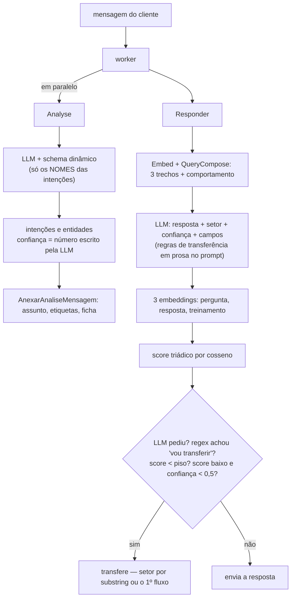
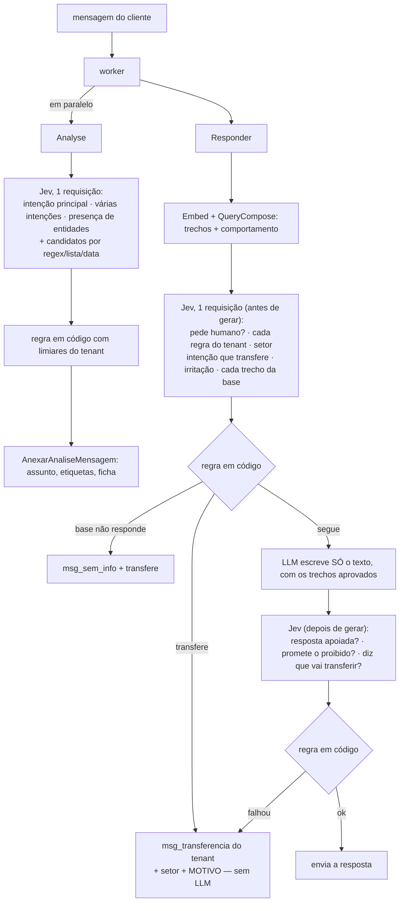

# 38 — Plano: `ia_engine_jev` — decisões da IA pelo Jev, geração pela LLM

> **Status:** plano consolidado, decisões tomadas em 2026-09-28 (§11) — nada implementado.
> **Data:** 2026-09-28 (revisado no mesmo dia contra a documentação e o código — ver §12)
> **Base:** estudo `37-estudo-ia-engine-jev.md` (fontes e raciocínio completos) e
> referência da lib `../libs/python/typesafe_sdk.md`.
> **Depois de aprovado:** canonizar em `.context/plans/ia-engine-jev/` via
> `/plan-restructuring`.

---

## 1. Objetivo

Criar o módulo `ia_engine_jev`, derivado do `ia_engine`, que **implementa o mesmo contrato
gRPC** (`IaEngineService`) e entra no lugar do atual trocando só o endpoint. Nele:

- toda **decisão** sobre a mensagem passa ao Jev (TypeSafe System One): intenção,
  presença e escolha de entidades, sentimento, **transferência para atendente**,
  relevância dos trechos da base e conferência da resposta;
- a **LLM** fica só com o que exige gerar texto: escrever a resposta ao cliente e extrair
  valores livres que não têm candidato;
- o que não é decisão (embeddings, transcrição, leitura de imagem, leitura de arquivo)
  continua igual.

**Fora do escopo:** trocar o provedor da LLM de geração, mudar o RAG (pgvector, chunks,
limiares de distância), mudar o quadro/Kanban.

---

## 2. Comparativo: como é hoje e como vai ficar

### 2.1 Visão geral

| Tema | Hoje (`ia_engine`) | Com o `ia_engine_jev` |
|---|---|---|
| Quem decide | a LLM, por *structured output* (JSON validado por pydantic) | o Jev, por perguntas tipadas; a regra final é código nosso |
| Quem escreve a resposta | a LLM | a LLM (só isso) |
| Intenção | LLM recebe **só os nomes** das intenções | `Choice` com **descrição e exemplos** de cada intenção + opção `nenhuma` |
| Várias intenções | lista livre devolvida pela LLM | um `Noul` por intenção (a doc manda assim para multirrótulo) |
| Confiança | número que a LLM escreve (padrão 1.0 na análise, 0,5 na resposta) | probabilidade **calibrada** (medida em inglês; em português a J0 confirma) |
| Entidades | LLM inventa o valor a partir do nome do tipo (a descrição do tipo se perde no caminho) | candidatos por regex/lista/data; o Jev escolhe; LLM pequena só para valor livre, conferida |
| Sentimento | LLM devolve nota, rótulo e "feedback" | `Score` de 5 níveis + `Choice` positivo/negativo; feedback = o próprio texto |
| Transferência | decidida pela LLM + regex + similaridade de embeddings | decidida por sinais do Jev + regra em código, com motivo |
| Setor da transferência | nome que a LLM escreve, casado por pedaço de texto; sem casar, **o primeiro fluxo** | `Choice` sobre os fluxos (+ `nenhum`); intenção pode trazer o seu setor |
| "Confiabilidade" gravada | cosseno entre embeddings de pergunta, resposta e treinamento | P(a resposta se apoia nos trechos aprovados) |
| Trechos da base | os 3 mais próximos vão todos para o prompt | cada trecho é classificado (relevante, responde, contradiz, tenta instruir); só os aprovados entram |
| Regras de transferência do tenant | prosa no `PROMPT_REGRAS_TRANSFERENCIA`, na persona e no comportamento das intenções, lida pela LLM | **cadastro próprio** na tela de configurações (§4.3), com destino e momento por regra; cada condição vira um `Noul` |
| Explicar uma decisão | não há número para olhar | cada sinal com seu valor, no `testar_pergunta` e na auditoria |
| Chamadas por mensagem | análise: 1 LLM · resposta: 1 LLM + 3 embeddings | análise: 1 Jev · resposta: 1 Jev + 1 por trecho, em paralelo + (se não transferir) 1 LLM + 1 Jev |
| Quando transfere | a LLM gera a resposta e só depois se decide | **a LLM nem é chamada** |
| Pydantic | schema dinâmico da análise, `AnaliseAvaliacao`, `RespostaBot`, domínio | só configs, settings e o SDK (que usa pydantic por dentro) |
| Falha do provedor | mensagem fica sem análise / cai no fallback | igual para a análise; na resposta, volta ao caminho atual (LLM decide) |

### 2.2 Fluxo da mensagem — hoje



### 2.3 Fluxo da mensagem — com o `ia_engine_jev`



### 2.4 Transferência para atendente, sinal por sinal

| Sinal | Hoje | Depois |
|---|---|---|
| Cliente pede uma pessoa ("quero falar com o Paulo") | depende de a LLM preencher `acao_transferencia` ou escrever "vou transferir" | `pede_humano` (`Noul`) antes de gerar |
| Regras do tenant ("pede preço fechado", "reclamação"…) | prosa no prompt; a LLM interpreta | uma `Noul` por regra, limiar por tenant |
| Intenção que manda transferir | texto no `comportamento` da intenção, que só chega se o RAG a recuperar | regra do cadastro com gatilho de intenção, visível na tela de transferência |
| A base não sabe responder | `training_vec` ausente + score baixo + confiança baixa | nenhum trecho aprovado como evidência + intenção de conteúdo |
| Resposta fraca | score triádico (parecença de vocabulário) < piso B4 | `resposta_apoiada` < `confianca_minima_transferencia` (recalibrado) |
| Resposta promete o que não pode (preço, prazo, desconto) | não existe | `promete_o_que_nao_pode` (`Noul`) |
| A resposta diz que vai transferir | regex de 6 padrões em português — e transfere | `resposta_transfere` (`Noul`) — **não** transfere sem regra: gera de novo; persistindo, "a revisar" |
| Cliente irritado | não existe | `insatisfacao` (`Score`), ligado por padrão (decisão de 2026-09-28) |
| Setor | substring do nome escrito pela LLM; sem casar, o 1º fluxo | setor da intenção → `Choice` do setor com confiança → fluxo padrão do departamento |
| Por que transferiu | não registrado | `motivo_transferencia` + valores de todos os sinais |
| Custo quando transfere | 1 LLM + 3 embeddings | 1 requisição Jev |

---

## 3. O que é o Jev (resumo do que pesa na decisão)

- **Primitivas:** `Choice` (uma de até 255 opções, confiável até ~240), `Score` (nível
  ordenado, 2–10), `Noul` (probabilidade de "sim"). Todas as perguntas de uma requisição
  rodam **em paralelo e isoladas**; o id da pergunta não vai ao modelo.
- **Saída:** sempre dentro das opções dadas, com probabilidades; `Choice` e `Score` trazem
  `confidence`. Não gera texto.
- **Velocidade e preço:** ~100 ms típico; US$ 0,042 por milhão de tokens de entrada,
  saída grátis.
- **Limites:** 1.200 requisições/min e 250 mil tokens/s **por conta** (dinâmicos);
  64k tokens por requisição.
- **Idioma:** inglês é o principal; outros idiomas "funcionam com acurácia menor".
- **Pontos fracos declarados (jev-1.13):** leitura literal, conta/contagem/datas,
  contexto grande com lixo, conteúdo adversarial, gerar texto.
- **Modelo:** `jev-latest` muda sozinho; fixar `jev-1.13.0`.
- **Dados:** não treina com as requisições; retenção zero só no plano enterprise.

---

## 4. Desenho

### 4.1 Análise da mensagem (`Analyse`, em segundo plano)

`state`: `{mensagem, historico (até 4 falas), empresa (uma linha)}`. Instruções em inglês;
opções e exemplos do tenant em português (a J0 decide se traduz).

| Pergunta | Primitiva | Uso |
|---|---|---|
| `intencao_principal` | `Choice` sobre o catálogo + `nenhuma`; cada opção `{what: descricao, examples: exemplo}` | assunto do atendimento se `confidence ≥ piso_assunto` |
| `intencao::<tag>` | um `Noul` por intenção | etiquetas se `≥ piso_etiqueta` — limiar próprio: a doc avisa que o limiar de um `Noul` não vale para a confiança de um `Choice`; faixa de dúvida → "a revisar" |
| `entidade_presente::<tipo>` | um `Noul` por tipo | só procura o valor do que está presente |
| `entidade::<tipo>` | `Choice` entre candidatos do código (+ `nenhum`) | valor copiado do texto, nunca inventado |

Entidades, por estratégia (configurável por tipo):

| Estratégia | Tipos da Ecoprint | Como |
|---|---|---|
| `regex` | `quantidade_tiragem`, `dimensoes`, `cores_impressao` | regex acha candidatos; `Choice` escolhe |
| `lista` | `segmento_producao`, `tipo_produto` | `Choice` fechada sobre as opções do tipo |
| `varios` | `acabamento`, `substrato_material` | um `Noul` por opção conhecida |
| `data` | `prazo_desejado` | partes da data por `Choice`; montagem em código |
| `livre` | `formato_arte`, `local_entrega` | presença pelo Jev; valor por LLM pequena; `Noul` "o valor está no texto?" |

Um `Choice` aceita até 255 opções e é confiável até ~240. Catálogo maior → dois estágios:
primeiro o grupo, depois a intenção dentro dele.

### 4.2 Resposta (`Responder`) com a transferência

**Requisição 1 — antes de gerar.** `state`: `{mensagem, historico, fluxos, regras,
trechos[]}`.

| Pergunta | Primitiva |
|---|---|
| `pede_humano` | `Noul` |
| `regra::<id>` | `Noul` por regra do tenant |
| `setor` | `Choice` sobre os fluxos + `nenhum` |
| `intencao_principal` | `Choice` (a mesma da análise, porque a análise roda em paralelo e não chega a tempo) |
| `insatisfacao` | `Score` de 3 níveis |
| `trecho::<i>::relevante`, `::responde`, `::contradiz`, `::instrui` | 4 `Noul` por trecho, numa requisição por trecho, em paralelo (o cookbook de passagens de RAG avalia cada par pergunta–trecho sozinho) |

O **comportamento** que vai para a LLM passa a vir da intenção escolhida pelo Jev (confiança
≥ `piso_assunto`), não mais da intenção mais próxima por vetor. Foi o furo de "Quero falar
com o Paulo": a intenção de transferência ficou a 0,602 de distância, acima do limiar, e o
comportamento dela nem entrou.

**Decisão 1 (código):** transfere sem gerar se `pede_humano ≥ limiar_humano`, ou alguma
regra do cadastro disparada (condição ≥ limiar da sensibilidade, ou gatilho de intenção com
`confidence ≥ piso`; se a regra pede **coleta antes**, só depois de os campos do cartão
estarem preenchidos), ou
irritação `≥ 1,5` (ligado por padrão). Se nenhum trecho passa como evidência e a intenção
é de conteúdo: `msg_sem_info` (transfere só se o tenant ligar). Senão, segue.

**LLM:** recebe só os trechos aprovados, em dois blocos ("evidência" e "conflito"), e
devolve **texto puro** — sem schema, sem setor, sem confiança.

**Requisição 2 — depois de gerar.** `state`: `{pergunta, resposta, trechos_aprovados,
restricoes_da_persona}`: `resposta_apoiada`, `promete_o_que_nao_pode`,
`resposta_transfere` (`Noul`).

**Decisão 2 (código):** transfere se `resposta_apoiada < confianca_minima_transferencia`
(recalibrado: o valor atual foi pensado para o score de cosseno; **desligado por padrão** —
sem ele, a resposta não apoiada vira a `msg_sem_info`),
ou `promete_o_que_nao_pode ≥ 0,8`. `resposta_transfere ≥ 0,8` **sem regra disparada não
transfere**: a resposta é gerada de novo uma vez e, se ainda prometer, sai marcada "a
revisar" — a LLM não transfere por conta própria. A `confiabilidade` gravada passa a ser
`resposta_apoiada`.

**Setor:** o destino da regra que disparou → `setor` se `confidence ≥ piso_setor` → fluxo
padrão do tenant.

**Faixa de dúvida** (ex.: `pede_humano` entre 0,4 e 0,8): **transfere por precaução**
(decisão de 2026-09-28).

**Regras do tenant:** o Jev lê cada uma ao pé da letra. A tela pede uma condição exata por
regra ("o cliente pede preço fechado", não "assuntos comerciais"), e cada regra pode ser
testada antes de valer (§4.3).

### 4.3 Regras de transferência: um cadastro do tenant

**Recomendação:** um cadastro próprio, numa tela "Transferência para atendente" nas
configurações, que vira a **única fonte** de quando o bot transfere. A transferência é
decisão do tenant, e hoje ela está espalhada e escondida: no Paulo Ecoprint, 18 das 23
intenções falam de transferência no `comportamento`, o `PROMPT_REGRAS_TRANSFERENCIA` manda
escolher o setor "mais próximo", e a persona repete a regra de falar com o Paulo.

| Opção | A favor | Contra | Veredito |
|---|---|---|---|
| Texto no prompt (hoje) | nada a construir | invisível, sem destino por regra, o Jev lê prosa mal | descartada |
| Lista de frases na config | simples | sem destino, sem momento, sem teste nem histórico por regra | descartada |
| Marca "transfere" em cada intenção | reaproveita o catálogo | só cobre intenção; espalha a regra pelo treinamento | vira um tipo de gatilho do cadastro |
| **Cadastro de regras** | tudo numa tela, destino e momento por regra, testável, auditado, no MCP | uma tabela e telas novas | **recomendada** |

**A tela, em quatro partes:**

1. **Sinais automáticos** — liga/desliga e sensibilidade (baixa · média · alta, cada uma
   mapeando um limiar calibrado na J0; o tenant não mexe em número cru): cliente pede uma
   pessoa (ligado); cliente irritado (ligado); na dúvida, transferir ou responder
   (transferir); base sem resposta (desligado); resposta sem apoio na base (desligado).
2. **Regras do negócio** — o cadastro, com botão **Testar** (mostra, para uma frase, se a
   regra dispara e com qual probabilidade).
3. **Padrões** — mensagem ao cliente na transferência e fluxo de destino padrão.
4. **Últimas transferências** — com a regra ou o sinal que disparou.

**Campos de uma regra:**

| Campo | Exemplo (Ecoprint) | Para quê |
|---|---|---|
| Nome | Fechar pedido | lista e motivo gravado |
| Gatilho | uma **condição** ("O cliente quer fechar ou confirmar um pedido") ou uma **intenção** do catálogo (`material_campanha_eleitoral`) | o que o Jev avalia: um `Noul`, ou a intenção escolhida |
| Exemplos que transferem / que não transferem | "pode fechar" / "só queria saber o prazo" | viram `criteria` do `Noul` |
| Momento | imediatamente, ou **depois de coletar** campos do cartão (tipo, quantidade, medidas) | cobre o "colete o essencial e passe para o Paulo"; a checagem dos campos é código |
| Destino | um fluxo, o setor escolhido pelo Jev, ou o padrão | para onde vai o cartão |
| Mensagem ao cliente | opcional | senão, a padrão |
| Sensibilidade | média | limiar do `Noul` |
| Ativa | sim | desligar sem apagar |

**Por trás:** tabela `oraculo_regra_transferencia`; CRUD no `data_postgres`; exposição
explícita no `AdminService`/gRPC-Web; ferramentas no MCP (`list/create/update/
desativar_regra_transferencia`); auditoria; permissão `configuracoes:write`. As regras
ativas vão para o Redis com a config do tenant (como os prompts) — o `ia_engine_jev` as lê de
lá e o contrato gRPC não precisa carregá-las; editar invalida o cache pelo mecanismo
existente. O motivo gravado é o nome da regra.

**Migração:** o texto de transferência de hoje (prompt de regras, persona e comportamentos)
é lido uma vez e vira **sugestões de regra inativas**, para o tenant revisar e ativar. Para a
Ecoprint: "quer fechar ou confirmar um pedido" → imediatamente → Comercial; intenção
`material_campanha_eleitoral` → imediatamente → Comercial; intenções de produto → depois de
coletar tipo, quantidade e medidas → Comercial. "Quer falar com o Paulo" já é o sinal
automático de pedido de humano. Ativadas as regras, o texto de transferência sai da persona,
do prompt e dos comportamentos — uma fonte só.

### 4.4 Sentimento (pesquisa de satisfação)

`nota` = `Score` de 5 níveis descritos, e a nota é o **nível mais provável** — não o valor
médio arredondado: a doc avisa que o `score` não serve para reconstruir números entre
níveis (número escrito pelo cliente vence o modelo); `sentimento` = `Choice` positivo/negativo; `feedback` = o próprio texto.

### 4.5 O que não muda

`Embed`, `Transcribe`, `InterpretMedia`, `ExtrairTextoDocumento`: copiados do `ia_engine`
sem alteração.

---

## 5. Pydantic

| Uso hoje | Destino |
|---|---|
| `build_dynamic_model` (análise) | removido |
| `AnaliseAvaliacao` (sentimento) | removido |
| `RespostaBot` (resposta + transferência + confiança + campos) | caminho de reserva (se o Jev falhar) até a J5, removido lá; no caminho normal a LLM já devolve só texto desde a J3 |
| `MediaAnalysis` (visão) | fica |
| `IntentItem`, `EntidadeItem`, `IntentsEntidades`, `RespostaFinal` | viram `dataclass(frozen=True)` |
| `config/models.py` (Redis) e `pydantic-settings` | ficam |
| `typesafe-sdk` | usa pydantic por dentro desde a v0.7.0 |

**Veredito:** o pydantic sai do domínio e de toda chamada de modelo, mas continua
dependência do projeto — o próprio SDK o traz.

---

## 6. Arquitetura do módulo

### 6.1 Onde mora e como pluga

Serviço Python novo `ia_engine_jev/`, mesmo padrão RSOE do `ia_engine` e **mesmo contrato
`IaEngineService`**. Plugar = `SMARTCORE_IA_ENGINE_ENDPOINT` apontando para o container
novo; voltar = apontar de volta. O Rust não precisa saber qual motor respondeu. Depois da
troca, o `ia_engine` antigo sai do repositório (sem código duplicado permanente).

### 6.2 Estrutura

```
ia_engine_jev/
  src/ia_engine_jev/
    typesafe/        cliente assíncrono, RetryPolicy, exceções → erros de domínio
    perguntas/       funções PURAS: dados → state + questions (intencoes, entidades,
                     sentimento, transferencia, rag, conferencia)
    decisoes/        funções PURAS: respostas do Jev + limiares → decisão + motivo
    candidatos/      regex e listas por tipo de entidade
    features/        analyse, sentimento, responder, embed, transcribe,
                     interpret_media, extrair_texto
    servicer.py  server.py  config/  telemetry.py
  avaliacao/         conjunto rotulado + script de métricas (roda na CI)
  tests/             respostas do Jev gravadas; nenhum teste chama a rede
```

Só o `datasource` fala com a TypeSafe; perguntas e decisões são funções puras, testáveis
sem rede.

### 6.3 Contrato (`ai_engine.proto`, tudo aditivo)

- `AnalyseRequest`: `repeated IntentDef intents = 7` (`tag`, `grupo`, `descricao`,
  `exemplo`) e `repeated EntidadeDef entidades = 8` (`tipo`,
  `descricao`, `estrategia`, `repeated string opcoes`). Sem `map` (o conversor
  proto→flatbuffers não aceita).
- `AnalyseResponse`: `intent_principal`, `confianca_principal`, `modelo`.
- `ResponderRequest`: `repeated IntentDef intents` e
  `repeated Trecho trechos` (conteúdo, distância) + `comportamento` à parte — hoje os trechos
  chegam colados num texto só (`dados_treinamento`), o que impede avaliar trecho a trecho. O
  `testar_pergunta` passa a mandar do mesmo jeito. As regras de transferência **não** viajam
  no contrato: vêm do Redis, com a config do tenant.
- `ResponderResponse`: `motivo_transferencia`, `repeated SinalDaDecisao sinais` (nome,
  valor, limiar); `confiabilidade` passa a ser `resposta_apoiada`.

### 6.4 Servidor (Rust)

- Worker: manda intenções completas (o `ListIntents` já traz descrição e exemplo; cache
  por tenant, como o de fluxos), as descrições dos tipos de entidade e o histórico na
  análise; grava `motivo_transferencia` e os sinais na auditoria e no movimento.
- Modo sombra: `motor_analise = sombra` chama os dois motores e grava as duas análises e as
  duas decisões de transferência; só a atual vale.
- `testar_pergunta`: mostra o motivo e os sinais.
- **Limiares separados por escala.** Hoje `confianca_minima_automatica` (0,8) decide ao mesmo
  tempo etiqueta, cadastro de entidade e "a revisar" da resposta. Passam a ser `piso_assunto`
  (confiança de `Choice`), `piso_etiqueta` e `piso_entidade` (`Noul`) e
  `piso_resposta_automatica` (sobre a `resposta_apoiada`), calibrados no conjunto de avaliação.
- **Histórico sem mistura:** `oraculo_mensagem` grava o motor e a versão do modelo junto da
  `confianca_resposta`, para não comparar cosseno com probabilidade.
- Cadastro de regras de transferência (§4.3): tabela, CRUD, gRPC-Web, MCP, auditoria, tela
  "Transferência para atendente" e publicação das regras ativas no Redis.
- Config **global** (plataforma): `typesafe_api_key`, cifrada como as outras chaves.
- Config do tenant: `motor_analise` (`llm` | `sombra` | `jev`), `jev_modelo` (padrão `jev-1.13.0`),
  liga/desliga e sensibilidade dos sinais automáticos, destino e mensagem padrão da
  transferência, `piso_setor`, estratégia por tipo de entidade.

### 6.5 Falhas

- **Análise:** TypeSafe fora (timeout, 429 além do retry, 5xx) → mensagem sem análise,
  como hoje.
- **Resposta:** falha do Jev → volta ao caminho atual (LLM com schema decide). O cliente
  nunca fica sem resposta.
- **Retry:** `RetryPolicy` com orçamento total curto (~2 s), porque está no caminho da
  conversa; cada nova tentativa cobra os tokens de novo. HTTP/2 (`typesafe-sdk[http2]`)
  para as requisições em paralelo dos trechos.
- **Log:** sem conteúdo de mensagem, só contagens, sinais e a versão do modelo.

---

### 6.6 Auditoria, logs e MCP

Nada de sistema novo: o módulo e as regras entram nos três que já existem, seguindo as
regras de cada um — auditoria diz **quem fez o quê** (sem conteúdo de conversa), log e
métrica dizem **como o sistema está** (sem conteúdo e sem tenant como rótulo), e o MCP faz
tudo o que a tela faz.

**Auditoria** (`audit_log`, via `security.audit` no Redis; config pelo `AuditPort` do
`data_postgres`, conversa pelo `AuditLogger` do worker; o MCP já chega identificado pelo
`user_agent` `SmartCoreAssistant-MCP/<tool>`):

| Evento | Hoje | Depois |
|---|---|---|
| `atendimento.transferido_por_ia` | atendimento, fluxo, etapa, atendente | + `motivo` (regra ou sinal), `regra_id`, sinais (nome, valor, limiar), `motor`, `modelo` |
| `bot.respondeu` | confiança e decisão | + `motor`, `modelo`, `resposta_apoiada`, `regerada`; decisão ganha `sem_info` e `reserva` |
| `bot.transferencia_prometida_barrada` | — | a LLM prometeu transferir sem regra; resposta gerada de novo |
| `transferencia_regra.criada` · `.atualizada` · `.ativada` · `.desativada` | — | id, nome e campos alterados |
| `transferencia_sinais.alterados` | — | sinais, liga/desliga e sensibilidade, antes e depois |
| `transferencia_regra.sugestoes_geradas` | — | quantas sugestões a migração criou |
| `tenant_config.motor_alterado` | — | `llm` → `sombra` → `jev`; só o superusuário muda |

A trilha ganha filtro por evento (`ListMyAuditLogRequest.evento_prefixo`), para a tela e o
MCP mostrarem só transferências ou só mudanças de regra.

**Registro das decisões da IA:** tabela `oraculo_decisao_ia`, por mensagem (uma linha por
motor na sombra): motor, modelo, intenção e confiança, sinais com valores, transferiu ou não,
motivo, ids dos trechos aprovados e descartados, tokens e duração. Fonte das métricas da
J0/J2, da calibração por tenant e das "Últimas transferências". Sem texto de mensagem;
retenção de 90 dias. Auditoria não é lugar para comparação de sombra nem para calibrar.

**Logs e métricas:**

- `ia_engine_jev`: mesmo molde do `telemetry.py` atual (span por RPC, log JSON com
  `trace_id`, nenhum conteúdo). Span novo `jev.requisicao` por chamada: etapa (análise,
  antes, trecho, depois), perguntas, tokens de entrada, modelo, duração, status e o
  `x-typesafe-request-id`.
- Métricas, sem tenant como rótulo: `smartcore_jev_requisicoes_total{etapa,status}`,
  `smartcore_jev_duracao_ms{etapa}`, `smartcore_jev_tokens_total{etapa}`,
  `smartcore_jev_limite_total` (429), `smartcore_ia_reserva_total` e
  `smartcore_transferencias_total{motivo}` (tipo de sinal ou "regra", nunca o nome da regra).
- Worker: spans `ia.responder` e `ia.analise` ganham `motor`, `modelo`, `transferida`,
  `motivo` e `llm_chamada`.
- Alertas (Grafana/Loki): taxa de 429, taxa de reserva, p95 do Jev acima de 1 s, custo diário
  fora do normal.

**MCP** — tudo o que a tela de transferência faz, no padrão atual (categoria, escopo,
`dry_run` que compara e recusa duplicata, confirmação nas destrutivas, paridade testada,
rota explícita no gRPC-Web):

| Ferramenta | Categoria | Escopo |
|---|---|---|
| `get_config_transferencia` | leitura | `configuracoes:read` |
| `list_regras_transferencia` (inclui sugestões inativas) | leitura | `configuracoes:read` |
| `list_transferencias` (últimas, com motivo) | leitura | `atendimentos:read` |
| `create_regra_transferencia` / `update_regra_transferencia` | configuração | `configuracoes:write` |
| `ativar_regra_transferencia` | configuração | `configuracoes:write` |
| `set_sinais_transferencia` | configuração | `configuracoes:write` |
| `testar_regra_transferencia` | leitura | `configuracoes:read` |
| `desativar_regra_transferencia` (confirma pelo nome) | destrutiva | `configuracoes:write` |

`testar_pergunta` passa a devolver motivo, sinais, intenção e confiança, trechos aprovados e
descartados e o modelo; `list_auditoria` ganha o filtro por evento. A troca de motor fica
fora do MCP do tenant: é decisão de plataforma, no painel do superusuário.

---

## 7. Validação

1. **Conjunto de avaliação** (300 mensagens reais anonimizadas): intenção, várias
   intenções, entidades, sentimento e **transferência** (pedido de humano, regra do
   tenant, sem resposta na base, cliente irritado, falsos positivos óbvios). Rótulo
   inicial pela LLM grande + revisão humana das divergências. Inclui as 6 perguntas do
   relatório de migração.
2. **Métricas:** acurácia da intenção principal; precisão/recall por etiqueta e por
   entidade; **precisão e recall da transferência** (transferir o que devia e não
   transferir o resto); calibração por faixa de confiança; latência p95; tokens por
   mensagem.
3. **Idioma:** três variantes (instruções EN + opções PT; tudo PT; catálogo e regras
   traduzidos para EN). A mensagem do cliente fica sempre em português: traduzi-la custaria
   uma LLM a mais por mensagem.
4. **Sombra em produção** num tenant, 2–3 semanas, com as duas decisões lado a lado.
5. **Limiares** calibrados nesse conjunto, por tenant.
6. **Trechos:** uma requisição por trecho (o que a doc recomenda) × todos numa só; fica o que
   acertar mais, com o custo em requisições na conta.

---

## 8. Fases

| Fase | Entrega | Aceite |
|---|---|---|
| **J0 — Avaliação** | conjunto rotulado, script de métricas, rodada das 3 variantes de idioma | relatório com acurácia, calibração, latência e custo; decisão go/no-go |
| **J1 — Esqueleto** | `ia_engine_jev` com o contrato completo; features inalteradas copiadas; `Analyse` e `Sentimento` pelo Jev; testes das perguntas e decisões; telemetria (span `jev.requisicao`, logs JSON, métricas do Jev) | CI verde; análise com intenção principal, multi-intenção e confiança real |
| **J2 — Contrato e sombra** | proto aditivo; worker com intenções completas, histórico e descrições de entidade; `motor_analise = sombra`; chave TypeSafe na config global; tabela `oraculo_decisao_ia`; `motor`/`modelo` em `bot.respondeu` e nos spans do worker; troca de motor no painel do superusuário, auditada | sombra rodando num tenant; Jev ≥ atual na intenção principal |
| **J3 — Transferência pelo Jev** | requisições antes/depois da geração; **cadastro e tela de regras de transferência** (sinais, regras com gatilho, momento e destino, teste); migração do texto atual em sugestões inativas; eventos de auditoria das regras e da transferência com motivo; filtro por evento na trilha; ferramentas MCP de transferência; filtro dos trechos da base; LLM só texto; motivo no `testar_pergunta` e na auditoria; trechos separados no contrato; limiares separados por escala; `RespostaBot` só como reserva | as 6 perguntas do relatório com a transferência certa; toda transferência com motivo; sombra com menos transferências indevidas que o motor atual |
| **J4 — Entidades** | candidatos por estratégia; LLM pequena só em `livre`, conferida; `campos_extraidos` pelo mesmo caminho | acerto por tipo medido; nenhum valor fora do texto |
| **J5 — Troca** | endpoint → `ia_engine_jev` por tenant, depois todos; alertas no Grafana (429, reserva, p95, custo diário) | uma semana sem regressão e sem cair na reserva; `ia_engine` antigo e `RespostaBot` removidos |

A transferência vem antes das entidades por ser a decisão com mais efeito na conversa. A
J0 é barata e decide se o resto acontece.

---

## 9. Custo e latência (estimativa com o catálogo da Ecoprint)

| Etapa | Tokens de entrada | Custo por mensagem |
|---|---|---|
| Análise (23 intenções com descrição e exemplos, 23 `Noul`, ~10 de entidade) | ~9 mil | ~US$ 0,0004 |
| Resposta, antes de gerar (sinais + 3 trechos × 4 perguntas) | ~8 mil | ~US$ 0,0003 |
| Resposta, depois de gerar | ~2 mil | ~US$ 0,0001 |
| **Total Jev** | **~19 mil** | **~US$ 0,0008 (≈ US$ 0,80 por mil mensagens)** |

- **Latência:** ~100–300 ms por requisição.
- **Ganho de custo:** as transferências passam a não chamar a LLM de geração nem os 3
  embeddings do score.
- **Ganho principal:** controle e explicação das decisões, mais do que preço.
- **Teto real:** 1.200 requisições/min por conta. Com ~6 requisições por mensagem que o
  bot responde (1 análise + 1 antes + 3 trechos + 1 depois), são ~200 mensagens/min por conta.

---

## 10. Riscos

| Risco | Mitigação |
|---|---|
| Português com acurácia menor | J0 com três variantes de idioma; sombra; troca só com números |
| Transferência indevida ou perdida | limiares por tenant calibrados no conjunto; faixa de dúvida → "a revisar"; sombra compara com o motor atual |
| Entidade de valor livre | candidatos; LLM pequena só em `livre`, conferida |
| Limite de requisições por conta, dinâmico | 1 requisição por etapa; métrica de 429; plano enterprise antes de escalar |
| Alias mudando respostas | versão fixa; trocar de versão = rodar a avaliação de novo |
| Texto do cliente vai a terceiro | DPA; termo do tenant; ZDR se exigido; nada de conteúdo em log |
| Mensagem adversarial | mensagem é dado; `Noul` de injeção nos trechos — filtro, não barreira de segurança, como a doc avisa; a análise não executa nada |
| Regra do tenant mal escrita (leitura literal) | uma condição exata por linha; teste de cada regra antes de valer |
| Limiar reaproveitado de outra escala | limiares separados por escala, recalibrados na J0 |
| Novo fornecedor fora do ar | fallback para o caminho atual na resposta; análise best-effort |
| Volta atrás | mesmo contrato gRPC: apontar o endpoint para o `ia_engine` atual |

---

## 11. Decisões (tomadas em 2026-09-28)

| Decisão | Escolha |
|---|---|
| Conta TypeSafe | uma conta da plataforma para todos os tenants; plano enterprise quando o limite apertar |
| Envio a terceiro | sim, com a TypeSafe como suboperador no termo/DPA do tenant |
| Formato | serviço separado `ia_engine_jev`, mesmo contrato gRPC |
| Entidades de valor livre | LLM pequena, só quando o Jev diz que está presente, com o Jev conferindo o valor |
| Ordem | J0 (avaliação em português) antes de escrever o serviço |
| Sinais que transferem por padrão | pedido de humano; regras do cadastro (condição ou intenção); cliente irritado |
| Faixa de dúvida | transferir por precaução |

Consequências no desenho:

- **Base sem resposta** e **resposta não apoiada** não transferem por padrão: o cliente recebe
  a `msg_sem_info` do tenant no lugar de um texto sem apoio na base. A trava B4
  (`confianca_minima_transferencia`) continua disponível para o tenant ligar.
- Com irritação ligada e dúvida transferindo, o bot fica conservador: a J0 mede quantas
  transferências a mais isso gera antes de fixar os limiares.
- A chave `typesafe_api_key` passa a ser **da plataforma** (config global cifrada), não do
  tenant; o termo do tenant ganha a TypeSafe como suboperador.

---

## 12. Revisão de 2026-09-28

Conferido de novo contra a documentação da TypeSafe (baixada outra vez; sem mudanças desde
2026-09-27) e contra o código. Ajustes feitos:

| # | Ajuste | Por quê |
|---|---|---|
| 1 | Trechos separados no `ResponderRequest` | hoje chegam colados em `dados_treinamento`; sem isso não há avaliação por trecho |
| 2 | Uma requisição por trecho, em paralelo (a J0 compara com todos juntos) | o cookbook de passagens de RAG avalia cada par sozinho; contexto com lixo derruba a acurácia |
| 3 | `RespostaBot` fica como reserva até a J5 | o plano removia na J3 e ao mesmo tempo usava o caminho atual como reserva |
| 4 | Limiares separados por escala (`piso_assunto`, `piso_etiqueta`, `piso_entidade`, `piso_resposta_automatica`) e B4 recalibrado | a doc avisa que limiar de `Noul` não vale para `Choice`; o 0,8 de hoje decide três coisas e foi pensado para cosseno |
| 5 | Motor e versão do modelo gravados com a confiança | não misturar cosseno e probabilidade no histórico |
| 6 | Comportamento vem da intenção escolhida pelo Jev | o comportamento por distância vetorial é o que deixou "Quero falar com o Paulo" sem transferir |
| 7 | Nota do sentimento = nível mais provável | a doc avisa que o `score` não reconstrói números entre níveis |
| 8 | Catálogo > 240 intenções em dois estágios | limite prático do `Choice` |
| 9 | Regras do tenant: uma condição exata por linha, testável | o Jev lê ao pé da letra |
| 10 | Conta de requisições: ~6 por mensagem → ~200 mensagens/min por conta | o limite é por requisição, não por mensagem |
| 11 | Pergunta de injeção descrita como filtro, não barreira; variante "tudo EN" = só catálogo e regras | fidelidade à doc; traduzir a mensagem custaria uma LLM a mais |

---

## 13. Regras de transferência como cadastro (2026-09-28)

Pedido do dono do produto: as regras de transferência precisam ser claras, mostradas nas
configurações do tenant, e a decisão é dele. Analisadas as opções (§4.3), o plano adota um
**cadastro próprio** com tela "Transferência para atendente" como única fonte de quando o bot
transfere; a marca "transfere" no catálogo sai do plano (virou gatilho de regra), a LLM deixa
de transferir por conta própria, e a migração gera sugestões inativas a partir do texto atual.

## 14. Auditoria, logs e MCP (2026-09-28)

Pedido do dono do produto: integrar o sistema de auditoria e de logs e o MCP. Analisado o
código (`AuditPort`/`AuditLogger` → `security.audit` → `audit_log`; `telemetry.py` do
`ia_engine`; registro, escopos e paridade do `mcp_server`), o plano ganhou a §6.6 e a
distribuição pelas fases: telemetria na J1, `oraculo_decisao_ia` e campos de motor/modelo na
J2, eventos das regras, filtro por evento e ferramentas MCP na J3, alertas na J5.
